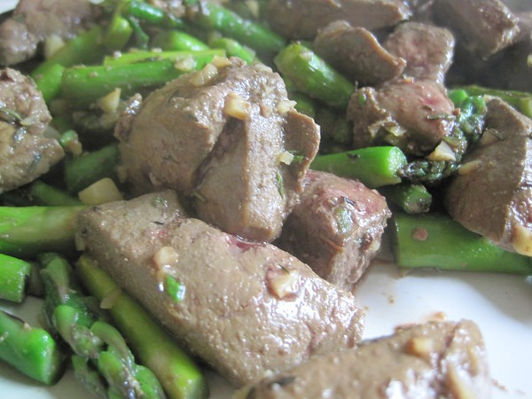

This week my plan was to cook up beef liver with a side of asparagus, but I realized I was short on pans. So I decided to cook everything together. It totally worked and I had one less dish to wash. **Summary**: _A simple way to prepare beef liver._

#### Ingredients

-   Beef Liver cut into bite-sized pieces
-   Asparagus chopped into bite-sized pieces
-   Chopped garlic
-   Thyme
-   Salt (I use Redmond Sea Salt)
-   Cooking Fat ([tallow](/2011/02/rendering-beef-tallow-in-a-crock-pot/), butter or ghee)

#### Instructions

1.  Chop the asparagus and set aside.
2.  Chop the garlic and set aside.
3.  Chop the liver and set aside.
4.  Heat the pan to medium and add some cooking fat.
5.  Toss in the garlic for a minute or so.
6.  Then add the asparagus for a few more minutes
7.  Finally put in the liver
8.  As it cooks down you can add water, beef broth or red wine.
9.  Add salt and thyme.
10.  Cook until done.
11.  Serve.

#### Quick notes

I used tallow, but after reading the [comment left by garymor](/2012/02/reversing-gray-hair/#comment-11559) - the next time I plan to try ghee.

#### Variations

I think adding mushrooms would make this dish even better. Preparation time: 20 minute(s) Cooking time: 15 minute(s)

---

## Comments

### Glenn
*February 26 at 2012 at 6:11 PM*

Will you forgive me for being a locavore fascist if I ask you whether asparagus is in season at the moment in Seattle?

---

### MAS
*February 26 at 2012 at 6:36 PM*

@Glenn - My season for produce these days is "whatever is cheap". :) I'm super strict and clean when it comes to organ meats. Pretty good for muscle meat. For veggies I'm mostly conventional unless organic is on sale.

---

### Becca
*February 26 at 2012 at 8:44 PM*

Where do you buy your organ meats?  Just at the grocery store, or do you go somewhere special?

---

### MAS
*February 26 at 2012 at 9:08 PM*

@Becca - The Ballard Farmers Market. If you don't have a local farmers market, you can seek out 100% grass pastured organ meat online.

---

### Stephan
*October 4 at 2012 at 1:37 PM*

MAS,

when I cook up my liver in a pan covered in ghee, some liver pieces turn out rather chunky on the bite. Have you had that experience? If so, is it the quality of the liver or how can you make liver turn out really tender during the cooking process?

---

### MAS
*October 4 at 2012 at 2:02 PM*

@Stephan - I may not have the best answer, because I have been cooking my liver less and less. I'm now eating liver rare. In fact, when I am slicing it up, I will eat a few pieces raw. The liver has been frozen for 2 weeks, so I believe it is safe to eat.

---

### Stephan
*October 4 at 2012 at 2:11 PM*

Your eating method is quite a leap forward. :)
I probably couldnt get myself to eat liver rare as of now. When you eat it, is it still partially frozen? What benefits do you see in eating it your way - better taste or improved absorption or both?

---

### MAS
*October 4 at 2012 at 2:16 PM*

@Stephan - I allow the liver to thaw. I was thinking that some of the vitamins, especially Vitamin C, get cooked out and that some traditional cultures eat meat raw, so I began experimenting with very small pieces. 

It doesn't taste better, but it doesn't taste bad.

---

