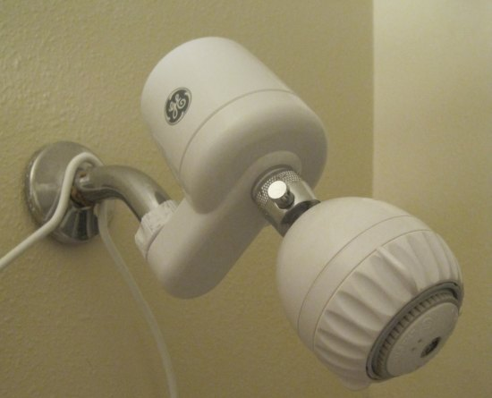

Last week I ended my [topical coconut oil experiment](/2012/02/the-topical-coconut-oil-experiment/) and started a new skin experiment. A month ago I was poking around the _Underground Wellness_ site when I found a post about [shower filters](https://web.archive.org/web/20210116144058/http://undergroundwellness.com/how-to-filter-your-shower-water/). My first thought was skepticism. I understood why you filter drinking water, but was doubtful there were risks to city water hitting your skin in the shower. Then I researched it further and became convinced that showering in chlorinated water presented a potential health danger that was very inexpensive to eliminate. So I bought a shower filter. One of the numbers I saw in several places was that taking a 10-15 minute shower with unfiltered water was like drinking 8 cups of chlorinated water. I'm not sure about any of this. What I do know is that since moving to Ballard I can smell the chlorine in my shower. Getting a shower filter is cheap insurance.  I bought a basic GE Shower filter. This is before I knew about the Vitamin C Shower Filters mentioned in Chris Kresser's article. Amazon sells both. I was able to install it myself without any problem and no one has ever confused me with being a handyman. GE GXSM01HWW Shower Filter System VITASHOWER SF-1 (Vitamin C Shower Filter) Since my showers are already very short, I'll probably be fine with the GE model for now. The chlorine smell is gone, so I assume it is working fine. In a month or two, I'll report back if there is a change in my skin health.

---

## Comments

### Roberta
*February 28 at 2012 at 8:43 PM*

Cool. I have been wanting to try one of these. 

BTW, made beef liver pate yesterday. It's not as good as the chicken liver version, but I assume ultra healthy!

---

### Stuart
*March 1 at 2012 at 12:40 AM*

I've used one of an Aquasauna filter at several past residences:

http://amzn.to/x78aVv

The water feels and smells different. Pay attention to how well your soap and shampoo suds up and your skin will also be less dry.

I think they are worthwhile investments.

---

### shower
*March 2 at 2012 at 2:36 AM*

I have become a shower filter user too. I don't remember for sure what movie it was (perhaps A Civil Action with John Travolta, maybe Erin Brokovich) where people where getting their dose of cancer causing chemicals by inhaling the atomized particles in their shower. Yuck.

---

### Mike
*March 3 at 2012 at 5:44 AM*

Chlorinated Water issue: So, all those kids on the swim team through school, college and then eventually daily lap swimmers at the Y are doomed.

---

### Glenn
*March 3 at 2012 at 6:37 AM*

VERY interesting. Thanks for the post.

To be fair to Andrew Weil, he highlighted this problem many years ago... and I've ignored it.

---

### MAS
*March 3 at 2012 at 3:35 PM*

@Mike - I'm guessing the average pool  swimmer also takes hot showers, so I'm not sure how one could study both groups to see different illness outcomes. 

I really wanted to dismiss this idea as fear mongering, but it is SO CHEAP that I had to try. Cheaper than a bottle of vitamins.

---

