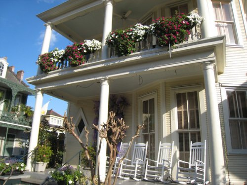
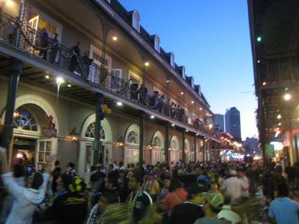
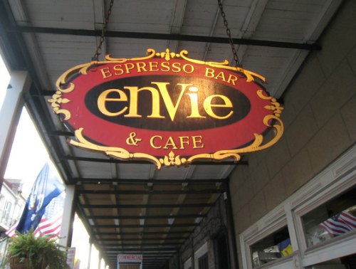
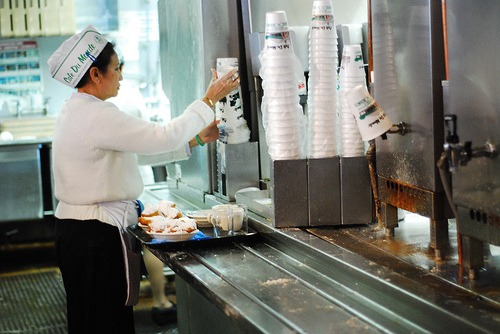

_This article was written after a 2009 trip to New Orleans._ This year I left the espresso comfort of Seattle and ventured to The Big Easy for my first trip to New Orleans. Bringing my [Rancilio Silvia](https://ineedcoffee.com/rancilio-silvia-espresso-machine-tips/) and a pound of espresso was not an option. I'd have to fend for myself and live off the espresso land. How did I fair? After landing at the _Louis Armstrong Airport_ in New Orleans I spotted my first coffee place. I needed a fix badly. It was there I spotted a place called _PJ's Coffee and Tea_. I ordered a double espresso and then with horror I saw the barista turn to the cheapest-looking super-automatic espresso maker I've ever seen in a commercial establishment. Like a well-trained circus animal, he hit a button, and out came the "espresso". It kept coming and coming. He handed me back a drink that looked to be almost 8 ounces. Savage! Not since my trip to Cabo San Lucas had I had such a wretched espresso. New Orleans had just made an awful first impression. New Orleans is a beautiful city with lots of great architecture. Here is a home in the French Quarter. Homes like this are everywhere.  _French Quarter Home_ The parades were wonderful too and I did make it through Bourbon Street on Fat Tuesday.  _Bourbon Street on Mardi Gras_ But, you don't want to hear about the parties, the parades, the homes, the friendly people or me seeing Val Kilmer. You want the coffee details! **Coffee in New Orleans is still a good 20 years behind Seattle.** Although there may be some gem buried deep in the French Quarter, I certainly didn't find it. There was one exception, I'll save that for last. In fairness to New Orleans, Mardi Gras is not just for tourists, it is primarily for the citizens themselves. That means quite a few places that are normally open are closed. When you have the caffeine monkey on your back, this is the last thing you want to see.  _Coffee Place Closed_ The [last time](/2009/05/coffee-on-the-road-grand-circle/) I directly trashed an American coffee house on the Internet, I got quite a few emails of support and a smaller amount of hate emails. Should I name names on my worst experiences in New Orleans (outside the airport that is)? What if a place was so bad it did the following:

-   Served over-extracted bitter espresso.
-   Denied my request to have the espresso served in ceramic (Mardi Gras was over at this point).
-   Helped themself to over a $1 tip by not returning my change after my ceramic request was denied.

I probably shouldn't name names.  _The worst espresso in the French Quarter_ _Community Coffee_ was recommended by a few locals. It was OK. Either that or my expectations were so low at this point that anything short of charcoal in hot water would have been an improvement.  _Community Coffee New Orleans_ There is one coffee New Orleans is known for and it is _Cafe Du Monde_. _Cafe Du Monde_ is located in the French Quarter and serves a darker coffee that has chicory in the blend. During my college years, before I became a coffee snob, I used to occasionally drink their pre-ground canned coffee. I recall liking it back then. I really feared that I wouldn't like it today. Kind of like an old sitcom. _Damn you, Barney Miller!_ Anyway, I took my first sip of _Cafe Du Monde_ and it was wonderful. Although these days I am more likely to be drinking a lightly roasted single-origin bean from _Stumptown_, it was nice having a darker, richer coffee. If you go to New Orleans, have a cup of coffee at _Cafe Du Monde_. This is a legendary coffee place, serving a unique coffee blend. The beignets were good too.  _Photo New Orleans - Cafe Du Monde by Flickr user Shawnmebo_ The best coffee I had in New Orleans goes to Cafe Du Monde. However, this town needs a lot of help when it comes to espresso.