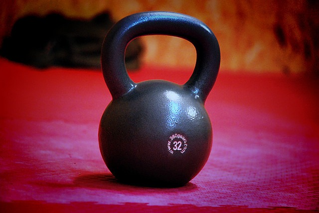

In the post [Help Me Understand CrossFit](/2011/03/understand-crossfit/), I got a great [comment from Jay](/2011/03/understand-crossfit/#comment-11165) about competitive CrossFit athletes.

> Speaking to the point that several of you have made regarding CrossFit's level of danger/lack of safety.What most of you are saying is CrossFit provides the same level of results or strength or fitness as other, much safer means of training My response: bullsh$t. Either you are not as strong and fit as you think you are, or you are hugely underestimating the level of fitness a competitive CrossFit athlete has.

And...

> We can do everything you do, just as good as you. You cant do anything we do.

My response is that in a narrow sense, Jay is absolutely correct. _Competitive_ CrossFit athletes of today are in better shape than I ever will be. However, it is too easy to draw false conclusions by looking at the extremely successful, especially when your definition of success is different than mine. I am not a fitness professional. I'm just a fitness enthusiast with a background in finance. How I approach the goal of getting stronger is based on risk versus reward. I think many of the extreme fitness protocols of today, including CrossFit, understate the risk and overstate the reward. Discounting or minimizing the risk of injury doesn't make it go away.

### Survivorship Bias

CrossFit is a sport and like any sport, certain people will rise to the top. Besides drive, they also tend to have good genetics and excellent recoverability skills. They also tend to be younger. As long as the business of CrossFit can keep adding survivors as the business expands, it will continue to attract new members. That is not proof of its efficacy. It is just proof of marketing. The fitness industry thrives on making us feel insecure about ourselves by pointing to extreme examples of success as evidence that with enough ambition, we too can be super athletes. In finance, countless value investors believe that with enough time and discipline, they can be the next Warren Buffet. In a competitive environment, some people will win. That victory may or may not happen from things within our control. What is the fair comparison when measuring strength protocols? Do you measure just the most successful or everyone? I believe you should count everyone, not just the young and genetically gifted. That includes everyone who quit or got sidelined with injuries. Also, fitness isn't just a moment in time. How I treat my body today will impact the body I have when I get older. We tend to only imagine the benefits and not the costs. A benefit might be increased muscle mass. A cost might be a torn pectoral muscle from pushing yourself to do one too many reps.  _[Photo](https://flic.kr/p/7MZ9GE) by Lóránt Dankaházi_

### Seeking Alpha

In finance, there is a term called alpha. It perfectly describes my approach to fitness. All movement has a risk versus reward profile. The risk is either the movement yields no results or results in injury. The reward is the positive benefits derived from the exercise.

> Alpha is the return in excess of the compensation for the risk borne.

When I engage in a SuperSlow leg press, it is not because I have a firmly held belief that it is superior to Olympic lifts. It is because the movement has a much higher alpha. Performing a SuperSlow leg press on a well-designed machine will provide full muscle fiber activation in a manner that honors bio-mechanics all while putting minimal stress on my joints. In my opinion, a CrossFit squat clean has a lower alpha, because it places much greater stress on the joints and uses momentum to work around weak points. An excellent technique may provide the illusion of strength. A less-than-excellent technique will have you reaching for Vicodin and an ice pack.

### Not For Me

What I do know is that CrossFit's bravado masochistic mentality to exercise holds no appeal to me. My goal is to be strong and fit well into old age. Beating up my joints with ballistic movements to impress my "bros" isn't for me. Even if my bias toward safety doesn't bring me to my full potential, I'm cool with that. I don't need to out-compete 20-year-olds. They tend to destroy themselves.

---

## Comments

### geekbeast
*February 14 at 2012 at 5:24 PM*

CrossFit is so passe. The new fad is P90X and Insanity.

I think the attractiveness is in the mutual extortion to push yourself hard.  I have never understood the need for people to get encouragement during a lift, but some people get a rush out of it.

It all just resembles fitness tribalism.

---

### MAS
*February 14 at 2012 at 5:28 PM*

@GeekBeast - "mutual extortion" = Brilliant phrase!

---

### thomas
*February 14 at 2012 at 5:37 PM*

Hey Bro, totally legit.

---

### Becca
*February 14 at 2012 at 5:44 PM*

My sister and I were just talking about this over the weekend.  Crossfit is cool, and definitely produces some very "fit" individuals, but it just isn't worth the risk.

So many of my friends are doing crossfit 5 days a week... how do their bodies recover?  How do you maintain that? It's only a matter of time before they hurt themselves or burn out.

---

### thomas
*February 14 at 2012 at 5:45 PM*

It would be fun to go a CrossFit class and be totally over-the-top with intense macho behavior.  

Like unnecessarily grunting, broody pacing coupled with intense stares to get yourself "fired up" before a relatively simple low-weight exercise, high-fiving people who just walked out of the restroom, carrying a Costco economy-size plastic jug of Gatorade to each workout station for replenishment, yelling out loud some non-sequitur "mantra" to get yourself "in-state", etc....although I could go on and on.

---

### MAS
*February 14 at 2012 at 5:50 PM*

@Thomas - "high-fiving people who just walked out of the restroom" ROFL!!!

---

### Dave
*February 14 at 2012 at 6:18 PM*

It is something about CrossFit in group sessions that provides me with that extra push I wouldn't otherwise have. Maybe it's the "mutual extortion" but I feel it is more than that. It is almost like a small "tribe" and maybe that sounds weird but I dig it. When I had a membership to the "glamour gym", I think you call it, sure I saw the same people there everyday but we never said a word to each other. I've so many new and excellent friendships with people that I would have never met otherwise. I do agree, some people go overboard with the "more is better" mentality of fitness but I think that is a matter of education on the part of the participant. I don't think CrossFit is to blame for this mentality. I think it is up to the individual to educate themselves appropriately, and yes, I've been learning a ton myself.

---

### Thor
*February 14 at 2012 at 7:12 PM*

Great post, I fully agree! 

What I always find a bit of a shame is that Glasman had a much safer model in the beginning. When you read his original articles in the CF Journal there is a lot about scaling, and about that even grandma should know how to deadlift so to not hurt her back when picking up her shopping bags. Many people bitch about CF programming, but I actually believe that when you aim for something like general physical preparedness then the mainsite programming is not too bad. 

Where it went wrong IMHO is when competitiveness crept in - it is mainly this "my Fran is bigger (or smaller, actually) than yours" mindset that leads to the problems you have mentioned. Even the Olympic lifts are in my view valuable and even reasonably safe ("good alpha") parts, even of an older athlete's program, provided (a) that they are well taught, and (b) they are not done competitively.

My personal conclusion is that CF-style program that targets GPP makes a lot of sense, but that unfortunately CF has become something like an ultra-decathlon where the goal is no longer GPP, but to be beat everyone else at Fran, Cindy and all the rest

---

### Dan
*February 14 at 2012 at 7:23 PM*

The mindset when one takes on psychical training is if one is not training to fatigue one is not making progress . So the next question is when is enough, enough

---

### J.
*February 15 at 2012 at 1:40 AM*

Excellent and relevant post, Michael! Many thanks for sharing. I've been hearing about CF for some time, but find myself in agreement with you on my goals for health and fitness.

---

### Stuart
*February 15 at 2012 at 2:10 AM*

I live in Pacific Beach at the moment which is the mecca of 20 year old crossfitters in San Diego.

I drive by this CrossFit gym on the corner of Fanuel and Garnet every couple of days and can see a minimum of 20 people going full out at all times throwing weights above their heads or doing 40 "pull ups". 

The windows are always sweating due to their intense workouts.

In my head I hear the sped up music from the Benny Hill intro scenes where they played the video at 4x speed. If you're under 35 you probably won't get it, but it's comical.

---

### Alan
*February 15 at 2012 at 2:43 AM*

MAS
If I had any desire to try CrossFit, I think you have persuaed me otherwise. The risk is to high at my age. I would like to walk pain free
until I die.

---

### MAS
*February 15 at 2012 at 3:17 AM*

@Stuart - I'd love to be down in San Diego right now. It is usually about this time of the year that I forget why I ever left. :)

---

### thomas
*February 15 at 2012 at 10:01 PM*

Here is an interesting link about a guy who was successful who killed himself because of chronic pain over the years caused by a toothache.  How does this relate to CrossFit???

The lesson is that the body you take care of, exercise, abuse, that suffers unfortunate accidents NOW is the SAME BODY you will be living with later.

---

### thomas
*February 15 at 2012 at 10:01 PM*

Ohh...the link:

http://www.dailymail.co.uk/news/article-2101672/Former-model-hanged-suffering-years-crippling-toothache.html

---

### thomas
*February 15 at 2012 at 10:05 PM*

Yet another GEM!

http://www.dailymail.co.uk/news/article-2101399/Heart-Attack-Grill-customer-Las-Vegas-suffers-cardiac-arrest-eating-Triple-Bypass-Burger.html

---

### Jim
*February 17 at 2012 at 3:23 PM*

Thor Falk, 
I agree with you as far as Glassman and his earlier greater emphasis on scaling.  But he also planted the seeds at that time for the current problems you mention.  Even from the beginning, he had stated that "men will die for points."  So, the competitive part was in there from the beginning, and this aspect always included "speed."  Once you add speed into a weightlifting competition, you are bound to end up where they are now.  This is also, however, what seems to make it fun.  So, it's live by the sword, die by the sword, I guess.

---

### Glenn
*February 18 at 2012 at 2:49 PM*

Great post - thanks MAS

---

### Dale
*February 21 at 2012 at 5:08 PM*

Michael, this post of yours has fail written all over it. There's no kipping in it! ;)

---

### MAS
*February 21 at 2012 at 5:16 PM*

@Dale - The topic of kipping pull-ups didn't come up. I can do them no problem. Kipping does look cooler. However, I personally get better results doing SuperSlow chin-ups (weighted and normal) and my shoulders feel much better.

---

### Dale
*February 21 at 2012 at 5:36 PM*

Hehe, I was just kidding. I think kipping *as an exercise* is a rather silly concept. On the other post you mentioned that you now drop the kettlebell as you terminate the goblet squat. 

No doubt you've honed the manner in which you drop the weight, for safety's sake. 

Now, Crossfitters are going to get wind of this and turn kettlebell dropping into a competitive pursuit.

---

### MAS
*February 21 at 2012 at 5:59 PM*

@Dale - I probably should have mentioned that I'm dropping the kettlebell onto grass and that my kettlebell has a vinyl cover. I'll go add that in the comments on that post. Thanks!

---

### Goldust
*May 13 at 2013 at 10:37 PM*

"We can do everything you do, just as good as you. You cant do anything we do"

This obnoxious attitude goes a long way towards explaining why a lot of people are not big fans of Crossfit (along with the high chance of eventually getting injured). When I still was running my mma/grappling gym you would sometimes see this kind of attitude from the younger guys who thought that they were invincible and would never get old or get injured. I used to try to explain to them that while it's important to train hard it's more important to train smart. The middle aged guys who were well into their 30's and 40's got it, but trying to get the point across to the guys in their 20's was almost impossible.

---

