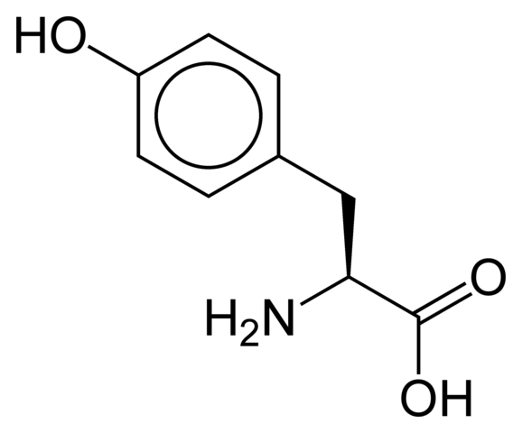

For months I have hesitated to post about this topic, because it is something I don't understand. In late 2008, I began to get a noticeable amount of gray hair. Not just on the sideburns, but throughout my hair. I wasn't alarmed. I fully expected it. I was at that age where all my friends were getting gray hair. Personally, I couldn't care less if and when I get gray hair. I'm just fortunate to have a thick full head of hair, which many men don't have at my age.

Then something happened. My diet changed. I lower my carbs - mostly by eliminating grains. I also stopped cooking with highly inflammatory vegetable oils. I was too busy watching my abs come in to see that the gray hair was slowly going away. Today, I have noticeably less gray hair than I did in 2008. And until this afternoon I didn't have a clue why.

Jimmy Moore just posted [Dr. Luan Pho: Gray Hair Isnt A Sign Of Old Age But A High-Carb, Low-Protein Diet](https://web.archive.org/web/20180805150448/http://livinlavidalowcarb.com:80/blog/dr-luan-pho-gray-hair-isnt-a-sign-of-old-age-but-a-high-carb-low-protein-diet/13437). In this guest blog post Dr. Pho states:

> Regarding gray hairs, this happens when your body is unable to synthesize an adequate amount of melanin. Melanin is the pigmentation that gives your hair its natural color. **In order to make melanin, your body needs a specific non-essential but yet conditional amino acid called tyrosine.** Your body also needs tyrosine in order to make dopamine, norepinephrine, epinephrine, coenzyme Q10, and thyroid hormones. The availability of the needed amount of tyrosine may become deficient due to an incomplete diet low in protein.
> 
> As you probably already know, amino acids are the basic building blocks of proteins. There are nine essential and eleven non-essential amino acids. Essential amino acids are synthesized into non-essential amino acids. This fact highlights the delicate balance as to how dietary protein intake acts on the supply of both the essential and non-essential amino acids. **Therefore, consuming an adequate amount of protein and supplementation with tyrosine may be the answer to keeping your natural hair color longer.**

Tyrosine, where I have heard that before?

A year and half ago after I finished reading the book [Primal Body, Primal Mind](/2010/07/primal-body-primal-mind/) by Nora Gedgaudas, I reached out to the author with a question on how I could start a coffee detox protocol. She suggested that I take the supplement L-Tyrosine on an empty stomach to curb my craving for the stimulate effect. And I did. These days I consume almost 30% less caffeine than I did back in 2010.

Did my coffee detox experiment trigger a side effect of reversing gray hair? Or was a result of embracing a more Paleo diet? Or something else? Beats me. I'll be sure to tune into the podcast interview with Dr. Pho on April 4th.

_L-Tyrosine_

**UPDATE (September 2013):** [Reversing Gray Hair? Part 2](/2013/09/reversing-gray-hair-part-2/)

---

## Comments

### Steve
*February 24 at 2012 at 1:39 AM*

I noticed a similar effect on the whiskers of my cheeks. My beard was turning greyish white, and about the same time I changed my diet to about 90% Meat - Something I continued with for 11 months. I usually shave my beard so it took a while for me to notice the that the grey was going. I must have left the beard to grow for a week or so, because I distinctly remember my surprise at noticing the grey had gone. Not completely, but very noticably! These days I only sport grey on my chin.  I wonder though, Melanin is the pigment in the skin. If you can't produce enough due to lack of Tyrosin in the diet, wouldn't that make you more susceptible to skin damage/cancer?

---

### MAS
*February 24 at 2012 at 3:19 AM*

@Steve - Looks like you are correct. 
http://www.ndhealthfacts.org/wiki/Tyrosine#Deficiency_Symptoms
"predisposition to skin cancer due to a lack of melanin"

Interesting about your beard. Another thing I didn't mention above is how some people believe copper supplementation helps. The #1 food for copper is beef liver. That is a food I now eat weekly, but never consumed it back in 2008. The plot thickens.

---

### Ashley
*February 24 at 2012 at 1:13 PM*

The first thing that comes to mind when I read this is all those slender, otherwise healthy looking vegetarian/vegans who are always rocking a full head of grey hair. I'm thinking yoga instructors and those yuppies who spend hours at the salad bar and supplement section in Whole Foods. Their slim and health conscious-but ALL grey. A lot of the time their hair seems to be frizzy, too. 

Another 'point' for the meat eating camp! :)

I've never tried beef liver, how do you prepare it??

---

### MAS
*February 24 at 2012 at 3:33 PM*

@Ashley - Interesting comment about vegetarians. I'll look for it. I tend to think of gray hair as universal. 

As for liver, you can start by making pate, which many people find enjoyable. Another idea is to slip it inside chili or meat loafs. 

If you like the taste of liver, use this recipe I did for beef kidney. They have similar tastes.

https://criticalmas.org/2012/02/beef-kidney-with-mushrooms-and-garlic/

---

### Roberta
*February 24 at 2012 at 6:56 PM*

I can't say I've noticed much difference in grey hair, but then it's usually covered with toxic dye. 

Any thoughts on beef vs chicken liver (both from farmer's market pasture raised animals).

---

### MAS
*February 24 at 2012 at 7:00 PM*

@Roberta - Everything I've read suggests that beef liver is nutritionally superior to chicken liver.

---

### Roberta
*February 24 at 2012 at 7:01 PM*

Thanks, Beef liver scares me, but maybe if I hide it in pate with lots of bacon I'll survive.

---

### MAS
*February 24 at 2012 at 7:03 PM*

@Roberta - It took a few times before I got used to and eventually enjoying beef liver. The first time I had beef liver since childhood it had almost a drug like effect. The next day I went to the gym and had tons of strength.

---

### thomas
*February 24 at 2012 at 9:08 PM*

Please write post if you come across any credible supplementation to regrow hair.  I've tried everything from rogaine to horse shampoo; nothing works.

---

### MAS
*February 24 at 2012 at 9:23 PM*

@thomas - Danny Roddy is considered an expert in the nutritional field on the topic of hair loss.

http://www.dannyroddy.com/book

---

### shane
*February 25 at 2012 at 4:09 AM*

my woo meter is hitting red for this post. 

there is so much money behind hair growth/loss. it is the golden goose. reversing gray hair has twice the market.

my anecdotal evidence has shown that gray hair forms with age. oh and genetics also plays a part.

my diet is fine, i eat a ton of liver, and i'm getting grayer by the day.

---

### Aaron
*February 25 at 2012 at 5:28 PM*

Shane,
    Woo meter?  MAS is just sharing his experience noticing he has less grey hair now than a couple of years ago.  
     Take what you want from it, but I'm glad people write about their thoughts and tinkerings with this kind of lifestyle.

---

### MAS
*February 25 at 2012 at 5:37 PM*

@Shane and @Aaron - 

My thoughts are that each individual has 2 "gray dates". The earliest and latest dates that person could go gray. My guess is the doctor can't reverse gray once that person is past the latest date, but he probably has techniques for delaying the earliest date. That difference may be years or a decade. I doubt it is more than that. Still a cool thought though.

---

### Becca
*February 26 at 2012 at 12:37 AM*

This is awesome.  And another potential reason to love the paleo diet :)

---

### shawn
*February 26 at 2012 at 5:33 AM*

I have recently found that the best way to prep liver is to marinate it in lemon juice and water for 4 to 6 hours. It comes out so tender! 

I've been paleo for about a year with great results but still have the gray hair slowly coming in. Maybe I will try some supplementation.

---

### MAS
*February 26 at 2012 at 5:35 AM*

@Shawn - Thanks for the liver idea. I'm heading to the Farmers Market tomorrow to buy some more!

---

### garymar
*February 26 at 2012 at 6:22 AM*

I just had a thin piece of liver this morning. Pan fried in ghee for 2 minutes until only the middle third was still red, smothered in fried onions and lotus root, little bit of butter on top and of course some fresh kimchi on the side. Also salty miso soup to top it off.

The strong flavors of liver require a strong supporting cast!

---

### MAS
*February 26 at 2012 at 4:37 PM*

@Garymar - I haven't tried ghee, but I will next time. I added your tip to the post I released this morning. 

https://criticalmas.org/2012/02/beef-liver-asparagus-garlic/

---

### Glenn
*February 26 at 2012 at 6:22 PM*

Good post - thanks!
I'm 47 and have had about the same amount of grey for the past 15 years - about 5 to 10% of my hair is grey. 

The weird thing is that the amount of grey fluctuates. What I think happens is some grey hair falls out and is replaced by my original mid brown hair color. I can accelerate this by vigorous brushing with a high-quality metal and rubber hair brush.

Over the past 2-3 years of 90% pure paleo, I've even noticed new hair growing in new places on my forehead.

BTW - There is "male pattern baldness" on both sides of my family...

I do eat *a lot* of animal protein (mostly meat and offal) plus sporadic doses of branched chain amino acids and also broad spectrum amino acids.

It's been fun to watch my younger colleagues in their early 30s catch up to me with their incipient grey hair...

---

### MAS
*February 26 at 2012 at 6:48 PM*

@Glenn - I too have added BCAA in the past year. Maybe it too has a role? Although my money is on the tyrosine, offal and consuming a low inflammatory diet. 

Perfect Health Diet linked to this story about young women today going gray in their 20s. The story speculates that oxidative and emotional stress might be the reason. Also said in the article:

<blockquote>‘Similarly, some studies in humans have shown that certain B vitamins taken in large doses can begin to reverse the process of greying.’</blockquote>

What food is a great source of B Vitamins? Beef liver. 

http://www.dailymail.co.uk/femail/article-1368239/Why-todays-women-going-grey-25.html

http://nutritiondata.self.com/facts/beef-products/3469/2

---

### chuck
*February 27 at 2012 at 1:16 AM*

MAS:

Are you still taking tyrosine?

---

### MAS
*February 27 at 2012 at 1:17 AM*

@Chuck - Yes, I started back up a few months ago as a test to see if it improved mood. It actually does help a little.

---

### Joey
*February 28 at 2012 at 4:20 PM*

The grey is "caused" by bleaching from hydrogen peroxide, naturally produced in the follicle.  The enzyme catalase neutralizes the hydrogen peroxide, until we run out, which occurs naturally with ageing (and perhaps environmental stress, etc)

So if you can figure out how to increase your catalase levels, then cha-ching!

http://www.seeker.com/dnews/

---

### Alex
*March 7 at 2012 at 4:24 PM*

MAS, just out of curiosity, how much tyrosine are you taking?

---

### MAS
*March 7 at 2012 at 4:29 PM*

@Alex - 500mg on an empty stomach in the AM. I may need to increase that depending upon what we learn on the upcoming podcast. 

Even if it does nothing for hair, it does improve mood. I tend to find 99% of supplements useless. This one is an exception.

---

### Chris
*June 25 at 2012 at 5:30 AM*

Beef liver is good....but lamb liver is the #1 source for copper!

---

### MAS
*June 25 at 2012 at 11:10 AM*

@Chris - Good to know. I recently had some Icelandic sheep liver. It tastes better than beef liver - even raw.

---

### Michelle
*December 1 at 2012 at 8:54 PM*

I am a vegetarian, and I eat plenty of carbs. My hair was going very gray until this summer, when it started gradually getting darker. No change in diet.  So what happened?  I have an auto-immune disease that seems to have gone into remission.  I always take lots of supplements and eat lots of greens. No meat, no low-carb.    I don't think it has to do with carbs as much as the type of carbs. Processed carbs like most Americans eat are really bad for you.  So is meat, it's really hard on the kidneys.    I wouldn't touch liver with a ten-foot pole, it's the part of an animal's body that filters out toxins...and they feed most of our cows trash nowadays, like leftover candy and dead animal parts, stuff cows shouldn't eat. Plus cows are so stressed that they are flooded with stress hormones when they are killed.  Not good for you either.

---

### MAS
*December 1 at 2012 at 9:17 PM*

@Michelle - Toxins are stored in fat, not in the liver. I source my liver only from 100% grass pastured animals. As for the gray hair, I really don't know. After listening to the Dr. I quoted above in the podcast, I sort of lost faith that he knew what he was talking about.

---

### Vivian
*August 25 at 2013 at 7:16 PM*

Interesting that I came upon this blog. I actually have become vegan and have been aiming for 100% raw foods, I'm not there yet, dinner usually has some cooked vegan foods. 

What I find interesting is that my grey hair is going away and coming back as my normal deep dark brown color.

---

### Daniel
*September 8 at 2013 at 8:28 AM*

Tyrosine is the key element in reversing gray hair. An accidental finding in imatinib receivers proved this. Imatinib is an anticancer drug, working through tyrosine kinase inhibiting. They noticed that patients on this drug regained their hair color after 6-7 months. Some of these patients were over 60! So I think that increasing tyrosine itself may also have the similar effect. By the way, spinach is a good source of tyrosine for vegs and those who dislike animal-drived proteins.
Cheers!

---

### MAS
*September 9 at 2013 at 5:21 PM*

@Daniel - Thanks for sharing. I started to suspect it was copper, so I stopped taking L-Tyrosine and took copper daily. The result was the gray slowly started returning. So starting yesterday, I resumed L-Tyrosine. We will see.

---

### Daniel
*September 9 at 2013 at 7:18 PM*

@MAS. Thanks for your personal experience. Keep us updated. I'm working professionally on the hair health (gray hair, androgenic alopecia), trying to find a cure. Don't forget using selenium and Zn supplements, either.
Regards

---

### MAS
*September 10 at 2013 at 1:38 AM*

@Daniel - I used your comment in a follow-up post. 
https://criticalmas.org/2013/09/reversing-gray-hair-part-2/

thanks!

---

### Pete
*October 9 at 2013 at 3:19 PM*

There are 4 key ingredients in reversing grey hair. 
-Tyrosine the precursor to the pigment melanin . higher levels of hydrogen peroxide that occur as a result of lower levels of catalase result in lower levels of tyrosine as well inhibiting its ability to produce melanin. The reactivity of the catalase is improved by the presence of tyrrosine which can assist in the oxidation of the Fe(III) to Fe(IV). 
*Copper helps produce melanin and Tyrosinase is a copper-containing enzyme present in plant and animal tissues that catalyzes the production of melanin and other pigments from tyrosine by oxidation
*PABA is typically known as the hair color vitamin. It has been used to treat Vitiligo, a condition where patches of skin lose color. 
*Catalase , which breaks down the hydrogen peroxide which cause grey hair.  When eating foods that contain catalase, your body reduces it to its component amino acids before absorbing them, that is why catalase pills do not work efficiently.  People tend to put onion juice which contain catalase on their scalp which is also absorbed by the skin. Mollasses also has shown some results as it contains both PABA and copper amongst others.

---

### MAS
*October 9 at 2013 at 5:58 PM*

@Pete - Thanks for the info. To be clear, you aren't suggesting one us molasses topically?

---

### Graham
*January 31 at 2014 at 5:29 PM*

Guys, the only reason I am posting here is because I came across you all in a google search.  I have noticed that my grey hair around the temples is reversing and becoming brown again. The major change to my lifestyle has been a switch to a vegan diet.  I was just googling to see if there is any link at all.........

---

### MAS
*January 31 at 2014 at 5:56 PM*

@Graham - Interesting. What foods have become your staples since going vegan?

---

### Bill
*February 8 at 2014 at 5:56 AM*

I, like Graham, noticed that the hair on the top of my head is getting darker. My hair was actually quite white but it is returning to it's natural color. I am 66 years old and became a vegan with out reined oil two years ago. Besides losing 45 pounds in 2 years, I have also noticed other effects, especially to my skin. I have lost many moles that my doctor told me were precursors to skin cancer. I have also been able to get off two blood pressure meds I was on and need no statin drugs because I eat none and my cholesterol tests normal now. I ate lots of meat, eggs and cheese before becoming a vegan and seemed to be losing my health, which, happily I have now regained. This could all be a coincidence but it does seem to be related to giving up animal protein and fat. I am certainly not complaining, just puzzled.

---

### Caroline
*April 22 at 2014 at 8:17 AM*

Thank you for a really interesting post, I was doing some research on grey hair after reading about hydrogen peroxide and grey had and taking a closer look at my own hair it has turned very grey sooner then what I would have expected, especially seeing my mothers hair not turning fray till about 50!

 have a question/comment, so I am definitely the thin not much meat eating, yoga practising type mentioned above but my question/comment is apart form that, I have been using a whole lot of teeth whitening products containing a lot of hydrogen peroxide. I am just pondering if this has affected my hair in terms of greying and if anyone else has any idea about it?

I am definitely going to try the L-Tyrosine and Copper and al to of Foie Gras and liver pate! :)

Thanks again for a grate post!

---

### MAS
*April 22 at 2014 at 4:36 PM*

@Caroline - There doesn't seem to be much information or a consensus n this topic. We are all self experimenting and sharing ideas. The upside is that even if our hair still goes gray that copper is good for heart health and L-Tyrosine has its own benefits as well. 

This post was written 2 years ago. Here is a 2014 update.
https://criticalmas.org/2014/02/experiments-update-sleep-gray-hair-tight-neck/

---

### Steve
*May 28 at 2014 at 7:10 PM*

I am 62 and was almost totally gray. i had shifted to a heavy vegetable and some chicken diet. Lost 20 pounds, but the hair continued gray- no worries-I looked great! Then I started lemon and hot water instead of coffee in the morning and coconut oil (unrefined virgin) twice a day.Now I am a calico cat with brown hair coming back in like crazy. Really strange and a shock to some. Is this normal?

---

### MAS
*May 28 at 2014 at 11:19 PM*

@Steve - I have read a few places that applying lemon juice to the hair can delay or reverse gray. But I didn't know consuming it could have an effect.

---

### Michelle
*June 1 at 2014 at 2:56 AM*

I found this conversation using google and wanted to share in the hopes it helps someone.
I have found that Virgin coconut oil which you can cook with or just take a little raw (acquired taste) in association with castor oil ( apply to any lymph node, ie; inner elbows ) has caused my hair to revert back ( mainly) to it's natural colour and has also sprouted so much new (baby soft ) hair to start growing in places it had long since disappeared from. 
My 27 year old son (unfortunately having his fathers reseeding hairline ) has started the same regime and hey presto his hair is also coming back.
A table spoon of coconut oil a day. A dab of castor oil on two lymph nodes a day.

---

### john
*October 7 at 2014 at 2:08 PM*

Dear Danny Roddy  l am going gray  howdo l reversing the gray do l take L-Tyrosine pills the strongest   in the pills what should l do for the best l am bald too what can l do to bring back  all my hair back  as l want it my dark brown hair back what pills do l take your book hair like a fox can you send it to me free if possible  what can l do to reversing  the balds please tell me l must know thankyou .

---

### Keith
*January 18 at 2015 at 5:16 PM*

On December 25, 2014, I began taking, for the first time, 500 mg of Tyrosine, and 2 mg of Albion's Ultra Chelated Copper. The Albion copper has been scientifically shown to absorb into the intestine. I will see what happens. How long did it take for the Tyrosine to reverse some of your grey hair?

---

### MAS
*January 18 at 2015 at 7:26 PM*

@Keith - I don't recall, nor do I know for certain it was the Tyrosine. This is something that happened when I wasn't paying attention.

---

### Keith
*February 10 at 2015 at 5:30 PM*

This is an update on my consumption with the Albion Chelated Copper, and Tyrosine. As I previously stated, I started to take both products on the 25th of Dec., 2014. However, at that time, I was taking the Tyrosine with food! I should have known better, so for about three weeks now, I have been taking Tyrosine on an empty stomach. I'll see! Everything is still in the nonage stage, so I will have be patient for a bit.

After reading some of the older comments on this page, it seems that  Tyrosine may be the way to go. The comment about Imatinib was fascinating. ☺

---

### Laura
*February 19 at 2015 at 5:17 PM*

I guess I'll throw my two cents in here too. I completely overhauled my diet a year ago. I eliminated all grain, eat only veggies, fruits, nuts, chicken, sardines, salmon, occasional beef and pork and only use coconut oil or olive oil. I have dropped 40 pounds, going from 180 to 140 with no increase in regular activities. I'm 54 and have seen about a 50% reduction in grey hair. I also use coconut oil to oil pull from my mouth before brushing my teeth with baking soda and hydrogen peroxide. I  drink a couple tablespoons 3 times a day of what I call my magic tonic, which consists of 1 cup filtered water, 1/2 cup of local raw honey, 1/2 cup of ACV raw with mother, 1/2 tsp. of ginger and cayenne powder between meals. My increase in energy is remarkable.  I was diagnosed with low stomach acid and started a regimen of HCL with Betaine after meals. I now only have to take it if my meal consists of a lot of animal fat. What has caused the reduction in grey hair, I have no idea, but it is a pleasant surprise.

---

### Petra
*March 20 at 2015 at 9:51 AM*

Hello everyone, it was really interesting to read all your posts.
I trust Indian herbal medicines and always Google if I have any health issues.
The Indian people use castor oil for regrowth of hair, and I will start trying it shortly too. About grey hair I believe stress is the main factor in life!
Live a healthy life style and get your blood checked regularly with your doc.
To see your hormones level as it plays a role to with your body.

---

### Harry
*April 17 at 2015 at 3:26 PM*

I am aged 66. I used liquid Copper and liquid Zinc supplementation from ancient plant sources for six months now (Cu/Zinc should taken in the ratio 1:10). My diet has been raw fruit &amp; veg, nuts, seafood and fish since two years.  Since Iron is an antagonist to copper, I've also started donating blood since six months. My hair was going grey but has slowed down, I also don't get colds anymore.  There's a lot of stress in my work due to quantity but my energy level is up and I'm running 2-5km most days. I'm now testing L-Tyrosine but stress reduction will remain a priority.

---

### MAS
*April 17 at 2015 at 3:45 PM*

@Harry - Thank you for sharing your experiment. I hadn't thought about the blood donation angle. Since 2010, I've been donating every 8 weeks.

---

### silver
*May 5 at 2015 at 1:55 PM*

Grey hair is related to the condition of your adrenals and kidneys in oriental medicine (i.e. Five Elements theory). Remember the stories of how someone's hair turned grey overnight from some tragedy or severe stress.... the flavor associated with the kidneys (water element) is "salty."  Each organ has a flavor.  A friend of mine, with a full head of grey hair in his early forties, went on a macrobiotic diet  and eliminated salt for a number of months...the roots of his hair came in dark brown everywhere. Minerals are tonifying for the kidneys...many times we crave salt as a substitute for minerals...thus aging our adrenals. Minerals are deficient in our  drinking waters and affected by fluoride poisoning.  Stimulants age our adrenals and kidneys. So when a person eliminates stimulants...their kidney/adrenals get rest and are able to produce hormones required for healthy hair and body. Regeneration.  When someones hair is regrowing from 'coconut oil' that has to do with thyroid. When grey hair is reduced from B vitamins...this has to do with absorption in the intestinal function.  Everyone's results for reduction of grey hair can be explained with in depth nutritional understanding...it's not what you ADD to your diet many times....but what you eliminate from your diet that makes the difference.

---

### silver
*May 5 at 2015 at 2:00 PM*

Also...too much protein can exhaust and age the kidneys.  That's why some people regain dark hair after becoming vegan or vegetarian. Kidney function is individual...some people need high protein...some people need no 'meat.'  Meat contains blood and blood is very salty.

---

### MAS
*May 5 at 2015 at 2:14 PM*

@Silver - Thanks for your comments. Do you think salt is bad if the body is getting sufficient minerals?

---

### silver
*May 5 at 2015 at 7:30 PM*

Salt is good...high quality salt like Celtic Sea salt or Tamari or seaweed for minerals and salt. .  Processed salt ...no.  Also salt needs are individual. You can reboot your body by going without salt for awhile as long as you're getting minerals. Then see how much salt you really need to feel good. If you start craving sweet...then your salt intake is too high. Sometimes people crave salt because they have deficient iodine...so get some iodine drops or seaweed.

---

### jack
*May 16 at 2015 at 11:42 PM*

Can genetics grey hair reversed or cure or slows down when we eat alot of food that helps to produce pigmants to the hair??? Im only 13 having some grey hairs its really weird can anyone help Thx..

---

### jack
*May 16 at 2015 at 11:45 PM*

I mant by eating the food that helps to produce more pigments by eating daily

---

### MAS
*May 17 at 2015 at 2:18 AM*

@Jack - That is the question this post is asking. 

@All - I'm closing comments on this blog post as there is a Part 2.
https://criticalmas.org/2013/09/reversing-gray-hair-part-2/

---

