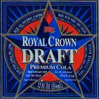

I've only been doing [High Intensity Training](/2011/02/high-intensity-training-at-ideal-exercise-of-seattle/) for a little more than a year now, so I am far from an authority on the topic. Before I became a believer in the effectiveness of HIT, I really didn't pay much attention to its supporters or detractors. However, in the last year, I've read numerous fitness articles and comments on the Internet attacking HIT. Now I'm just a regular person. I'm not a personal trainer and I don't have a client list to prove to anyone anything. What I've discovered in the past year is that HIT is highly effective for me. I did it the other way for 16 years. In my N=1 experiment, High-Intensity Training is superior to traditional weight lifting or explosive training. I'm not saying HIT is superior for everyone - just for me.

### Is Coca-Cola Better than RC Draft Cola?

One of the things I constantly read from fitness "experts" is how HIT is flawed because they see better results with clients that don't follow a High-Intensity Training protocol. They say this as if it is proof that HIT is less effective. For starters, I don't discount that statement is true. But it is not for the implied reason. Way more people are exposed to traditional weightlifting protocols than HIT. I'd be surprised if HIT made up 1% of all strength training. It only makes sense with that huge of an advantage that non-HIT trainers would have a greater pool of successes. Also, those athletes that respond well to classic strength training are going to be less likely to give it up and embrace HIT. So we don't know if they would do better or worse on HIT, what we know is they aren't going to be as motivated to switch. Back in the mid-1990s, I was still drinking cola. I preferred Coke over Pepsi. One day I spotted RC Draft Cola and tried to recall if I liked it as a child. I wasn't sure, but I was willing to give it a try. The taste blew me away. It was superior to Coke, probably because it used raw cane sugar and no high fructose corn syrup. For a few months, I recall telling friends and co-workers about RC Draft Cola. With one exception, I don't think anyone tried it. Coke was working for them, why should they seek out a far less popular cola option? I was able to get one die-hard Coke fan to try it and agree with me.  The fact way more people prefer Coke to RC Draft Cola isn't proof that Coke is superior. And the fact the majority of elite athletes don't use HIT isn't proof that traditional strength training is superior.

### Measuring Failure

Just as Coke has far more fans than RC Draft Cola, more people have quit drinking Coke than have quit drinking RC Draft Cola. The same is true for strength training. There are far more lifters that quit or got injured doing traditional weight lifting than High-Intensity Training. Popularity cuts both ways when it is used as a metric to measure efficacy.

### Try Both

Instead of repeating the same old arguments for and against HIT, why not just try it for yourself? Seek out a top trainer in your area and schedule a workout. I thought I understood intensity after reading Body By Science and watching a few videos online. I didn't. After my workout at Ideal Exercise, it all clicked. _UPDATE (Feb 4, 2012): I changed the title of this post to be more descriptive._

---

## Comments

### thomas
*February 5 at 2012 at 1:58 AM*

I recently did a HIT workout and was so exhausted I had to lay down for about 20 minutes.  My heart rate was 150bpm, unusually high for a weight-training for my routine at least.  I basically did 5 HIT exercises in succession and after about the fifth exercise I felt woozy and out of breath.  

I felt worse than if I had to sprint and suddenly stopped.  Was that a good thing or a bad thing?  Was I straining my heart rate part of the program or am I doing HIT wrong.  Also what are the results in terms of immediate growth in your experience, ceteris paribus (i.e. all things being equal).  

On a side note, I am reading "Fault Lines" by Raghuram G. Rajan which is an excellent book on the current state of the economy.  You should check it out.

---

### MAS
*February 5 at 2012 at 2:34 AM*

@thomas - Sounds like you did it right. After my first workout I had to take a nap. Body By Science goes into the metabolic pathways if you are interesting in learning why a super slow movement can wind you as much or more than sprinting. 

I just put Fault Lines on hold at the library. Thanks for the tip.

---

### MAS
*February 5 at 2012 at 2:47 AM*

@Thomas - Forgot to answer the other part of your question. I estimate that I gained 5 pounds of muscle doing HIT in 2011. Considering I'm an ectomorph that started lifting in 1994, this is significant. It was my best year in terms of gains since 2001-2002.

---

### Alan
*February 5 at 2012 at 3:18 AM*

MAS,

In your opinion is HIT safer than Traditional Weight Training.  Having a bit of a back problem, I would not want to aggravate it.  I did something and aggravated my back in Oct. 2011 and struggled for two months.

---

### MAS
*February 5 at 2012 at 4:09 AM*

@Alan - Absolutely. SuperSlow on machines is very easy on the joints. This year I left better than any year since I started weight lifting.

---

### Gman
*February 6 at 2012 at 7:57 PM*

Real simplified HIT workout:

Lower/mid body:   sprints
Upper/mid body:   either pushups or military press

---

### Karl
*February 7 at 2012 at 2:39 PM*

MAS,

I'm completely with you here. HIT training is great. That hasn't prevented me from experimenting around the edges- I found that I like adding some barbell training here and there, but the bottom line is that BBS has worked better for me than anything else I've ever tried. That it only takes 15 minutes is an amazing bonus.

What I've seen is that people are usually pretty interested in what I do, but most still feel like it must be some kind of scam or that I'm a genetic outlier. To that latter point I can only laugh. I'm about as hard a hardgainer as you can be.

Karl

---

