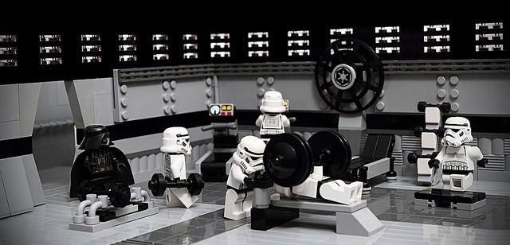

A month ago I reviewed the body weight exercise book [You Are Your Own Gym](/2012/02/you-are-your-own-gym/) by Mark Lauren. Now for the most part, I liked the book. By avoiding the most dangerous exercises, you could design an effective Tabata, HIT or HIIT workout. However, there was one paragraph in the book that made me cringe. From page 40:

> I've visited hundreds of gyms in my career. And the proof is in the pudding. I look at the people there. Then I look at my SpecOps troops. The difference is night and day. And you can achieve this difference with an amazing small sacrifice of your time. I mean, who cannot really find the time or willpower to workout for 20 - 30 minutes, four or five times a week, and completely change their life?

As a fitness enthusiast and former member of military, what didn't I like about his quote?

1.  As I stated in the post [The Problem With Boot Camp Training](/2012/01/the-problem-with-boot-camp-training/), there is heavy selection bias in the military. They only take young healthy individuals who pass a battery of medical tests before they can ever step foot onto a military base. What super trainer Mark isn't seeing are all the rejected candidates. In fact, he wasn't even working with normal military selection bias. He was working with candidates that made it to an elite military school. The soldiers that make it to Special Operations are some of the most resilient people on the planet. It would be hard NOT to get results from them.
2.  There is no selection bias in commercial gyms. If you can pay, you can join. Everybody you see in a commercial gym in a unique individual. They vary in age, in health and in skill. Those are factors military trainers do not have to address, as every candidate they get has been vetted extensively that they are fully capable of engaging in military training prior to the first workout.
3.  Soldiers are paid to be in shape and show high levels of motivation while doing it. Civilians don't get money when they workout. Financial incentives are real and can not be ignored.
4.  Soldiers train to be in top shape to reduce the risk of getting injured or killed in a battle that takes place during their enlistment period. What motivates members in the gym varies wildly. I don't engage in balls-out training, because one of my goals is to not destroy my joints so that I can extend great health well into old age. If I knew I was going into combat in a month, I might change my training program. But I'm not and neither are most gym members, so we approach exercise from different motivations.
5.  I do not workout for 20-30 minutes 4-5 times a week. It has nothing to do with time or willpower. It has to do with being ineffective. That volume of training is too much for me. I could never recover fast enough to complete the next workout safely. My results improved when I traded duration for intensity. I'm in far better shape doing [one 10 minute HIT workout every 5-7 days](/2011/11/escaping-the-glitter-taking-high-intensity-training-outdoors/) than when I did longer more frequent workout sessions.
6.  Mark implies that with a _small sacrifice_ people at any given gym can get into SpecOps shape (_"achieve this difference"_). I don't think so. By the time you've made it to an elite military school, you've already demonstrated you are _Genetic Gold_. The typical person isn't. A solid exercise program can bring an individual closer to THEIR POTENTIAL, not necessarily the potential of an elite soldier.
7.  I have an issue with the "_people lack willpower_" argument. I think they give up when they fail to get expected results. If they define realistic goals, design a safe and sane program, and see themselves progressing, they will often find the willpower to continue. If you fill their heads with fantasies of being in _SpecOps shape_ following a program that doesn't let their body recover - because they aren't _Genetic Gold_ - they will lose willpower. And I don't blame them.

I agree with Mark that exercise can change your life. We just disagree on the expectations. We all can't be Rambo and that's OK.

_[Photo](https://flic.kr/p/9pbzs7) by W\_Minshull_

---

## Comments

### Karl
*March 22 at 2012 at 4:32 AM*

Great points. Mistaking a good physique for training ability or knowledge is a very easy thinking error to make. It's also really tempting to attribute your own success to hard work, even if it was really luck or genetics. If you've ever had a chance to compete with or against a truly world class athlete, you know how ridiculous it is to think that the only difference between you and them is that their training is somehow better. They may as well come from a different planet.

I also couldn't agree more on the lack of willpower point. I spent years feeling like I needed to work out at least every other day, but never really getting anywhere because I would always stop after about 2 months. It never occurred to me, before first reading DeVany and then BBS, that I had the completely wrong idea of exercise. Success and progress makes it a lot easier to have willpower.

---

### Thor
*March 22 at 2012 at 11:28 AM*

Great analysis. There is a selection bias though --- gyms are full of people who (a) feel guilty because they are not fit enough, but dont really know what to do, and (b) want to buy fitness with money.

---

### MAS
*March 22 at 2012 at 4:14 PM*

@Karl - Thanks. I was going to really expand the idea in point #8, but the post was getting too long, so I'm going to save that rant for another day.

@Thor - Good point. I thought about that, but then decided the decision to become more fit and doing something about it is a baseline selection bias.

---

