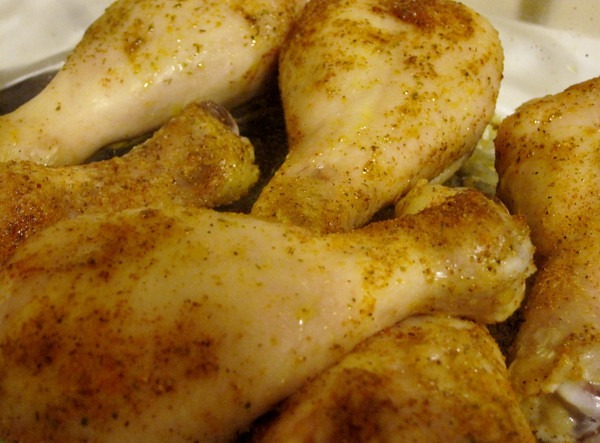

_Trader Joe's_ sells packages of organic chicken drumsticks for about $3.30. That yields two meals. This week I made the absolutely best chicken drumsticks I've ever had using a Cajun Seasoning spice sent to me by Aviva, who lives in the New Orleans area. This Cajun Seasoning spice blend includes salt, garlic, red pepper, paprika and green onion. This meal is silly simple and at $1.65 per portion, it is also very affordable. And I used organic chicken. If you decide to use conventional chicken you can make this dish for under a $1.

1.  Preheat oven to 375F.
2.  Pour some olive oil or melted butter on thawed chicken.
3.  Add Cajun Spices to the chicken. You can rub it in if you like.
4.  Put chicken in oven. Let it go 10 minutes and then drop the heat to 350.
5.  My oven takes about 30 minutes before the internal temperature of the chicken hits 160 degrees.
6.  Remove from oven. Let it cool for a few minutes and then serve.

My side dish was steamed broccoli with a little butter.  _Cajun Chicken Drumsticks_

---

## Comments

### Becca
*March 26 at 2012 at 2:14 AM*

gotta love it when you can be healthy AND affordable!

---

### aviva
*March 26 at 2012 at 9:29 PM*

So glad you put the spices to some good use. I'm curious to hear about your favorite of the bunch. Those look yummy, I'm most definitely going to make them.

---

### MAS
*March 26 at 2012 at 10:26 PM*

The one I used for this recipe was "Cajun Land". 
http://www.cajunbrands.com/store/p/111-Cajun-Land-Cajun-Seasoning-with-Green-Onions-15-oz-.aspx

---

### sheri
*March 31 at 2012 at 2:33 AM*

Gonna cook this up this weekend! Trying to get back with Paleo (as I've been a miserable failure at it this year so far). Starting small -- going gluten/wheat free this week. Day one, and already feeling better. Maybe if I'd stuck to it since the beginning of the year, I wouldn't have had the nasty head cold/allergies crap I've had going on pretty consistently :/
Also -- YAY, Glitter Gym stories again :)

---

### MAS
*March 31 at 2012 at 2:35 AM*

@Sheri - Some guy that is a dead ringer for an obese Dick Cheney just joined my gym. :)

---

### sheri
*April 3 at 2012 at 8:11 PM*

It was a HUGE hit!!! I almost didn't make enough for how fast it was going (14 legs for 3 people - we are oinkers!) and I did a side of steamed green beans. They said it was super-filling and didn't miss having bread with the meal :) Just wanted to say THANK YOU for posting these recipes ... up next: taco meatloaf, probably this weekend!

---

### MAS
*April 3 at 2012 at 8:28 PM*

@Sheri - As your comment came in I was eating leftover Cajun drumsticks. Glad you like the recipes. Hope to have more out this year.

---

