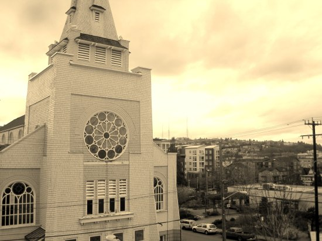

Maybe this is a Seattle thing, but everywhere I go I see this obsession with constantly being connected to the Internet. It is getting out of hand. I donate blood every 8 weeks and if you have an appointment it doesn't take long. Today while donating, the guy next to me starts this monologue how they should offer WIFI for the people donating blood. Really? You've got blood coming out of one arm for maybe 10 minutes. Is it really that important that must get online with your one free arm? Heaven forbid you should actually chat with your fellow donors or sit quietly alone with your thoughts. _Must get online!_ I really hope the blood people dismiss this idea. The last thing we need are [phlebotomists](https://en.wikipedia.org/wiki/Phlebotomist) troubleshooting network connections while carrying needles and pints of blood.  _This photo I took last Sunday has nothing to do with this post. I just wanted to share it. :)_

---

## Comments

### Jim
*March 10 at 2012 at 7:49 AM*

Related.
http://zenhabits.net/infoholic/

---

### MAS
*March 10 at 2012 at 3:19 PM*

Also:
https://criticalmas.org/2011/11/nicholas-carr-information-overload-2011-speech/

---

### Jim
*March 10 at 2012 at 4:51 PM*

MAS,
Your posts have inspired me to start giving donating blood this year.  In setting some broad goals for the year, I typically start with many big goals, and then prune them down to minimal few (almost comically) small goals that I might actually achieve.  So, in my "community service" category, I first thought about starting a charity, or maybe doing Habitat for Humanity.  Then, when scaling it back, I decided that giving blood 5 times this year would be easy, discrete, helpful, and I something I might actually do.  So, thanks for the inspiration to do my tiny part to help out.

---

### MAS
*March 11 at 2012 at 12:59 AM*

@Jim - I'd love to say that my donating blood was strictly coming from the heart, but that is only half of it. 

https://criticalmas.org/2010/06/the-selfish-case-for-donating-blood/

I need to do more goal posts.

Thanks for the nice comment.

---

### Alan
*March 11 at 2012 at 3:29 AM*

MAS,

Do feel fatiqued for several days after donating the blood?  I suspect you would not do a session of HIT the next day!

---

### Jim
*March 11 at 2012 at 3:41 AM*

MAS,
Yes, and for a while, many in the paleo-sphere were conjecturing that losing blood had other immune system benefits, as it would simulate loss of blood from a fight with a predator during the paleolithic era, a situation we were evolved to encounter.  
In any event, I think for many professionals, any hands-on charity work is partially for self-benefit, as the most "efficient" form of giving for anyone with a (relatively) high salary would probably be just to earn a bit more money in their given profession, and to donate it to an established charity.  Any hands-on type work is also for the good feelings created in the giver.  Just add blood mineral content to the list.

---

### MAS
*March 11 at 2012 at 3:41 AM*

@Alan - I don't feel at all fatigued after giving blood. I do recall the first few times I gave blood feeling very tired, but that was many years ago.

I always time my HIT to just prior to lifting, so I always have a few days of rest after donating.

---

