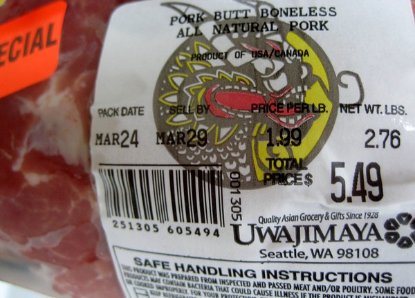
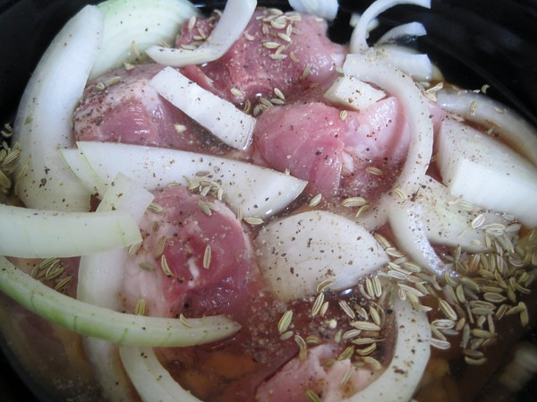

This week I made the recipe [Unbelievable Crockpot Apple/Onion Pork Butt](http://www.food.com/recipe/unbelievable-crockpot-apple-onion-pork-butt-471360). The only thing I changed in the recipe was I added fennel. It was cheap and tasty. Let me run the numbers.

-   2.76 pounds of pork butt = $5.76
-   1 onion = $0.40
-   1/2 can of apple juice concentrate = $0.75

Total cost was $6.91 and it made 4 meals for an average meal cost of $1.73. The time it took to chop the onion, load the crock pot with pork butt and top off with apple juice was 10 minutes. I prepped the meal mid-morning and it was ready by evening. It doesn't get much easier than that.

_Seems I didn't take a photo once it was finished cooking._

Even though I liked this recipe, I prefer using BBQ sauce to apple juice. I used conventional pork for this recipe. Had I ordered ahead of time and got pastured pork, the price would have been $4.59/lb. This works out to $13.81 for the entire crock pot or $3.45 per meal. Still cheap.

---

## Comments

### chuck
*March 31 at 2012 at 12:23 PM*

was that caraway or cumin in there?  slow cooker pork but is always a staple in our house.  easy, inexpensive, and always a lot of versatile left overs.

---

### MAS
*March 31 at 2012 at 1:08 PM*

@Chuck - Fennel, but I think caraway may have been a better idea.

---

### Becca
*March 31 at 2012 at 6:06 PM*

sounds pretty easy/affordable/delicious!  i wanna try it with the bbq sauce... do you just buy pork butt at the grocery store?

---

### MAS
*March 31 at 2012 at 8:12 PM*

@Becca - Yes. I was at an Asian Grocery store and it was on sale.

---

