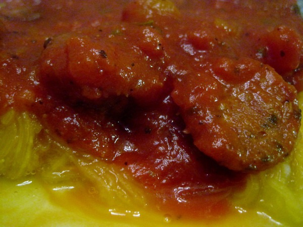

I've long since given up regular spaghetti. These days I use the spaghetti squash. I detailed my pasta journey in the post [Spaghetti Evolution The Road to Paleolithic Pasta](/2010/11/spaghetti-evolution-the-road-to-paleolitic-pasta/). This week I was inspired by a recipe online to swap out the ground beef for Italian Sausage. It turned out great, both as dinner and for leftovers the next day.

_Spaghetti Squash and Italian Sausage_

The only variation I did with the recipe is I now cut the spaghetti squash and scoop out the inner guts prior to baking. I found you can reduce the oven time down from an hour to 35-40 minutes. The downside to the fast method is I think it makes the result a little more watery. I'll keep experimenting.

---

## Comments

### Ali
*March 7 at 2012 at 4:25 PM*

Thanks for the link back! 

Italian sausage wins over ground beef in almost all casserole-type dishes for me. In fact, I made a breakfast casserole this week that called for ground beef and as I've been eating it the past couple days I just know Italian sausage would up the flavor experience tremendously.

---

### MAS
*March 7 at 2012 at 4:30 PM*

@Ali - Have you posted on your breakfast casserole?

---

### Becky
*March 7 at 2012 at 9:54 PM*

MAS, this is a comment about your previous post on headaches.  If you think your HA is caused by sinus issues, I recommend that you get some Alkalol and use it in your Neti pot. It is a very old remedy, essential oils, eucalyptus, menthol.  You mix it in warm water, or if desperate, you can use it straight up. It will really open your sinuses.  We cannot be without it at my house.  Some pharmacies carry it, but you should call around and see before you look.  Some leave it behind the counter since it is not a frequently purchased item.  Cheap, too, costs about $4 for a pretty large bottle.  If you can't find it locally, you can order off the internet.  It's miraculous for most people.

---

### MAS
*March 8 at 2012 at 3:35 AM*

@Becky - Thanks for the tip. I like cheap ideas. :)

---

