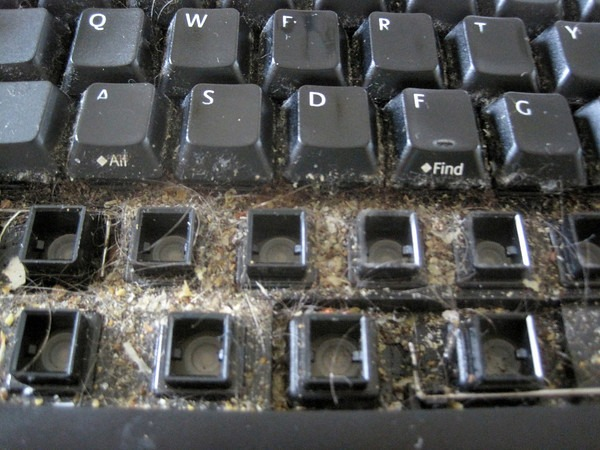

Today I did a task that I've been putting off for years. I cleaned my keyboard. Not the typical surface cleaning, but a proper full cleaning. In the past a keyboard would break long before it required a serious cleaning. Not anymore. I've had this one for probably 7 or 8 years.

First I unplugged the keyboard completely from the PC. Then I removed the keys gently and slowly using a butter knife. I placed them in a bowl with warm soapy water. I used Sal's Suds. Look under the keys. Yuck!

While the keys were soaking, I first took a can of air and blasted the region. That removed about half the crud. The rest required Q-Tips and rubbing alcohol. According to [HowToGeek](http://www.howtogeek.com/65073/how-to-thoroughly-clean-your-keyboard-without-breaking-anything/), only use isopropyl alcohol.

Once the base is cleaned, start rinsing and drying the keys. Then you can put the keys back. To make this task easier, I recommend taking photos of the keyboard layout before you start removing keys. It makes things easier. If you fail to do this, there are sites with images of a PC keyboard layout. Of course this requires a 2nd computer with keys that aren't soaking in a bucket.

Now my keyboard is brand new clean again. Good for another 7 years! :)

---

## Comments

### Ahrand
*March 30 at 2012 at 7:36 AM*

yuck indeed
But it does say something about you as a human in this world:
footprint, care, efficiency, non conform, ...

---

### MAS
*March 30 at 2012 at 12:22 PM*

Sometimes I put together a page that is unrelated to any other topic. I do it for my future self. Someday I'll need to clean my keyboard and I'll know that I put the instructions on what worked on my site. I won't need to find "that link" or remember which of the strategies worked and didn't work for my keyboard.

---

### c460053
*March 30 at 2012 at 3:13 PM*

Cleaning a keyboard is truly a tedious task. Buying a new one every so often is certainly an option, but not the best one by any measure. I came across an easy way to clean a keyboard over a decade ago on some random forum post: shower with it.

Today, I have 2 Apple Wired Extended Keyboards. Every 3 months or so I swap them, take the "dirty" one into the shower with me, give it a good suds and scrub, and then shake most of the water out. Afterwards, I prop the newly spotless one up over a vent or in front of a fan for a few days until completely dry. Then into the closet it goes until needed.

I've done this with $10 keyboards, $100 keyboards, ancient keyboards, modern keyboards, wired keyboards, and wireless keyboards. Never once with a problem. Nothing but great results. Most keyboards are built to be abused, beat on, and doused in beverages. They're much more resilient than you may realize. That being said, your mileage may vary.

Note: I'm *almost* certainly sure that you shouldn't try this technique with a laptop keyboard. Although, if you're in need of a very expensive paperweight, give it a shot.

---

### chuck
*March 30 at 2012 at 3:16 PM*

for fun, i take apart people's keyboards and put them back together in a slightly unproper manner.  it is quite entertaining.

---

### MAS
*March 31 at 2012 at 1:51 AM*

@c460053 - Showering with a keyboard. Brilliant. 

@Chuck - By accident I put the H in the wrong location. I caught my error before plugging it back it. Loved that video you posted today.

http://escapetheherdblog.blogspot.jp/2012/03/dont-let-average-influence-you.html

---

### Aaron
*April 1 at 2012 at 12:45 AM*

You need to stop using your keyboard as a placemat Bro ;)

---

