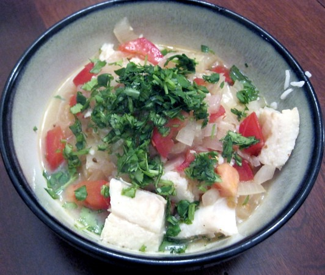

Now that I've conquered the [Gyro Meatloaf](/2012/03/the-gyro-meatloaf-recipe/), my number cooking priority is getting much better with Indian cooking. To date it has been the most challenging cuisine to cook. I love the Indian food that I get in restaurants. Not certain dishes, but every dish. After a visit to an Indian restaurant, I usually come home fired up and motivated to replicate what I just ate. I find what I think are equivalent recipes and do my best. However, although the end product tastes good enough to eat, it never wows me and often tastes nothing like what I had at the restaurant. Then I stumbled on the book 5 Spices, 50 Dishes: Simple Indian Recipes Using Five Common Spices. Instead of hitting you over the head with countless ingredients and steps, it goes straight to the basics. Before posting this review, I made two of the recipes in the book.

### Dish 23 - Lamb Meatballs in a Spicy Malabari Curry

Most of the dishes I've had at Indian restaurants have brighter colors. This one didn't. I feared I had screwed up the recipe right up until the moment I took a bite. It was amazing. This coconut milk based curry has a little kick. This was an Indian dish that I had never had before. It was a simple recipe that worked.  _Lamb Meatballs - Spicy Malabari Curry_

### Dish 34 - Baked Fish in a Spice Broth

I got a sweet deal on some cod, so I made this dish. Just like the previous recipe, it was a dish I had never had at an Indian recipe. It had less heat, but it took a boring piece of white fish and made it delicious.  _Baked Fish in a Spice Broth_

### Almost a Perfect Cookbook

The photos in the book are excellent. The directions are clearly written and as I've stated before, it takes a simplified approach to what can seem like a complicated process. My one compliant with 5 Spices, 50 Dishes: Simple Indian Recipes Using Five Common Spices is every recipe uses canola oil. Even a cracker like me knows Indians cook with butter, ghee and maybe coconut oil. Make that one switch and this book is great. 

---

## Comments

### Lena
*April 27 at 2012 at 12:38 AM*

Beautiful! I love coastal Indian food. Where'd you pick up the book?

---

### MAS
*April 27 at 2012 at 12:39 AM*

@Lena - Seattle Library, but Amazon has copies pretty cheap.

---

### TigerAl
*April 29 at 2012 at 6:19 PM*

Good for you, MAS.. let me know if I can help :)

---

### thomas
*April 29 at 2012 at 10:49 PM*

Regarding your diet, have you ever heard that people used to live to 100 regularly a thousand years ago due to a pure paleolithic diet.  I dunno what to believe; I always thought most of our ancestors only lived to 50 tops in general.  I figured if anyone knew if this is true it would be you.

---

### MAS
*April 29 at 2012 at 10:55 PM*

@TigerAl - Thank you for the offer. I am still looking for a Tikki Massala recipe that is straight froward and tastes as good as the restaurant. Everyone I've tried so far hasn't worked out. 

@Thomas - I have never heard of any culture regularly living to 100 years old. Average life expectancy was lower on average, but the distribution was much wider. A lot of deaths during childbirth and accidents kept the average lower than today.

---

### thomas
*May 2 at 2012 at 8:13 PM*

I have been jonesin' for Indian food for a few days since I have read your post.  I only eat Indian food about once/twice a year but am always amazed by how everything tastes not only wonderful but different from each other.  Often ethnic foods have one flavor that permeates all dishes, and although good not really brilliant like Indian food.  But maybe I haven't had enough Indian food to make a knowledgeable opinion.

---

### MAS
*May 3 at 2012 at 1:03 AM*

@Thomas - I have another Indian food post coming up soon. I made a killer Vindaloo.

---

