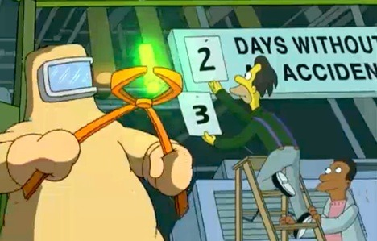

This is the third part of my series about exercise and fat loss. Part one was the post [Walking Didn't Lean Me Out](/2012/04/walking-didnt-lean-me-out/), where I showed how all my fat loss was a result of diet and how exercise played no role. Part two was titled [How Exercise Indirectly Kept me Fatter](/2012/04/how-exercise-indirectly-kept-me-fatter/). In that post, I covered how twenty years of varying exercise protocols not only didn't lean me out but increased my appetite above my activity level during down periods of injury. For the past 3 years, I have firmly stated that **fat loss occurs in the kitchen, not the gym**. I still believe that. On the surface, it appears obvious that exercise would result in fat loss, but the long-term success rates are awful. Appetite will rise to meet activity level. Increase the exercise and not only will your appetite increase, but so will your risk of injury. Trying to out-exercise your appetite is a losing battle. Your buff personal trainer will blame your lack of discipline, but the reality is the body sees chronically exercising more than caloric intake as a threat to its survival. At some point, its survival plan exceeds your willpower to override it.

### Not For Everyone

This post is not for the typical overweight person. If you are still consuming [toxic foods](/2011/09/ranking-my-postive-health-changes/) such as grains, sugar, soy, and vegetable oils then you should devote your resources to fixing that. Remove the toxins and load up on [highly nutrient-dense foods](/2011/06/high-velocity-super-warrior-foods/). In other words, get healthy to lose fat, not lose fat to get healthy. An hour of learning to cook will have a far greater impact than an hour of exercising.  _Eating nutrient-dense foods like [kimchi](https://criticalmas.org/best-of/fermentation/) will do more for fat loss than exercise. Going into energy deficits before you've fixed nutrient deficiencies is like trying to row a leaky boat. Fix the leak first._ The second group this post is not for is the young and genetically gifted. By young, I mean all you 25-year-old [CrossFitting](/2012/02/responding-to-a-crossfit-enthusiast/) [Parkour](http://www.youtube.com/watch?v=Z9j6-2LyDZE) junkies with Kevlar joints that scoff at us mere mortals. This post is for the normal sane healthy person who wishes to leverage exercise in a way to accelerate fat loss while minimizing injury risk and honoring recovery. If your sport requires a higher volume of training, then by all means do what is necessary to be successful. If you like to spend hours every week spinning or jogging, because it is good for your _mental health_, that is wonderful. This post is just about fat loss.

### The Case For Less

Let me start by saying that I am not a personal trainer and the only client I've trained is myself. I will say that I've read numerous books and a ridiculous number of articles written by industry professionals. I've studied the failures of conventional fitness and arrived at a few core principles regarding the role of exercise in fat loss.

1.  The limiting factor in exercise is not desire, it is recoverability and results. Without sufficient time for recovery, results will be limited and the risk of injury will increase.
2.  Some people have amazing recoverability skills. Modeling your workout with the gifted is a mistake.
3.  During periods of injury recovery, appetite does not fall to baseline.
4.  The #1 way to maximize results is to not get injured.
5.  Injuries are most likely to happen when volume is too high and recoverability time is too short. The importance of quality sleep can not be overstated. Never sacrifice sleep for exercise.

### 

_The key to leveraging exercise for fat loss is minimizing downtime, not increasing volume. Bias should always be towards safety. Be patient with your body and focus on the long term._

### My Exercises

My exercise plan for fat loss is based on low frequency, low stress, and brief periods of high intensity. It is not about burning calories and volume. I believe those approaches fail in the long run due to increased appetite and risk of injury. For me, I want to push the boundaries of what my body is capable of performing. Increase strength and speed in an energy-conserving manner and the body will respond positively.

1.  **High Intensity Training (HIT)** - The number one exercise is weight training. I use a [HIT protocol of SuperSlow](/2011/02/high-intensity-training-at-ideal-exercise-of-seattle/) and [static holds](/2011/08/the-mentor-workout/). I favor machines over free weights, as they both honor biomechanics and are safer as the movement approaches failure. Reaching full failure on a leg press is perfectly safe. Going to failure with a back squat will hurt you. I perform a single HIT workout once every 5 to 7 days.
2.  **Uphill Sprints** - About 1-2 times a week and never on the day I do HIT, I perform 4-8 uphill sprints modeled after Phil Campbell's Sprint 8 plan. The twist I added to improve safety is to [only run uphill](/2012/01/running-up-that-hill-sprinting-salvation-for-tall-people/). Sprinting has been shown to spike growth hormone levels, which can accelerate fat loss.
3.  **Rowing Machine** - I got this idea from frequent commenter _GWhitney_. I've been rowing now for 2 weeks and I love it. It is a sprint for the upper body. Go all out for 20 seconds, rest for 10 seconds, and repeat for 6-10 sets. Or something close. To see excellent form, watch this [24 second video of Rob Smith](http://www.youtube.com/watch?v=RTxpQ3AHdRM). Right now I am rowing about twice a week, although I could see going up to three times as this is even less stressful than uphill running. I do not row on the day I do HIT.

_**2017 UPDATE:** I can no longer recommend Rowing as many trainers smarter than me are seeing high injury rates. A 2 handed kettlebell swing with perfect form is likely superior._  That is it. My HIT workout takes about 15 minutes and includes light mobility work. The sprint session takes about 10 minutes, where most of the time is spent walking back to the bottom of the hill. The rowing takes less than 5 minutes. **Adding everything together I am exercising less than one hour per week.** All my exercising is done in a fasted state. Before weight training, I do supplement with BCAA. I don't know if it helps build/preserve muscle, but it is cheap insurance. After my HIT workout, I consume starchy carbs and protein. After my sprints and rowing, I continue fasting for another hour. Not only am I leaner than I've ever been, but I feel better than ever. I'm not dog tired like I used to be when I was a runner and I don't get the aches and pains I did when I did volume-based free weights.

---

## Comments

### JM
*April 10 at 2012 at 7:02 PM*

I've been doing Crossfit for the last 4.5 years (in a box).  At home before that.  I recently moved to a new state and decided to change my workout.  It looks remarkably like yours (and Mark Sisson's).  2-3 days of Sprint 8.  1-2 days of weights and walking the remainder of the time.  Joints feel much better but I sorely miss the companionship of Crossfit.

---

### thomas
*April 10 at 2012 at 7:32 PM*

OK so you are lean.  What about muscle growth?  Not definition from leaning out but actually having bigger musculature.  Will your diet and exercise routine produce this kind of result?

---

### MAS
*April 10 at 2012 at 7:41 PM*

@JM - Thanks for the comment. The young CF members seem to think that if only they had perfect form with every repetition and if their gym had good people that they will make tremendous gains without pain or injury. They remind me so much of the value investors that believe with enough due diligence they can't lose money in the stock market. 

@Thomas - Absolutely. Staying injury free is actually far more important for muscle growth than fat loss.

---

### Brendan
*April 10 at 2012 at 10:37 PM*

FYI the erging form in the video you linked to is not something anyone other than a trained rower should be using as a model, despite the fact that these guys are beasts when it comes to power output. 

They are doing an extreme form of sprint rowing which is nothing like the regular stroke that emphasizes leg drive, and allows for a fuller extension of the posterior chain and a controlled recovery.  70+ strokes per minute is a great way to blow up your form, as they admit in the comments. A newbie (even someone in good shape but relatively new to rowing) who mimics this stroke would be asking for an injury... Don't get me wrong though, there's nothing like sprinting in a real boat race -- it's a veritable lactic acid debauch, but there are better ways to get a great workout on an erg.

---

### MAS
*April 10 at 2012 at 11:03 PM*

@Brendan - I've only done this for 2 weeks, so I'm not an expert on the best form for indoor rowing. If there is a link to a video showing a preferred form, please post it. I'm willing to mix it up.

---

### MS
*April 10 at 2012 at 11:28 PM*

Could not agree more!

Case #1:  I started on a structured low/carb weight loss program back in Nov (with weekly visits to a nutritionist/nurse).  

One of their first recommendations was "no exercise for 6 weeks unless you feel like it."  Due to expected low energy transitioning off of the carbs.   For the first time in years, I stopped jogging / feeling guilty when I didn't go.  What a relief -- I always disliked jogging/running even before I got plantar fascitis.

These days, it's 2x a week with the weights plus tennis drills/point play a couple of times a week.  I actually look FORWARD to my exercise now because it's less frequent.  I never felt that way about "cardio."

I've lost over 50 lbs in about 5 months and I am doing at least 50% less "cardio" than any time in the last 20 years.  Plus all that awesome free time in the mornings when I used to go jogging.

Case #2:  My sister ran a marathon in the city where I live.  For moral support, I went with her to check in and then watched from one of the check points.  I couldn't believe all the overweight people I saw running that race.  If 26 miles isn't enough to keep weight off, I don't understand why anyone would think 30 minutes 5x/week will do it.

And is there anything more depressing than watching rows of people at a health club mindlessly stare into space on their little hamster wheels?    Even if cardio was "weight neutral" / doesn't make you gain/lose just not having to do that would be enough reason for me to avoid it like the plague.

---

### MAS
*April 10 at 2012 at 11:35 PM*

@MS - Your marathon story reminded me of a NOVA episode from 2007. They took 13 people and trained them to run their first marathon. 

http://www.pbs.org/wgbh/nova/body/marathon-challenge.html

The only person in the group to lose weight was the lady that quit the program, lost the weight and then rejoined the group in a leaner state.

---

### Dan
*April 11 at 2012 at 3:29 PM*

I agree completely. I do HIT once a week, and now that it's warm I'm adding in some sprinting, but that's all. Muscle comes from exercise; fat comes from food. So diet is where you reduce fat. Muscle is broken down during exercise; muscle is built during recovery. So recovery is how you build muscle.

As for diet, I have a pretty simple rule - no soreness, no carbs. So I'll eat sweet potatoes on a workout day and the next day when I'm sore. As the soreness tapers off I'll reduce my carbs in turn. When I'm no longer sore I go low-carb and IF, which reduces calories in turn. After a day or two of that I know it's time to hit the gym again. 

That old post of yours on cycling your summer/winter periods to hit ketosis before a workout was absolutely brilliant. I've been giving it a try for the past few weeks, and for the first time in my life my muscle isn't just pushing up (skinny) fat; it's becoming defined. Of course this is also the first time I've done HIT, but the combination is killer.

---

### MAS
*April 13 at 2012 at 3:38 PM*

@Dan - I think you've arrived at the same conclusion I have. I too couple carbs and activity. I only wish I had figured this stuff out 20 years ago.

---

