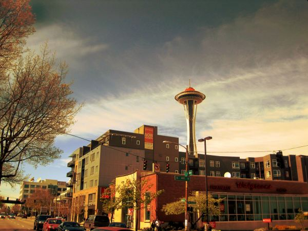
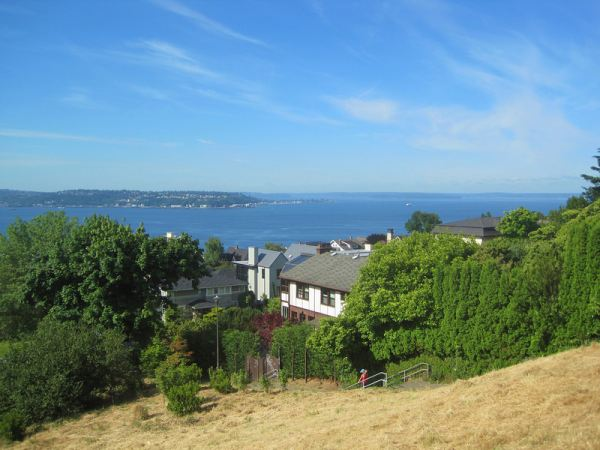
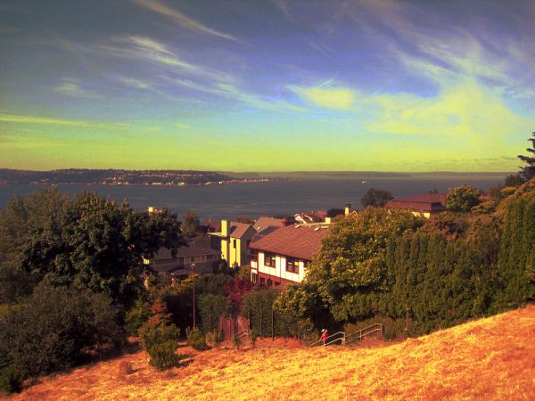
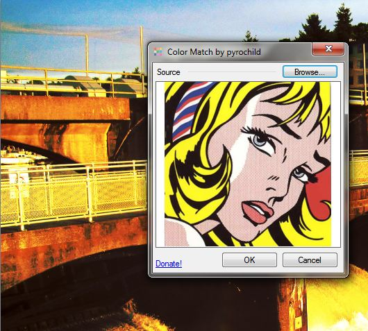

Five years ago I was playing with mashing up photos and classic art using Photoshop. These days I use the free Paint.NET for my image work. Well, it turns out with a third party plugin you can do the same mash up in Paint.NET. For this post I used four photos I took in Seattle and mashed them with the colors from a Kinkade painting.        

### Tutorial

To perform this trick in Paint.NET download the Pyrochild Plugins. I donated the requested $5 and immediately put the **Color Match** to work.  _Select Adjustments > Color Match…_  _For my first attempt, I loaded a Roy Lichtenstein. Yikes!_  _For attempt two, I used a painting by Thomas Kinkade. Much better!_

---

## Comments

### thomas
*April 26 at 2012 at 9:18 PM*

Nice photos.  Theres an app for that!  If you had coded that some years earlier you would be drowning in dollars.  BTW  Kincade the artist was one of the greatest rip-off artists ever!  and a terrible artist to boot!

---

### Sandi
*April 26 at 2012 at 10:14 PM*

Hi Michael:

Stunning image transformation.  Very different from filters.  My favorite is the Seattle Pier.

Thanks for link to that Thomas Kinkade gallery.  I loved looking at his paintings.  Didn't know he did Vegas, Indy500 and some of the others I saw.

Can Paint.Net be used by anyone?  Haven't visited yet to see.  Don't want to waste my time if it isn't something that a novice could use.

---

### MAS
*April 26 at 2012 at 10:16 PM*

@Sandi - Paint.NET is free for anyone, provided you are running Windows.

---

