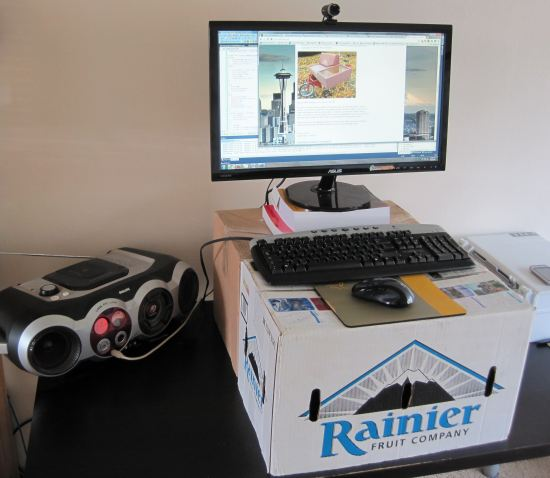

I haven't been motivated by the recent health scare stories that equate sitting at a desk as a health risk equal to smoking. I've worked in offices. I know the variations in people. I'm a wiggly ectomorph that can't sit still for long. I have to get up and move. Yet, I've worked with people who can sit for hours. They show less movement than a painting. To me it is obvious that our health outcomes will probably be different. _Better Movement_ has a great post titled [Is a Standing Desk a Good Idea?](https://www.bettermovement.org/blog/2011/is-a-standing-desk-a-good-idea) that rings more true to me. It also covers the problems from prolonged standing. This year I've been doing a lot more computer work and I've been experiencing more and more pain. The pain is behind my right shoulder and goes down my arm and lasts several hours a day. I probably need a new mouse, but today I needed to try something to deal with the pain. So based off a recommendation from a friend, I started shopping for an adjustable height desk. Then I had a thought that if didn't help with my pain, I'd be out $400. The logical course of action was to go ghetto. I grabbed a box.  _My standing desk does double duty as my [fermentation station](/2011/10/my-fermentation-station/)._ Day one was a tough adjustment. My pain decreased, but at first I found it harder to focus on doing work. My guess is this just takes practice. I'll continue this experiment to see if my shoulder and arm feel better. Just when I was about to publish this post, I saw that the blog _Pain Database_ just released part one in a [series on Standing Desks](https://web.archive.org/web/20150811031932/http://paindatabase.com:80/standing-desk-1/). One line that jumped out at me was:

> **Variation in posture** is extremely important for pain prevention and treatment.

Today I did have far more variation in my posture. I look forward to reading the entire series and learning how standing desks might reduce pain. Maybe I am on the correct path and soon my right arm, shoulder and neck will be pain free?

---

## Comments

### garymar
*April 24 at 2012 at 2:45 AM*

Too funny.  I think I'll try the box idea too. As for adjustment, just sweep the boxes off!

---

### Karl
*April 24 at 2012 at 5:06 AM*

I always thought that the key must be avoiding staring in the same position for long periods of time. I find the worst 'computer' pain I'd get would be from a marathon Civ III session when hours would pass without really changing my position at all- I wish I could get that engrossed in something productive, but there you go.

When I do simple things like just sticking a bunch of books under my computer and move it up and down during the day, combined with my natural tendency to jump up every so often, that seems to keep me from any real trouble. The standing desk always seemed like more trouble than it was worth.

---

### Jim
*April 24 at 2012 at 1:34 PM*

I read an article from an ergonomics expert where he said that from all his experience, the best posture or position is the "next" one you are going to transition to.  In other words, no single position is good for too long.  You have to keep changing it up.  I previously tried a standing desk, but am currently doing computer work while sitting, and standing for everything else, such as phone calls, thinking, writing lists, etc.

---

### chuck
*April 24 at 2012 at 1:41 PM*

i have been doing a similar ghetto standing desk for a few years now.  i find myself not wanting to sit anymore whether at the office or elsewhere.  took some getting used to but i wouldn't want to go back now.

---

### Kamal-
*April 24 at 2012 at 2:24 PM*

Michael- have you ever looked into "vertical" mice? 

A neutral hand position often translates to better shoulder positioning. Since I've had a few shoulder surgeries, I tried to look into a zillion different ways to ease shoulder tension at the computer, and this might be one good thing to look into.

---

### MAS
*April 24 at 2012 at 3:04 PM*

@Kamal - The vertical mouse is the one I was looking at yesterday. I hadn't heard about them until this past weekend. I'm going to purchase one. Thanks! 

@Jim - That is exactly how I felt all yesterday. Every standing movement made me feel better - at least until the next movement. 

@Chuck - Glad to hear you got used to the ghetto standing desk. Hour 3 for me was easier than Hour 1.

@Karl - My guess is that in some future date we will all have googles and gloves instead of monitors, keyboards and mice. Unlimited movement.

---

### MAS
*April 24 at 2012 at 3:31 PM*

Found this glowing review of the vertical mouse with pain symptoms that sound exactly like mine.

http://www.amazon.com/review/R1ZE1L17LUPKQR/ref=cm_cr_pr_perm?ie=UTF8&ASIN=B00427TAIK&nodeID=&tag=&linkCode=

---

### Eric
*April 24 at 2012 at 4:26 PM*

I switch to standing occasionally by using a custom cardboard box that I built -- big enough for keyboard and mouse and then just tilt my monitor upwards and it works ok.  I tend to sit most of the time but will sometimes enjoy standing for 2-3 hours if I'm really into something. I tend to dance a little while typing but eventually sit down because my feet get sore.  I'm sure a cushioned floor pad would help but that's one more thing to move out of the way during the transition back to my chair.

---

### Becca
*April 24 at 2012 at 5:20 PM*

I'm loving the frugality!  I always thought standing desks would be great for doing things like answering e-mails, catching up on the news, etc. - basically things that require short bursts of attention span.

The idea of writing a lengthy paper while standing... doesn't seem quite as appealing.

---

### MAS
*April 24 at 2012 at 5:27 PM*

@Eric - I think it helps that I am standing on carpet. No way I could have done this on a hard floor. 

@Becca - You might be the first woman that has said she loves my frugality. :) Yesterday, I wrote this short blog post standing up. I'll work up to longer ones.

---

### Anemone
*April 24 at 2012 at 7:04 PM*

I use a box on my chest of drawers. I've worked at the kitchen counter a few times, but usually it's too messy for a laptop.

I was going to say it's unfair that your feet aren't sore, but you're cheating by standing on carpet (and perhaps wearing padded shoes too). I stand on wood floor barefoot. My feet hurt for the first few days to week but then stopped being a problem except for the one day I went for a long walk first. Ditto for lower back ache. I'm standing maybe 6-7 hours per day.

I find I move around a lot more, especially when I'm playing music, but also just to shift my feet around to prevent pressure on the same place all the time. And I now find standing more comfortable than sitting while using my laptop. My butt hurts now when I sit for very long. Also, I concentrate better. Sitting seems to make me feel lazier.

At the same time, standing has not prevented my wrist from getting sore. Playing less solitaire on the computer would be the fix for that.

---

### Txomin
*April 25 at 2012 at 2:03 PM*

Believing that "doing X is as bad as smoking" is as bad as smoking.

I have done the box thing for a year now. I am pleased with the results. Here are a few things that I've learned:

1. Put some distance between the keyboard/mouse and the screen. At least 2 feet, better 3.

2. Only raise the keyboard/mouse.

3. Only use the raised keyboard/mouse for certain tasks. For me, it works well to do 1 hour on my feet, 1 hour off.

4. Allow a bit of room for pacing.

---

### MAS
*April 25 at 2012 at 8:13 PM*

@Txomin - Thanks for the tips.

---

