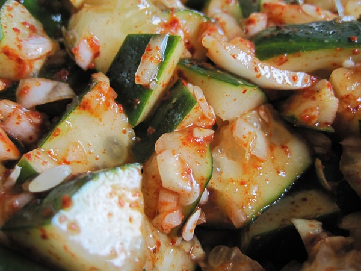
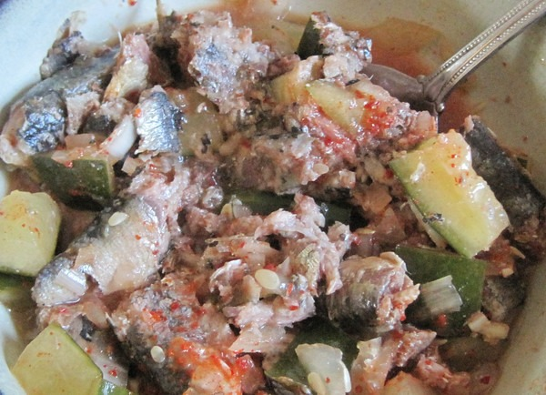

Recently I made my first-ever cucumber kimchi. I'm still dialing in the recipe, so I have nothing to post at this time. This is a shorter fermentation than [regular kimchi](/2011/03/kimchi-101/), because there is no cabbage. I pulled mine after two days. It is sliced cucumbers, chopped garlic, Korean red pepper flakes, and sea salt all topped with water. Optional ingredients include chopped ginger, fish sauce, and sugar.  _Making cucumber kimchi_ Mine had a nice sweet taste and I knew it would make an excellent salad dressing. Much better for you than the vegetable oil based salad dressings you find at the store. Anyway, I found an alternate use. I mix the cucumber kimchi with canned sardines. Note that you only want to buy the sardines packed in water. 99% of the other ones are packed in soybean oil.  _Sardines and cucumber kimchi_ This is a highly nutrient-dense meal that can be made in 30 seconds, assuming you already made the cucumber kimchi. Tastes good too!

---

## Comments

### XROLOL
*October 5 at 2012 at 12:56 AM*

Looks awesome. My kids love to eat herring out of the tin, brunswick brand, packed in water. I like it as well, but I would like to get more into it, since I have been wanting to eat smaller fish that are lower in the food chain: oily with omega-3, good for the environment, cheap as all hell, and tasty.

I love kimchi. Reading your other kimchi pages, and this looks like the perfect way to eat more herring. Now I just got to get the kimchi cooking away.

BTW, I make an awesome kefir with 35% cream, it's luscious. I always have a minimum four containers cooking away for days. YUM.

---

### MAS
*October 5 at 2012 at 5:02 PM*

@XROLOL - I miss kefir. I think I will start the hobby up again soon.

---

### Sandi
*December 30 at 2022 at 2:12 AM*

Hi Michael: I like sardines and eat them often with cheese and crackers. What's wrong with soybean oil? I thought it would be healthy in the sardines. Since I was able to switch to decaf coffee years ago, I could switch to sardines in water if I felt it was better for me. I also know that crackers/bread is not that healthy.

---

### MAS
*December 30 at 2022 at 2:24 AM*

@Sandi - Many now think that seed oils such as soybean are bad for health. Soybean oil is 51% linoleic acid which may be a driver of obesity via reduced metabolism.

https://criticalmas.org/2021/04/escaping-pufa-hibernation/

I get my sardines in olive oil. I also consume a lot of cilantro. See this post and the first comment. https://criticalmas.org/2021/10/joe-rogan-sardines-and-arsenic/

---

