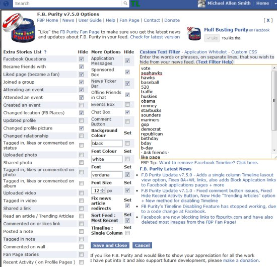

This post is an update on the September 2011 post [Distraction Diet 2](/2011/09/distraction-diet-2/), along with some new ideas. Distraction Diets are about reducing the growing number of distractions in an always connected digital age. How did I do?

1.  **Early Morning Reading** - This continues to be a success. Other people like reading in the evening, I prefer the morning.
2.  **No Stock Quote During Trading Hours** - This has been a major success. In fact, I consume less financial news now than I have in many years.
3.  **2 Desktops** - I still use the VirtuaWin program to divide my computer into 2 desktops (Work and Fun). I can get hours of uninterrupted work done by staying inside the Work desktop and following a rule not to launch distracting programs while there.
4.  **Evening Disconnect** - This hasn't gone so well. I am still checking for email and messages past 9 PM on most nights. I could do a better job here.

Ideas 1-3 are going well and I plan to do better on Idea 4. I also have some new ideas.

### Smarter Social Networking

Having a presence on Facebook, Twitter, Google Plus and now Pinterest can be a real time suck. This year I have stopped using Google Plus and Pinterest for myself. I still connect briefly to manage new links for the [INeedCoffee](https://ineedcoffee.com) account, but my personal connection to those two sites has ended. I might do a separate post on why I dislike Pinterest. Google Plus means well, but I grew tired of it quickly. For Twitter, all my accounts automatically post links to new blog entries and I have an RSS feed that returns a search of when any of my accounts are mentioned. So my time on Twitter is minimal. For the most part I find that Twitter is a bunch of people talking with very few listening. The noise is deafening. Facebook is the best social network, but you need a browser extension to make it that way. Once I installed and configured the [FB Purity extension](http://www.fbpurity.com/), the noise level on Facebook dropped considerably. I can block specific post types, change the font, hide ads and best of all block posts with certain keywords. I never see birthday posts or anything related to voting or local sports teams.  _Click image for larger view of FB Purity settings._

### The Opposite of Distracted is Focused

Probably the greatest piece of advice I got from Tim Ferriss author of [The 4-Hour Workweek](/2007/12/defending-the-4-hour-workweek/) was how it is important to _define_ what is meaningful to you BEFORE you _eliminate_ distractions. The reason is when you remove a distraction without defining what is important, you run the risk of filling it with a new distraction. So one of the main keys to eliminating distractions is becoming more focused on what is important to us. After you've defined what is important, how does one go about increasing focus? Caffeine, meditation, exercise and memory games all come to mind. I have a notebook that I pull down every so often where all I do is multiplication of 2 and 3 digit numbers. Instead of writing down every step, I use math tricks that force me to use my working memory to break up the steps and perform the calculation in my head. This it is tough at first, but you get faster over time. Strengthening the connection between short-term and long-term memory will increase focus. As great as the Internet can be, the downside is our short term memories are constantly being filled and emptied with every mouse click. Nicholas Carr covers this in depth in the book [The Shallows](/2010/08/the-shallows-what-the-internet-is-doing-to-our-brains/). I believe developing stronger focusing skills are a necessary component of any distraction diet.

### NZT-48?

Before I end this post, I want to say that earlier this year I actually found a supplement that increases my ability to focus. I haven't blogged about it, because I am highly skeptical of all supplements, but after months of testing, I can really tell the benefits. What is it? That will be the topic of my [next post](/2012/05/l-tyrosine-is-my-nzt-48/).

---

## Comments

### Greg
*May 21 at 2012 at 5:49 PM*

I like the idea of <i>intelligent</i> social networking.  Social networking isn't inherently bad or worthless, as some people make it out to be.  It can actually be a very valuable tool if used properly. 

Anyway, I basically dropped Twitter too (I only tweet when I have new posts); however, I think G+ is still a great place for photographers (or those interested in photography).  Facebook seems to be the best place for microblogging and link sharing.

---

### Glenn
*May 21 at 2012 at 7:10 PM*

Thanks for the update MAS. Good comments, especially about Twitter.

It's past 9 p.m. my time, so I should quickly shut down my computer!

I've been doing a lot more meditating/mindfulness training lately and it's definitely improved my focus.

Glenn

---

### Becky
*May 22 at 2012 at 12:42 PM*

I take PS 100 and Alpha GPC when it is critical that I focus.  These 2 supplements help me quite a bit.  I can always tell that I have received a little "push".  PS 100 assists with accessing memory, while Alpha GPC assists with focus and motivation.  I do not take them daily for 2 reasons.  I think they make me cranky when I take them too much, and they are both expensive.  Having said that, they are invaluable when I take them on a day that requires true focus.  I don't think that they are substitutes for other methods to increase focus and mindfulness, just more reliable.

---

### MAS
*May 22 at 2012 at 2:42 PM*

@Greg - Agreed that G+ is excellent for photography. 

@Glenn - I powered down my PC at 8 PM last night. Felt good. 

@Becky - I haven't heard of either of those supplements, but I'll remember them in case the effects of my NZT-48 (L-Tyrosine) wears off.

---

### Pauline
*May 23 at 2012 at 9:37 PM*

I don't know if you have read much on magnesium, there is a link between deficiency and headaches.  Taking magnesium at night is good for stress and sleep.  Like your enthusiasm and willingness to share and learn.

---

### MAS
*May 24 at 2012 at 12:25 AM*

@Pauline - I take Magnesium, mostly because other smart people do. Maybe it helps me, maybe it doesn't. I feel the same regardless of dosage or type of Mg I supplement with. When I take a break from the the supplement, I feel no different. To me it is cheap insurance.

---

### Pauline
*May 25 at 2012 at 9:09 AM*

A good way to take magnesium is transdermal, as it doesn't need to go through digestive tract, and can be used directly for any joint/back problems anywhere on the body.  I wanted to recommend a book for food sensitivies, Was It Something You Ate by John Emsley and Peter Fell. It has a whole chapter on caffeine and is solidly evidence-based.

---

### MAS
*May 25 at 2012 at 2:56 PM*

@Pauline - I just put that book on hold at my library. I am a caffeine "enthusiast". I'd look forward to reading that chapter. 

Transdermal Mg. hadn't heard of that. Thanks.

---

### Pauline
*May 25 at 2012 at 7:11 PM*

I love coffee!  Totally addicted but not sure how happy my liver is about it!  Here is a link re the transdermal magnesium for easy reference -  
http://www.amazon.co.uk/BetterYou-BY-008-Magnesium-Joint-Spray/dp/B003JMTPWA/ref=sr_1_2?ie=UTF8&amp;qid=[phone removed]&amp;sr=8-2
(it got some good reviews).

---

### Pauline
*May 28 at 2012 at 12:59 PM*

I bought the magnesium oil spray, and applied to my neck was having very intense headaches and it brought relief within a few hours.

---

