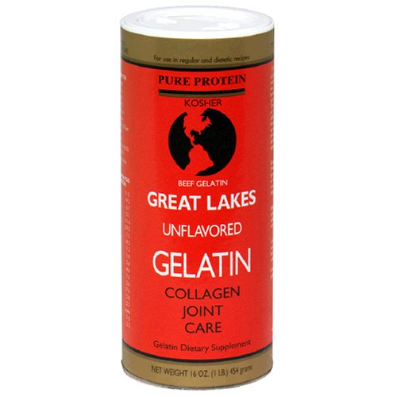

A month or so ago I stumbled across a recommendation for using gelatin supplementation to improve sleep quality. Specifically the theory was that gelatin could minimize early morning awakenings. This idea appealed to me, since the period of my sleep that is the most fragile is that 3 AM to 5 AM period. This is when [headaches](https://criticalmas.org/tag/headaches/) will often wake me up and even on the non-headache nights, this period is the most sensitive.

The article [Gelatin, stress, longevity](http://raypeat.com/articles/articles/gelatin.shtml) by Ray Peat makes a solid case for supplementing with gelatin for deeper sleep. The short explanation is that the modern diet is very heavy in muscle meats and low on the non-muscle parts of the animal. And each part has a different amino acid profile. When we favor too much muscle meat and not enough of the parts used more in traditional cuisines (think organ meats, bone broths), we are out of balance. From the article:

> When only the muscle meats are eaten, the amino acid balance entering our blood stream is the same as that produced by extreme stress, when cortisol excess causes our muscles to be broken down to provide energy and material for repair. The formation of serotonin is increased by the excess tryptophan in muscle, and serotonin stimulates the formation of more cortisol, while the tryptophan itself, along with the excess muscle-derived cysteine, suppresses the thyroid function.

The article goes into scientific detail on how eating too much muscle meat, which is high in cysteine and tryptophan which affect the thyroid, can produce nocturnal stress. This stress can negatively impact sleep quality. By supplementing with gelatin that balance could be restored, nocturnal stress could be reduced and the result would be deeper sleep. The author tested it on himself and said:

> For years I hadn't slept through a whole night without waking, and I was in the habit of having some juice or a little thyroid to help me go back to sleep. The first time I had several grams of gelatin just before bedtime, I slept without interruption for about 9 hours.

Even though I already consume bone broths on a regular basis, I was interested in trying this supplement out. My research lead me to Great Lakes Unflavored Gelatin as a clean source of quality gelatin. So I bought a two pack from Amazon.

_Great Lakes Unflavored Gelatin (AMAZON USA)_

### Did It Help?

I've been tracking [Sleep Quality](/2012/03/my-chamomile-tea-and-sleep-quality-experiment/) every night for almost a year. I rank sleep on a scale of 1-5. A 5 represents perfect sleep and 1 is awful. I consumed gelatin prior to sleep 13 times in the past 26 days. Here are my Sleep Quality averages.

-   **3.77**  Gelatin
-   **3.92**  No Gelatin

My sleep quality did not improve at all with the Gelatin supplementation. In fact it was slightly worse. I don't believe the Gelatin made my sleep worse. If I extended the test out, my guess is the numbers would equal out. I may repeat this test at a later date, but I'm not expecting the gelatin to suddenly give me deep uninterrupted sleep.

Gelatin has other more known benefits such as a joint repair. I'm going to continue taking the supplement, mostly on workout days or when I'm making meals that are all muscle meat with no bone broths. What I did learn was that Gelatin was not my magical sleep bullet, but I could see where others that don't make their own [bone broths](/2011/04/homemade-beef-broth/) could get those benefits.

**UPDATE 2014:** I now believe my test was invalid. Either I needed a higher dose or a longer test period. Also, judging sleep quality based on that day's supplement is likely flawed. The benefit from gelatin is likely cummulative.

---

## Comments

### balor123
*May 14 at 2012 at 6:47 PM*

Sleeping on your side not working then? You might try recording yourself to see if you stay that way all night long. Even better, you might try a sleep study, as sleeping on your side isn't guaranteed to eliminate the apneas and hypopneas. It's a common harmless and not too troublesome test to get done - just make sure to get your insurance in order first :)

---

### MAS
*May 14 at 2012 at 6:52 PM*

@balor123 - Sleeping on my side has improved my sleep quality, but it hasn't made my sleep perfect.

---

### chuck
*May 14 at 2012 at 7:34 PM*

i had always been intrigued about joint health and this stuff.  never heard of the sleep benefits.

---

### MAS
*May 14 at 2012 at 8:19 PM*

I'd be interested in hearing from other people that have tested supplemental gelatin and whether or not it improved their sleep. I'm thinking if it is doesn't, it is still a high quality food that most people could benefit from.

---

### Padraic
*May 14 at 2012 at 11:49 PM*

I've been using gelatin supplements for about 2 months now, for roughly the same reasons...I hadn't read Peat's article, but have read similar stuff.  The claim that it helps your sleep was gravy, especially for me, since I've had sleep issues for years (took prescription sleep meds for several years, thankfully was able to completely drop them after I changed up my diet).

In short, I didn't notice any real difference, taking the gelatin most nights for the last 2 months, though I may not be the best test subject, as I have a one year old who doesn't understand the notion of "night time is bed time..."

---

### Allison
*May 17 at 2012 at 9:38 PM*

I have some of the same gelatin.  How did you eat it and how much is recommended?

---

### MAS
*May 17 at 2012 at 9:52 PM*

@Allison - Ray's site mentions using 10-15 grams for sleep and arthritic pain consumed just before bedtime. A single teaspoon is 7 grams. 

I wondered if the dose might be too low, so I just did some more searching and found this post on Seth Robert's site.
http://blog.sethroberts.net/2010/10/02/gelatin-and-sleep/

That post mentions using 2 Tablespoons per day or 28 grams for sleep. I'm going to give this a try and report back.

---

### Allison
*May 18 at 2012 at 12:25 AM*

I would be interested in your results.  I will try it also and report back.

---

### Pauline
*July 23 at 2012 at 8:34 PM*

Any recent feedback on using gelatin in larger recommended dose?

---

### MAS
*July 23 at 2012 at 10:30 PM*

@Pauline - Yes. I have tried larger doses and gotten no benefit. Maybe this is a sign my thyroid health is excellent?

---

### Kelly
*November 21 at 2012 at 1:49 AM*

One needs to keep in mind that Ray Peat has been eating thryoid meds like after-dinner mints for 30+ years, so that may be a factor in his supposed sleep improvement.

Also, I note you have the "Collagen Joint Care" product pictured above.  That's a different product than their plain gelatin, which also comes in two different versions.

---

### MAS
*November 21 at 2012 at 2:07 AM*

@Kelly - The product I linked to above is the one I bought. I just went on Amazon and looked over their product line. All say "Collagen joint Care". So does the containers on the Great Lakes site.

---

### Pam
*April 8 at 2013 at 3:42 PM*

Has anyone had benefits of collogen and hair and nail growth?

---

### Pam
*April 8 at 2013 at 3:44 PM*

Has anyone had the benefits of collogen, and hair and nail growth?

---

### MAS
*April 8 at 2013 at 3:50 PM*

@Pam - This article suggests gelatin is good for hair and nails.
http://web.archive.org/web/[phone removed]5409/http://blog.arkofwellness.com:80/gelatin-reduces-inflammation-promotes-healing-and-aids-in-weight-loss/

---

### Chanda
*November 7 at 2013 at 4:08 AM*

I'm almost nine months pregnant, so getting a good night's sleep is really hard for me, especially since I tend to be a light sleeper anyway. I started taking Knox gelatin powder in the packets that you find in the baking aisle at the grocery store. I've been taking it for about four days, but I've already noticed a huge improvement in my sleep. I would constantly wake up at night, to roll over, to readjust position, and at least two or three times to go to the bathroom. Since taking the gelatin, I've slept deeply through the night, the past three nights. I haven't had the need to get up to go to the bathroom. I feel refreshed when I wake up in the morning instead of groggy. Whatever it's doing, it's working, and I'm going to keep taking it.

---

### Susan
*February 13 at 2014 at 12:27 AM*

I have always had difficulty sleeping and even when I do sleep I never wake up refreshed.  As apparently, I do not get enough deep REM sleep (unless I go back to sleep at 6 am, then that sleep somehow goes into the deeper sleep - but who can sleep in until 9 everyday?).  So, I've been taking a large spoonful of gelatin in the morning with my smoothies, and then another big spoonful at night mixed in with a little fresh orange juice (like 2-3 fingers), a splash of sea salt and then eat 2 nuts (for the fat content to balance everything out) and WAH LA!  I've had "deep" sleep for the last 3 nights and I feel SO much better throughout the entire day.  It's wonderful not feeling like you have to force yourself out of bed.  All you people who normally wake up feeling refreshed, you don't know how blessed you are!!   For everyone else, I'd give it a try for at least a week.  Depending on your chemistry it might work for you too.    But note, I'm sure it still all depends on everything else in your life too (are you drinking alcohol, are you really stressed out, eating poor, no nutrition diet etc.  If so, this might not work).  I've been on a very clean healthy diet, no alcohol, some light yoga or hot bath to unwind at night - and now the gelatin.  It's definitely worth a try.  I just hope it lasts!

---

### MAS
*February 13 at 2014 at 12:33 AM*

@Susan - Glad to hear gelatin is working for you.

---

### Melanie
*March 6 at 2014 at 4:05 PM*

I put some of the Great Lakes gelatin from the green can (about a tablespoon) in a smoothie last night and it made me very sleepy within 30 minutes. I usually have to take a Zquil or Tylenol PM to sleep but it wasn't needed last night. I sleep soundly and woke up feeling well rested. Had vivid dreams that I remembered so I got good quality REM sleep. I also gave some of the smoothie to my 12 yr old son who also sleep soundly and was much easier to wake up this morning. We're excited and hope to get the same results tonight. I personally couldn't take it in the daytime as it would knock me out.

---

### MAS
*March 6 at 2014 at 6:06 PM*

@Melanie - I am going to start taking gelatin again soon. Mostly for a knee injury, but I will also check to see if higher doses affect my sleep.

---

### granny
*March 21 at 2014 at 3:33 AM*

I take meds for hypothroid, am diabetic (no meds) and pain often keeps me from deep sleep.  After using an entire can of Great Lakes gelatin in the orange/red label I can say it definitely improved my sleep.  My thin hair and my weak nails also improved.  I just doubled my dose to two tablespoons a day.  I usually have it in a cup of hot tea or coffee, but Wellness Mama has a lot of other ideas on her website.  Sorry I can't provide a link with this device.

---

### MAS
*March 21 at 2014 at 3:36 AM*

@Granny - Glad to hear it is helping. I recently started taking the gelatin again. Hope it helps my knee.

---

### Kayla
*June 2 at 2014 at 8:43 PM*

I've been taking 2 tablespoons of collagen from a fancy company and 1 tablespoon of Great Lakes gelatin in the morning with my bulletproof coffee and before bed.  I've followed this protocol for 2 months and have lost 5 pounds, gained a lot of muscle, am sleeping very well and my joints are 50-percent improved. I still need them to get a lot better. way too much cracking sounds when I move. 

I've read a lot about collagen and gelatin and really don't totally understand the mechanism behind all the different benefits or why one person gets one benefit and someone else doesn't. 

For example, I was hoping it would help my hair, nails and skin. Nada so far. I will keep going for 6 months then re-eval. Thanks for this site and all the interesting info. 

To health. Kayla

---

### MAS
*June 4 at 2014 at 12:25 AM*

@Kayla - Congrats on the health gains. I've noticed my hair and nails are growing faster when I take gelatin.

---

### granny
*November 26 at 2014 at 2:26 PM*

Here's an update:  When I raised my Great Lakes gelatin intake from 1 tbs to 2 tbs daily I started having fuzzy thinking and reduced mood.  This came on slowly over two or three months.  I found a reference to gelatin being related to diminished tyrosine.  When I stopped the gelatin it took a few weeks to regain my thoughts and my mood.  I think a tablespoon once or twice a week will be my pattern for a while.  I still retain the sleep benefits and it did improve my hair and nails.

---

### MAS
*November 26 at 2014 at 4:42 PM*

@granny gibson - Interesting. I hadn't read about that. Another thought might be to supplement L-Tyrosine at the higher doses of gelatin to see if the fuzzy thinking goes away. Then you'll know if it is the lower tyrosine or something else.

---

### granny
*November 26 at 2014 at 7:34 PM*

Here is where some of my info was found.

http://caloriesproper.com/protein-dilemma-sleepy-or-smart-gelatin/

I'm not savvy enough to know if it's on the right track.  Interesting, though.  He speaks of tryptophan and glycine.  I think tyrosine is a precursor to tryptophan?

---

### MAS
*November 26 at 2014 at 8:33 PM*

@granny gibson - That was a good post. I recall reading it when it came out. I have since experimented with glycine directly. Because my sleep this year has been amazing, I can't tell any difference. That is a good problem to have. 

Regardless of sleep, I like both gelatin and glycine. I believe they are aminos that we need the most for reasons explained well in Denise Minger's book. 
https://criticalmas.org/2014/04/death-food-pyramid-calorie-myth/

---

