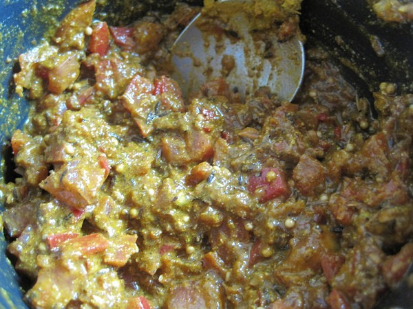
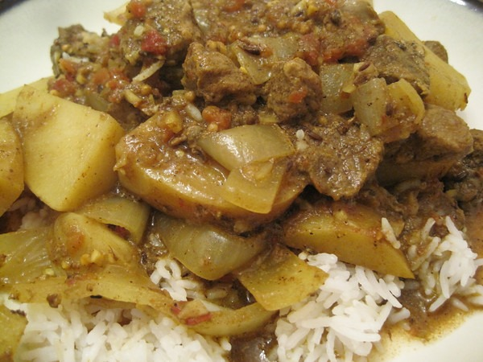

My quest to tackle Indian food continues. Since my [5 Spices, 50 Dishes](/2012/04/5-spices-50-dishes/) review, I've made two vindaloo dishes in my slow cooker. I read several recipes online and used the spice guidelines in the _5 Spices_ book to come up with this recipe. The first one used pork shoulder and then second used lamb. The recipe below works equally well for both. Both were outstanding. Easily restaurant quality.

The approach to spices came from _5 Spices, 50 Dishes_. My selection of spices was inspired by what I had available to me when I started cooking. :)

**Summary**: _An Indian curry recipe using a slow cooker._

#### Ingredients

-   1 large or 2 medium white potatoes (optional)
-   1 Tablespoon of red wine vinegar
-   1 onion
-   1 pound of pork shoulder (chopped into bite sized pieces)
-   3-6 cloves of chopped garlic
-   1-2 inch piece of chopped ginger
-   1 tomato
-   1-2 Tablespoons of cumin \*
-   1 Tablespoon of coriander \*
-   1 teaspoon mustard \*
-   1 teaspoon turmeric
-   1/2 - 1 teaspoons of chili powder
-   1/2 teaspoon of sea salt
-   black pepper
-   2 cups of broth or filtered water

#### Instructions

1.  If you are using the optional ingredient potato, chop them into bite-size pieces and line bottom of slow cooker.
2.  Chop onions and lay on top of potatoes.
3.  Lay pork pieces onto onions.
4.  Toss chopped ginger and garlic onto pork pieces.
5.  \* If you have whole spices, which I recommend, toast up the cumin, coriander and mustard. Then grind and add to bowl with the remaining spices. Otherwise add ground spices to bowl.
6.  Chop tomato up into tiny pieces and add to bowl. Stir to make paste.
7.  Add paste to slow cooker. Stir into meat.
8.  Add red wine vinegar.
9.  Add broth or water.
10.  Turn crock pot on high for 30 minutes and then drop to low for 3-4 hours. Or just keep it on low for 4-4.5 hours.
11.  Serve.

_Step #6 - Make a paste with the ground spices and chopped tomato._ 

_Serving the Vindaloo._ 

#### Variations

There are many spice variations on vindaloo. Some use ground cardamon or curry powder. Use what you have.

Preparation time: 30 minute(s)

Cooking time: 4 hour(s) Culinary tradition: Indian (Southern)

UPDATE: Shortly after posting I got a helpful hint from my friend Rishad that has made this dish many more times than me. He states that in order to be a "_true vindaloo_" it requires vinegar. The name "vindaloo" itself comes from Portuguese for vinegar. I also learned that potatoes are optional for the dish and that traditional Portuguese / Goan recipes don't have any potatoes at all.

---

## Comments

### Nick
*May 8 at 2012 at 7:02 PM*

Nice!  I need more slow cooker recipes!  

I never use mine, but want to start.  I actually almost bought a pork shoulder yesterday, but didn't know how I'd cook it, so I put it back.  

Going to try this this week for sure!

---

### chuck
*May 8 at 2012 at 7:31 PM*

this sounds really good.  looks easy too.  gonna have to try it.

---

### Marcia
*May 10 at 2012 at 3:06 AM*

I love the send to kindle link.

---

### Marcia
*May 10 at 2012 at 3:09 AM*

Are those the measurements for whole spices, or ground?  Have you seen anything online with suggested measurements for whole spices when the recipe specifies ground?

---

### rachel
*May 10 at 2012 at 3:32 AM*

Thanks for the recipe, it looks delicious! and I just bought some lamb stew meat :)

---

### MAS
*May 10 at 2012 at 3:50 AM*

@Marcia - I'm glad to hear the "Send to Kindle" feature is useful. I don't own a Kindle, so I haven't seen the site on one yet. The spice measurements should be about equal for ground vs whole. Going a little higher or lower will still work. 

@Nick, @Chuck, @Rachel - I hope you guys do try the recipe. I'm not sure if I prefer the pork or the lamb. Both were equally excellent.

---

### hännah
*May 15 at 2012 at 5:49 AM*

This looks like such a good, easy dinner.  And I love that it doesn't require slaving over a hot stove (to be avoided at all costs now that summer has hit and my apartment has no AC).  I think I'm going to give it a try with lamb.

---

### MAS
*May 15 at 2012 at 1:56 PM*

@Hannah - I am making your Creamy Risotto recipe later today! 
https://dishesanddishes.wordpress.com/2012/04/24/creamy-vegetable-risotto/

---

