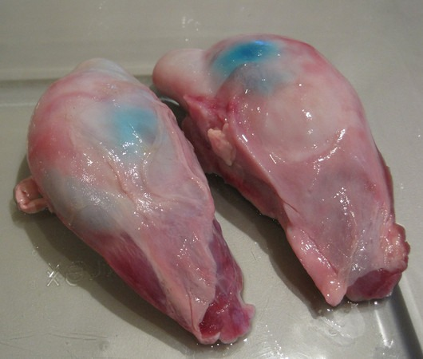
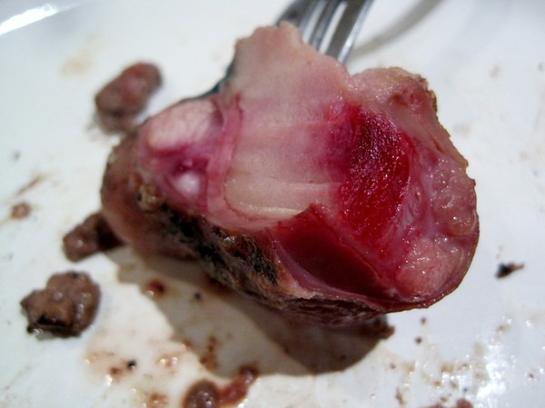

Some people go to the Farmers Market to buy colorful and overpriced produce. I used to play that game, but not anymore. My primary interest is to get the highest nutritional density per dollar. Paying $4 for a bunch of kale doesn't cut it for me. The most nutrient dense food you can buy comes from _the nasty bits_. Liver, kidney, heart and marrow bones come to mind. Well recently I had the opportunity to try something completely different. The same booth that sold me the [Icelandic Sheep Liver](/2012/05/icelandic-sheep-liver/) also sold Icelandic Sheep Testicles.  _Not sure what the blue tint is from. Maybe it is an Icelandic thing?_ :) For a mere $3, I walked away with 4 frozen sheep testicles. I had no idea how to cook them, but just days before I watched an episode of Anthony Bourdain's No Reservations where he was eating testicles in some wonderful far away land. Good enough for Anthony Bourdain, good enough for me. I love exploring traditional cuisine. Growing up in Ohio my _traditional cuisine_ was canned _SpaghettiOs_ and peas. My research told me that I could either deep fry the balls or grill them. I chose the grill.  _Sorry the photo blurred. I'll try and replace it the next time I make this dish._ Here is the recipe. Put on grill, let it cook and flip it so it cooks evenly. Add salt and pepper and eat. Actually, I don't have a recipe. But simplicity works. Don't over think this.  _Yummy!_ The taste was unique. The outside had a meaty crispiness to it, but the inside actually tasted like a scallop. And I love scallops. **Bon appétit!**

---

## Comments

### Aaron
*May 25 at 2012 at 1:50 AM*

We call them Rocky Mountain Oysters up here :)

---

### Ed
*May 25 at 2012 at 4:06 AM*

This is where I draw the line, your creeping me out dude.

---

### MAS
*May 25 at 2012 at 3:02 PM*

I like how Anthony Bourdain said that most disgusting thing he ever ate was a Chicken McNugget.

---

### J.
*May 25 at 2012 at 6:13 PM*

MAS, 

I'm with Ed on this one...I shopped this around my network and Ed isn't alone:))

Good on you!

---

### MAS
*May 25 at 2012 at 6:39 PM*

I did some searching on the nutrition.
http://www.diet-blog.com/11/the_nutrition_of_animal_testicles.php

High in protein and high in cholesterol, which makes this food seriously anabolic.
(link removed) 

Did I mention they tasted wonderful? :)

---

### Roberta
*May 25 at 2012 at 11:26 PM*

This I will never ever ever eat, but I was wondering what farmer's market sells the icelandic sheep liver?

---

### MAS
*May 26 at 2012 at 1:00 AM*

@Roberta - Ballard Farmers Market (Seattle). They were sold out of liver last Sunday.

---

### Roberta
*May 26 at 2012 at 6:31 AM*

I'm there every weekend. I'll have to keep my eyes open.

---

### MAS
*May 26 at 2012 at 12:51 PM*

@Roberta - Their booth is at the front (north end).
http://www.stokesberrysustainablefarm.com/

---

### Glenn
*May 26 at 2012 at 5:18 PM*

I've tried them a couple of times and like them too! Unfortunately even in France you can only get them at a few specialist markets in the bigger cities.

---

### Mike
*May 28 at 2012 at 12:40 PM*

Here in Germany you can get them at many Turkish supermarkets (and probably at all the others by predordering) - present-day Turkish cuisine may be a vegetable oil-driven nightmare, but you can always get your meat fix.

---

