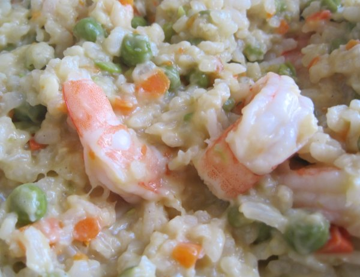

Years ago I attempted to make risotto and it didn't turn out that well. I don't recall what I did wrong, but after seeing the [Creamy Vegetable Risotto](https://dishesanddishes.wordpress.com/2012/04/24/creamy-vegetable-risotto/) recipe on _dishes and dishes_, I decided to try again. I'm glad I did, because it turned out great. I was missing a few items when I went to make the dish, so I made the following substitutions.

-   No onions.
-   Used peas instead of green beans.
-   Used chicken stock instead of veggie stock.
-   Used less Parmesan cheese, but added a splash of cream.
-   At the end, I threw in some shrimp.

My guess is the key to making great risotto is gradually adding the stock to the Arborio rice and cooking it slowly. What veggies or protein you use or don't use is probably less important. The creamy texture can come from butter, cheese, cream or some combination. The next risotto I make will be loaded with mushrooms.  _Shrimp Risotto_

---

## Comments

### Jenn
*May 16 at 2012 at 5:16 PM*

the trick is DEFINITELY to add slowly and stir as per the instructions... I made that mistake myself once and ended up with a sticky gummy mess

---

### Padraic
*May 16 at 2012 at 6:33 PM*

My wife has a trick way of doing risotto in the slow cooker that's really easy and always seems to come out the perfect consistency...I think it's as simple as dumping the ingredients in and occasionally stirring.  She did one a while back that was beef, red wine, and Parmesan...unbelievable!

---

### hännah
*May 16 at 2012 at 7:09 PM*

I'm so glad this recipe worked for you and I love the idea of adding shrimp!  Thanks for the link and I look forward to seeing your other kitchen creations!

---

### MAS
*May 16 at 2012 at 7:10 PM*

I hadn't thought of using a slow cooker for risotto. There are a few recipes out there. This one looks interesting.

http://www.thenaptimechef.com/2012/01/slow-cooker-week-mushroom-sage-risotto-naptime-everyday/

---

### J.
*June 15 at 2012 at 2:04 PM*

Hi MAS, 

I buy shrimp with the head on, clean them and make a shrimp base stock from the scraps remaining. Works like a champ.

---

### MAS
*June 15 at 2012 at 2:31 PM*

@Scott - I have yet to make a fish stock. I am going to do it this summer!

---

