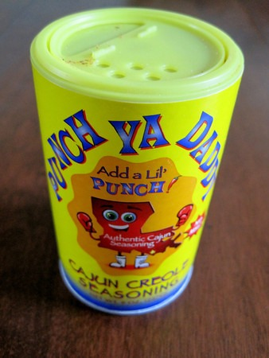

I wonder if anyone has ever combined Cajun spices with [Icelandic sheep testicles](/2012/05/sheep-testicles-taste-wonderful/) before? :) Besides the fact they taste great, why would anyone eat animal testicles? They are [loaded with protein and high in cholesterol](http://www.diet-blog.com/11/the_nutrition_of_animal_testicles.php). Cholesterol has been demonized as being unhealthy and a cause of heart disease. That is a myth. Several books have been written on the topic. That is old news. The recent news is how dietary cholesterol can help build strong muscles. Check out _Research Update: Eating More Cholesterol Makes Muscles Stronger_ by Anthony Colpo if this topic is of interest. (FEB 2017 UPDATE: Colpo's article is now behind a paywall).    

---

## Comments

### aviva
*June 14 at 2012 at 1:44 AM*

hm. alrighty then. spicy balls.

---

### Tim
*June 15 at 2012 at 12:40 PM*

I'll be getting a pair on Monday; my cholesterol is fine (at 400+), but my triglycerides could come down 40mg/dl or so, which is why I'll be upping my intake of entrails and laying off the lard habit a bit.

---

