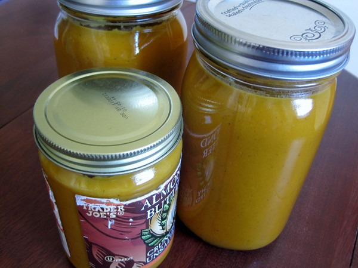

Recently, I was gifted a large amount of sweet potatoes. They were getting old and had already started to grow little vines. I needed to make use of them quick, but I didn't have the appetite to roast them all. Soup! The great thing about making soup is whatever I can't eat right away can be stored in the freezer. Got to love making meals in advance. **Summary**: _An easy soup made with sweet potatoes._

#### Ingredients

-   Sweet potatoes or yams
-   Cooking oil (coconut oil, tallow, or lard)
-   Onion
-   Ginger
-   Stock or Water
-   Curry Powder
-   Chili Powder
-   Cinnamon (optional)
-   Salt to taste

#### Instructions

1.  Chop up onion and ginger.
2.  Caramelize onion.
3.  Peel and dice sweet potatoes.
4.  Add sweet potatoes to stock pot.
5.  Cover potatoes with stock or water.
6.  Add all the other ingredients.
7.  Simmer until soft (~20 minutes).
8.  Use an immersion blender to blend into soup.
9.  Taste and add any additional spices.

 _Make lots of soup at once and store the rest. Note that you shouldn't freeze jars like the two in the back row, because they have soup above the bend. See Lesson on [Freezing Canning Jars](/2011/12/lesson-on-freezing-canning-jars/)._  How much of each ingredient should you use? Whatever you like. This soup is very forgiving and you can always add more spices at any point.

#### Variations

For more sweetness, you can add brown sugar. I do this when served, not in the cooking process. Preparation time: 10 minute(s) Cooking time: 30 minute(s)

---

## Comments

### Al
*June 28 at 2012 at 7:35 PM*

I've heard Chris Masterjohn talk about his problems with the large amount of oxalic acid in sweet potatoes - have you had any problems?

---

### MAS
*June 28 at 2012 at 8:05 PM*

@Al - News to me. Found this post.
http://www.paleohacks.com/nutrition/why-are-sweet-potatoes-better-than-regular-potatoes-2523

I feel fine after eating sweet potatoes. Not sure what excess oxalic acid feels like though.

---

### Al
*June 29 at 2012 at 8:46 AM*

Here's a nice overview; the part about mold is particularly interesting - I'm just recovering from a serious bit of food poisoning due to some moldy (but hey, peeled!) sweet potaotes:
http://perfecthealthdiet.com/2011/01/what’s-the-trouble-with-sweet-potatoes/

---

### MAS
*June 29 at 2012 at 2:36 PM*

@Al - Thanks for sharing. I do peel my sweet potatoes as well. The article suggests that yams should be OK, but then I read that what are often labeled yams at grocery stores are really sweet potatoes. 

I used to eat a lot of spinach. Never experienced any issues.

---

