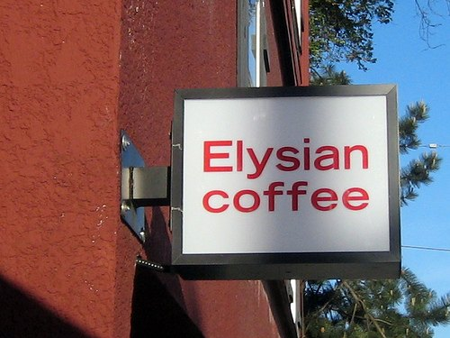
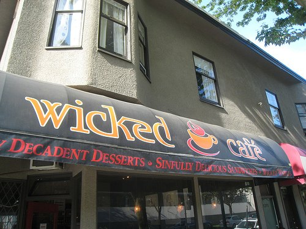
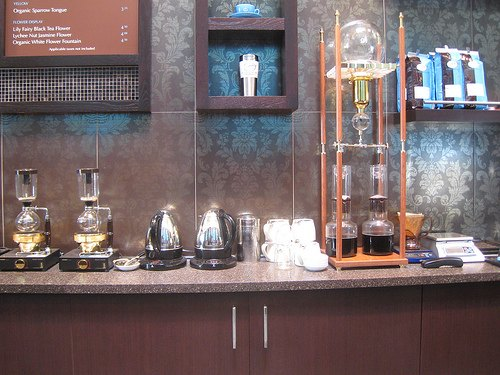
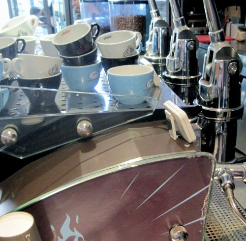
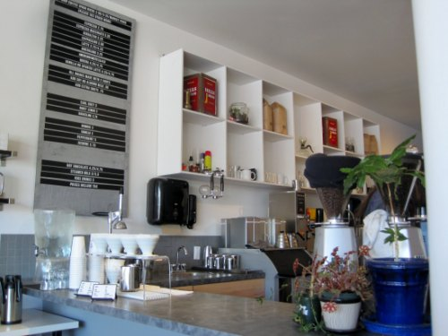

_This Espresso Vacation took place in May 2009 with an update which took place on a second visit in May 2012._ Memorial Day Weekend was approaching so I decided it would be an ideal time to take off on a little vacation. Where should I go? Since it was almost summer, I decided a return visit to Vancouver, Canada would be perfect. I was there with friends a little last summer but did very little exploring. Thankfully I live in Seattle, so Vancouver is just a few hours drive north. Before leaving I did some research on where the good coffee places were. The more research I did, the more I knew I would love Vancouver. I got a few tips from Lynanne, a member of the _Coffee Club of Seattle_. Her tips lead me to the _CleanHotDry_ website, which in addition to having amazing coffee photography, also has a wallpaper of 10 espressos pulled from various Vancouver coffee shops. What started out as a regular vacation was to become an espresso quest. How much espresso could I consume during my short trip? I was about to find out. I loaded up my Garmin GPS with cafe addresses and headed for the border.

### Elysian Coffee - 590 West Broadway

I almost walked past this place. The front sign is very subtle. Thankfully I entered _Elysian Coffee_ and started off my espresso vacation in style. This is a very slick cafe. I had intended to get an espresso, but they offered Clover Coffee. Since Starbucks bought the company that makes the Clover, they have been slowly disappearing from the Seattle area. I make it a point to support the Clover when I see it in independent coffee houses.  _Elysian Coffee - 590 West Broadway_ I also was fortunate that _Elysian Coffee_ was very close to my hotel and was able to visit here three times.  _Clover Coffee at Elysian Coffee_

### Caffe Artigiano - 853 West Broadway

During my two previous visits to Vancouver, this was my only coffee house stop. It impressed me back then and it impressed me on this trip as well. Super friendly people here. The evening barista came out to my table and talked to me about their espresso blends. I'm not a big fan of milk in my espresso, but I make an exception when I go to _Caffe Artigiano_. They have a drink called the **Americano Misto**. It is a traditional Americano with just enough frothed milk added to do latte art.  _Americano Misto at Caffe Artigiano - 853 West Broadway_

### JJ Bean - 3010 Main St

This location of JJ Bean has a fireplace for the cold days and wide-open garage-door style windows for days with perfect weather. It was perfect weather the day I visited. The espresso was outstanding as well.  _JJ Bean - 3010 Main St_

### Re-Entry Espresso - 4363 Main Street (CLOSED)

Continuing my espresso hike, I made it to Re-Entry Espresso. The cafe has a spaceship/science fiction feel to it. Another great espresso. My vacation had just started, but I already could see Vancouver is way better than almost every place I've ever visited. _Re-Entry Espresso is no longer open._  _Re-Entry Espresso - 4363 Main Street_

### Cito Espresso - 116 Davie Street (CLOSED)

After a few hours of adrenal rest, I got myself an espresso from _Cito Espresso_. Wow. Yummy in that Northern Italian style. If you are a fan of Espresso Vivace's Dolce Blend, you will love their espresso. And you know I'm a big Vivace fan. Check out the tagline in the photo below: _Coffee Isn't a Drug, It's a Vitamin!_ Agreed and it was time for more anti-oxidants. _Cito Espresso is no longer open._  _Cito Espresso - Vancouver, BC_

### Wicked Cafe - 1399 7th Avenue West

At first, I thought I entered the address into my GPS incorrectly. I was walking through a residential area. There couldn't be a coffee shop around here. Yes, there was. A corner cafe with indoor and outdoor seating. Wicked Cafe uses _Intelligentsia Coffee_, so I had to get a _Black Cat Espresso_. _Wicked Cafe_ is the kind of place you wish was in your neighborhood.  _Wicked Cafe - 1399 7th Avenue West_

### Bump N Grind Specialty Coffee - 916 Commercial Drive

I was running out of time and needed to decide where I could visit before driving back to Seattle. The barista at _Elysian Coffee_ recommended going to _Bump N Grind_. If it was good enough for _Elysian_, then I was sure to love it. And I did. _Bump N Grind_ also has a Clover Coffee brewer. The Tanzanian Peaberry I had here was the best cup of coffee I had on my entire trip.  _Bump N Grind Specialty Coffee - 916 Commercial Drive_

### Continental Coffee - 1806 Commercial Drive

To be honest, when I first entered this place I thought my espresso hot streak was finally going to come to an end. There was a missing character on the sign out front, they had misspelled Colombian (Columbian) on their menu and you had two baristas running back and forth from the register to the espresso machine. I prefer that my espresso not get cold while paying for my drink. The shot I got here was so off the hook good, it didn't matter. I was blown away. Amazing rich body with flavor. How good was the espresso? I got back in line and bought a 1/2 pound of whole beans to take home with me. It was that good.  _Continental Coffee - 1806 Commercial Drive_

### 49th Parallel Cafe - 2152 West 4th Avenue

49th Parallel is the roaster for many of the coffee places that I visited while in Vancouver. This is their cafe and I am so glad I went here. This was going to be my last coffee drink before heading home. I love the Epic Espresso Blend, so I ordered it and took a seat.  _49th Parallel Cafe - 2152 West 4th Avenue_ It was only then did I fully take in everything around me. This was a coffee lover's playground. After savoring every drop of my espresso I got up to get a closer look at the huge cold coffee brewing system they had. They also made siphon (vacuum) brewed coffee in these beautiful glass brewers. The photo below shows the siphons on the left and the cold brewer on the right. I wanted to stay and drink more coffee, but I was running out of Canadian currency and it was time to go home. I felt like a kid being dragged kicking and screaming from the amusement park. _But I want more coffee!_  _49th Parallel Cafe Slow Bar - Siphons and Cold Brewers_ What a vacation. Vancouver delivered. It is a first-class coffee city and I'm honored to have them as my neighbor to the north. There were a few places on my list that I didn't get to. I'll be sure to visit them the next time I take an espresso vacation to Vancouver. I'm getting jittery just thinking about it.

---

### May 2012 Update

The 2009 espresso vacation to Vancouver was so wonderful that I returned for a second visit exactly three years later. Here are a few new coffee venues worthy of checking out when you visit.

### Coffeebar - 10 Water Street

The best espresso of my 2012 visit was at Coffeebar. Like many other Vancouver coffee shops, they use beans roasted by 49th Parallel. However, they have something that most coffee shops don't have, which is a hand-pulled espresso machine. The espresso I received was amazing. It was both bright and syrupy. Visit here if you find yourself in the Gastown area.  _Coffeebar - 10 Water Street_

### Matchstick Coffee Roasters - 639 E 15 Avenue

This spacious cafe opened in early 2012. They also roast their own coffee on site. The barista shared with me that my espresso was a blend of different beans from Colombia. It had a wonderfully creamy and textured taste. Check it out when you visit Vancouver.  _Matchstick Coffee Roasters - 639 E 15 Avenue_

### Kafka Coffee and Tea - 2525 Main Street

Kafka uses Seattle based roaster Herkimer Coffee for their espresso blend, which is one of my hometown favorites.  _Kafka Coffee and Tea - 2525 Main Street_