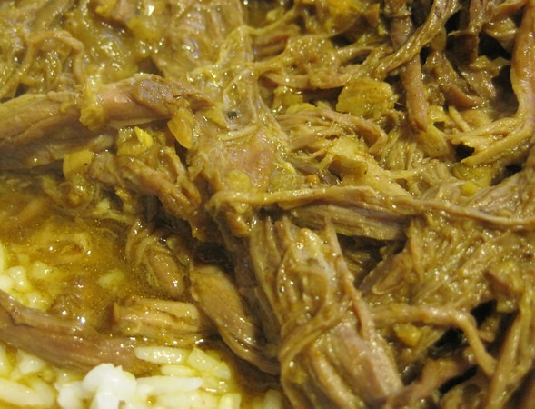

_The Perfect Pantry_ posted a slow cooker recipe for **nihari**, which is a curry from Pakistan. It also has the nickname _"old clothes"_, which is what the beef brisket looks like when you pull the meat apart with forks after hours of co. I made this dish twice. It is super simple and I think they got the spices correct. However, I have a few ideas for making this even better.

1.  Swap out the canola oil for either a slab of butter or ghee.
2.  Cut the garlic requirement in half, unless you really like garlic.
3.  Instead of cooking for 9 hours on low, I cooked it for 5 1/2 hours with just the first hour on high. BTW, that is a trick I use with most slow-cooking recipes. Cooking for 9 full hours will certainly have the meat melting in your mouth, but I don't mind a little bit of chewing. Plus I subscribe to the theory that we shouldn't be overcooking our proteins.

 _Beef Brisket Curry_

---

## Comments

### Greg
*July 30 at 2012 at 6:14 PM*

Thanks for sharing this.  I'm going to give this recipe a go tomorrow.  Do you think a sirloin tip roast will work for the meat?

---

### MAS
*July 30 at 2012 at 6:22 PM*

@Greg - Not sure. The key to this recipe is being able to shred the meat like "old clothes" and then return the meat to the slow cooker. I'm looking at photos of sirloin tip now and it doesn't appear to have that texture.

---

### dhammy
*July 31 at 2012 at 12:46 PM*

Made this last night and it was wonderful!  The whole family enjoyed it... although the wife complained that it was a bit too spicy for her.  Perhaps a little less chili powder next time.

D

---

### MAS
*July 31 at 2012 at 2:38 PM*

@dhammy - Excellent. I have the heat content in chili powders varies wildly. I have this powder I got from a Indian grocery store in LA that is ridiculously hot. One half a teaspoon of it is equal to 2 or 3 tablespoons of most chili powders.

---

### TigerAl
*September 15 at 2012 at 4:25 PM*

@MAS: You probably got some Kashmiri chili powder.. it is hot, delicious and has a beautiful red color.

---

### MAS
*September 16 at 2012 at 1:45 AM*

@TigerAl - You might be right. I don't recall any detail on the label. I've since transferred it to a glass jar.

---

