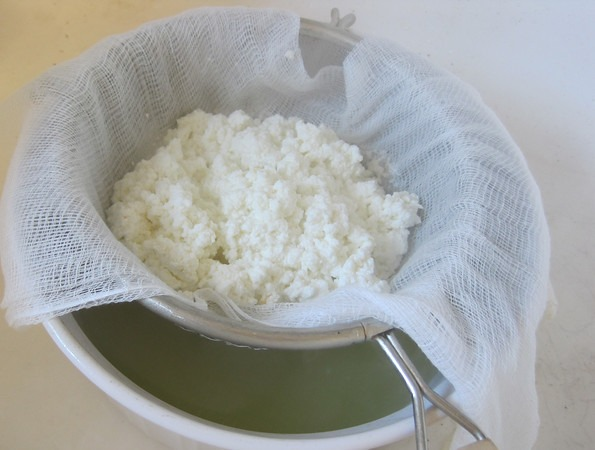

When I first read the recipes for paneer, my initial thought was _"it can't be that easy"_. So I checked a few other recipes and confirmed that it was really a ridiculously easy thing to make. QFC had a gallon of full-fat milk marked down to 99 cents. Perfect price for practice!    Here is my first attempt at paneer. I might need a little more practice with the presentation, but it tastes good. My next batch will use the spice recommendations in [this video](http://www.youtube.com/watch?v=UQu5jVagfao). But for now, I need to acquire some spinach to make Palak Paneer.

---

## Comments

### Barbara
*July 7 at 2012 at 5:33 PM*

Fresh homemade paneer is my ABSOLUTE favorite! This is a great recipe and I'm looking forward to your spiced paneer recommendations!

---

### Becca
*July 7 at 2012 at 5:36 PM*

I made my own paneer about 2 months ago and loved it.  Mine looked less crumbly than yours, but it was delicious.  Looking forward to adding spices next time as well!

---

### NevadaSmith
*July 8 at 2012 at 3:42 AM*

Since raw milk is sold in health food store in Pennsylvania, I think I need to make some paneer with raw milk. Thanks for the post and the idea.

---

### MAS
*July 9 at 2012 at 1:26 AM*

@Barbara - I made paneer #3 with spices.

cumin seed, sea salt, chili powder. It looks good and has a nice kick to it!

---

### Pauline
*July 9 at 2012 at 2:25 PM*

Is it really just a question of heating milk, adding lemon juice, and then waiting for separation of whey and curd and pouring into container using muslim cloth?  Did you add the spices once it was done and did you press it to get such a good overall look?  Your pics are wonderful!

---

### MAS
*July 9 at 2012 at 2:29 PM*

@Pauline - Yep, it really is that simple.  For the spiced one, I added the spices just as the milk was about to boil. The press portion for Batch #2 and Batch #3 (the good looking ones) were 1 hour. Batch #1 (which was crumbly) had a 3 hour press. So my take away lesson here is that one hour is enough.

---

### Pauline
*July 9 at 2012 at 2:31 PM*

Just watched the video, really lovely to see and thanks for sharing your recipes and exploration of food ideas/recipes.  Going to try this soon.

---

### Amarsh
*August 4 at 2012 at 1:20 AM*

i prefer to seed my paeenr with yoghurt. milder flavour and the whey is pure dairy, delicious for cooking dal in.re 4% fat   milk _is_ only about that much, or 5-6% at most, if it's from a cow. anything more in a pure milk product means it's been thickened with fat extracted from other milk. (the fat from skimmed milk is what makes cream   and greek-style 10% fat yoghurt).i'm obviously not a vegan.

---

