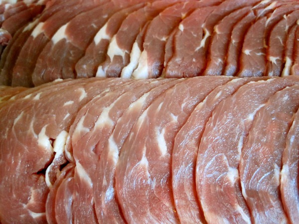
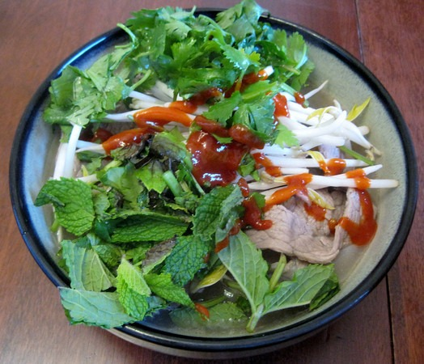

My latest food project moves to Vietnam.

I used the average of a few [pho](https://en.wikipedia.org/wiki/Pho) recipes online. It turned out to be very tasty. The funny thing is that I never actually had pho before\*, so I can't tell you how authentic my version turned out. I suspect I did OK.

_\* I've been to Pho restaurants twice before and had the vegetarian option both times. Youthful indiscretion_. ;)

---

## Comments

### chuck
*July 1 at 2012 at 3:44 PM*

welcome to the club of pho lovers.  it looked really authentic for never actually having it before.  i prefer jalapenos over sirachi but i am sure it was great.  i usually make my pho broth at the end of a batch of beef broth.  even after 24 hours of simmering there is some good beef flavor left in the bones.  drain off your broth but leave the bones n bits, add the spices, water, and even some fat if you want.  then simmer for a few hours.  it doesn't take more than a few hours to impart the flavors of the pho spices into the broth.

it might be a good idea to go to a really good pho restaurant to help you perfect your home version.

---

### MAS
*July 2 at 2012 at 1:37 AM*

@Chuck - That is a great idea. I did some research and found I live close to one of the better Pho places in Seattle. I will visit them this week.

---

### MAS
*September 12 at 2012 at 7:12 PM*

Since this post I have had PHO at two different places in Seattle. My dish was superior to one and not as good as the other. So middle of the pack. Not bad for a first attempt.

---

