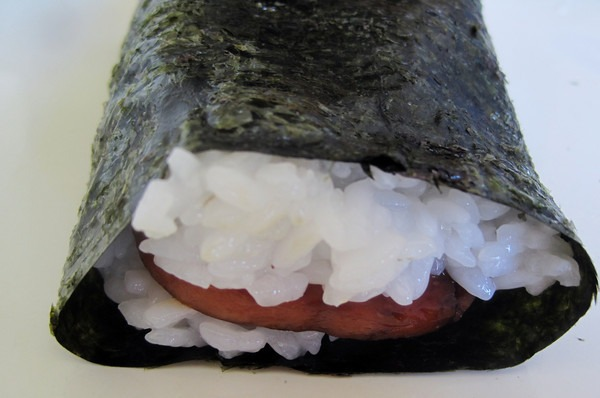

I just had to try [this recipe](http://www.seriouseats.com/recipes/2008/04/tutorial-how-to-make-hawaiian-spam-musubi-sushi.html). I never could find the masubi maker locally, so I rolled the sushi together by hand. I also left out the furikake, as every type I located at the Asian market had either MSG or gluten.

Spam may not be the greatest quality of pork. Oh well. This recipe sure tasted great.

The double-decker Spam Sushi was definitely the way to go.