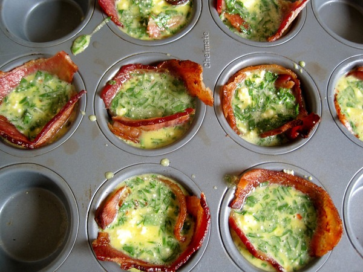
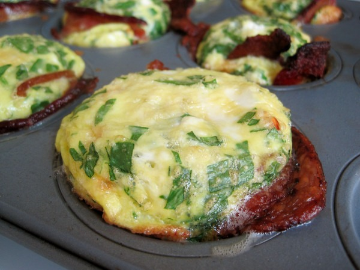

I did a twist on my [Bacon Egg Cupcakes](/2011/07/bacon-egg-cupcakes/) by adding some chopped spinach and Mexican ricotta cheese. Yummy!

---

## Comments

### Darren
*August 27 at 2012 at 6:51 PM*

Sound great!  I loved the original recipe.
What is in Mexican ricotta?  I have never seen that.

---

### MAS
*August 28 at 2012 at 12:33 AM*

@Darren - I believe it was called Requesón. Oddly enough, my Chinese grocery store carries a lot different Mexican cheeses. I'm trying a new one with each visit.

---

