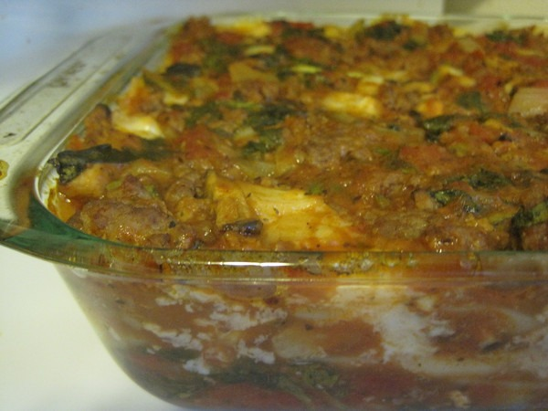

I've never made lasagna before, but I love the dish. When I gave up the gluten a few years ago, I also gave up the lasagna. Well, I got to chatting with a local gluten-free chef that mentioned using wide rice noodles for the pasta portion. The wide rice noodles are available in some Asian markets. I've seen them before but never purchased them. A quick search on a lasagna recipe that uses wide rice noodles pulls up my favorite nutrition site _Perfect Health Diet_. Using [their recipe](http://perfecthealthdiet.com/2010/12/rice-noodle-lasagna/) as a template, I sat out to make my first lasagna.

The first problem I ran into was finding the fresh wide rice noodles. After about 7 visits, I found some at the HT Market. Note that although similar in name to H Mart, it is completely different. H Mart is Korean and amazing. HT Market is Chinese and pathetic. But HT happens to be the closest to me. _If can't love the Asian market you want, love the one you're with._ :)

Anyway, it turns out that the fresh wide rice noodles made in Seattle have wheat and soybean oil added to them. Uggh! Well, I found an interesting substitute in the dry noodle aisle that worked. Made from rice alone.

Unlike the fresh noodles, these noodles are soaked in very warm water for several minutes prior to use. That softens them up.

To no surprise, I discovered HT Market did not have ricotta cheese or full-fat mozzarella. I had no interest in visiting yet another grocery store, so I turned an HT strength to my advantage. HT Market has an excellent section of Mexican cheeses. If you've read Tyler Cowen's latest book An Economist Gets Lunch, then you'll already have an appreciation for these cheeses. If you haven't read it, do so. Probably the best book I've read in a year. Full review coming soon. Anyway, I grabbed some Oaxaca cheese. New to me.

For the rest of the recipe, I followed the guidelines from the _Perfect Health Diet_ recipe. I did add some oregano, basil, and sea salt.

I baked it for 30 minutes at 325F degrees.

It was outstanding! Maybe it was the cheese or the grass feed beef or the rice flakes. Whatever I did, it worked. This was one of the best lasagnas I've ever had and it was 100% gluten-free.

---

## Comments

### Roberta
*August 6 at 2012 at 6:52 PM*

Looks tasty!  You might check some place like Madison Market for rice lasagne noodes (wheat free). Back in the day, before I started shunning all things grain, I used to buy things like that there. Whole foods might have something like that too.

---

### dhammy
*August 6 at 2012 at 6:54 PM*

Looks quite yummy!  I make an eggplant lasagna on occasion which is quite delish.  You just need to slice the eggplant thin, salt it, and bake it 5 minutes on each side.  Great substitute for the noodles.

---

### MAS
*August 6 at 2012 at 8:37 PM*

@Roberta - I'll be on the look out for those noodles. I'll be in that neighborhood on Wednesday.

@dhammy - Great idea.

---

### Stephan
*August 6 at 2012 at 9:49 PM*

@MAS: You got back to blogging sooner before you had planned. :) Wasn't the sun bright enough to keep you away from blogging again? :)

Lovely recipe. I have tried those thin long rice noodles when making Miso soup. True alternative to conventional pasta.

---

### MAS
*August 6 at 2012 at 10:03 PM*

@Stephan - True. I had planned to take more time off, but I realized my blog to-do list was getting too long.

---

### Geoff
*August 7 at 2012 at 11:07 AM*

Sounds good, but how do leftovers hold up?  I always liked lasagna more a day or two after it was first cooked.  Do the noodles hold up, or were there no leftovers to test :) ?

---

### MAS
*August 7 at 2012 at 2:19 PM*

@Geoff - Good question. The leftovers were even better!

---

