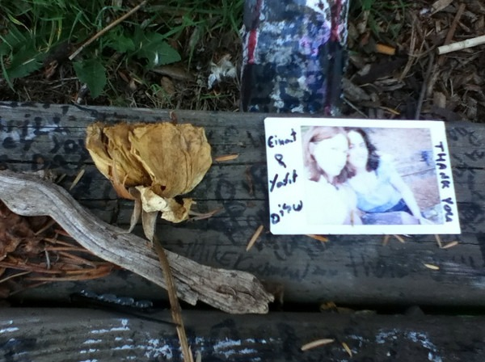

It has been a long time since I did a Seattle specific post. Earlier this summer on one of my [urban hikes](https://criticalmas.org/best-of/urban-hiking/), I made my first stop to the Kurt Cobain bench. How this landmark escaped me until recently is a mystery. I must have walked past this little park twenty times. [Vieretta Park](https://en.wikipedia.org/wiki/Viretta_Park) is right next to the house that Kurt was living in when he killed himself. This is very beautiful neighborhood in the Denny-Blaine section of Seattle, which is south of Madison along Lake Washington. Nirvana fans have converted the park bench into a makeshift memorial. I took some photos.   

---

## Comments

### Jim
*August 17 at 2012 at 2:18 AM*

Reminds me a bit of Jim Morrison's grave in Paris.

---

### MAS
*August 17 at 2012 at 1:12 PM*

@Jim - I was thinking the same thing. I haven't been to France, but have seen the Morrison grave photos before.

---

