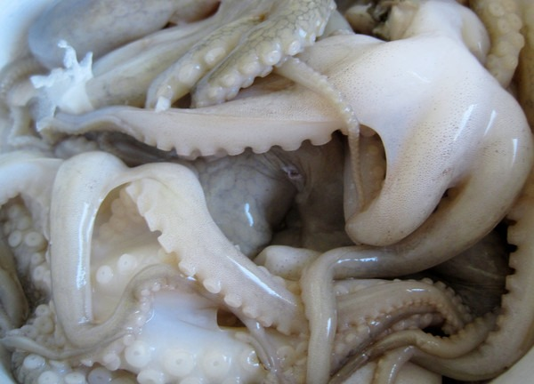

Each time I visit an Asian grocery store I make it a point to buy something foreign to me. I want the challenge of taking home a food item that puzzles or scares me. On a recent adventure, I bought a box of baby octopus. I had no clue how I was going to prepare them. Fortunately for me, a Korean cooking blog that I subscribe to provided an idea.

_Eating and living_ posted the recipe [Jjukkumi Gui (Spicy Grilled Baby Octopus)](https://web.archive.org/web/20180717130042/http://eatingandliving.blogspot.com:80/2012/08/jjukkumi-gui-spicy-grilled-baby-octopus.html). I love Korean food, so I took on this new cooking test.

The recipe says:

> Heat a lightly oiled grill or a grill pan to medium high and sear for about 3 minutes, turning a couple of times. Do not overcook.

I followed this advice for the first few octopus and 3 minutes was too much. Way too chewy. The remaining ones took about half that time. The chewiness was far less, but still not absent. Even though my marinade was 6 hours, it seemed the flavors never soaked in to the octopus. The Korean spices tasted like more like a topping.

The four octopuses I ate didn't taste bad, but they didn't taste good either. Very neutral. Better than [pig uterus](/2012/01/pig-uterus-recipe-an-offal-idea/), but not nearly as delicious as [sheep testicles](/2012/05/sheep-testicles-taste-wonderful/). I saved half the box of octopus so I can try a second recipe.

---

## Comments

### Ed
*August 26 at 2012 at 4:29 PM*

I think I'll pass!!

---

### Barb
*August 27 at 2012 at 12:23 AM*

In the movie "Jiro Dreams of Sushi" they prepare the (much larger) octopus by massaging it, basically kneading it by hand, for 50 minutes. There seemed to be some white stuff on it, so maybe an oil? Anyway, you might try spending 20 to 30 minutes kneading/massaging your marinade into the octopus - at least it should end up less chewy!!

---

### MAS
*August 27 at 2012 at 3:13 AM*

@Barb - I probably massaged it for 3 minutes. I have a few more in the freezer. I'll use your tip and do a longer rub next time. Maybe later this week. 

I just added that movie to my Netflix Queue. Thanks!

---

### Txomin
*August 27 at 2012 at 11:51 AM*

I prefer to fry or BBQ them but there is a Spanish dish (pulpo a la vinagreta) that is simply outstanding. Anyway, I've eaten them for years. Delicious seamonsters, they are. Chewy for sure but not unlike squid and similar creatures.

---

### MAS
*August 27 at 2012 at 1:50 PM*

On the Critical MAS Facebook page, I got this suggestion.
http://www.maangchi.com/recipe/ojingeojeot

A one month fermentation.

---

### aviva
*August 28 at 2012 at 12:42 AM*

great minds think alike, Barb - I was just going to say the exact same thing. 40-50 minutes of massaging. very helpful. Delicious when done RIGHT!

---

