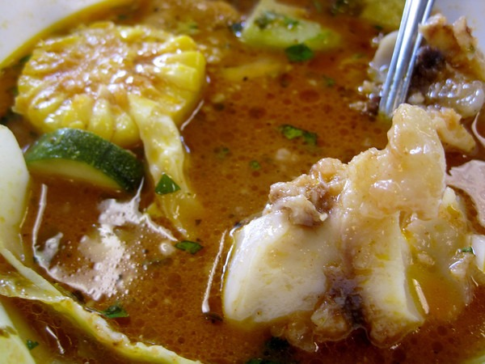

There have been a few popular Weston A. Price (WAPF) bloggers who have attacked the Paleo diet. I understand some of their criticisms but dislike their techniques. I find the two diets to be highly complementary. For those new to these terms, check out my post [Paleo vs Weston Price](/2011/02/paleo-vs-weston-price/). I like the Paleo diet as a starting spot. Turning back your diet 10,000 years is a great way to reboot your internal operating system. Dropping the neolithic poisons and eating a diet made up of foods our ancestors thrived upon is an effective strategy many have used to improve their health.

As much as I like the Paleo diet as a starting point, I prefer a Weston A. Price approach to nutrition. Paleo is good at figuring out what foods to eat. Weston A Price focuses not only on food and food quality but also on food preparation. Paleo is about bringing the food back to the cave. Weston A. Price takes it from there and figures out how to extract the maximum nutrition from that food. Fermentation, soaking, sprouting, making stocks, and organ meats.

What appeals to me about the Weston A. Price approach is how different cultures in completely different parts of the planet that had no way to communicate with each other, independently came up with similar solutions to food preparation. Only when modern cultures rejected traditional food preparation in favor of convenience and cost-saving did health begin to decline. Nutritional science is just beginning to catch up to what our ancestors knew about food.

_Recently I had [sopa de pata](https://en.wikipedia.org/wiki/Sopa_de_pata) at an El Salvadorian restaurant. This soup includes beef feet, tendons, and tripe cooked slowly with vegetables including yucca, corn, cabbage, and onions. Not only did it taste amazing, but I felt great afterward. There is some ancestral wisdom in that soup._ 

To stay completely Paleo without embracing elements of Weston A. Price is to reject thousands of years of ancestral knowledge. On my nutritional journey, I am more interested in learning recipes from traditional cultures than pouring through PubMed looking for ammo to defend a dietary position.

Sharing [homemade sauerkraut](/2011/06/cortido-sauerkraut-recipe/) with friends is far more enjoyable than debating carbs or calories. One of my favorite TV shows is _Anthony Bourdain: No Reservations._ He travels the world eating traditionally prepared cuisines - often from restaurants with multi-generational history.

Learning more and more about nutrition now seems like a waste of time to me. It's all about the food.

---

## Comments

### Jim
*August 8 at 2012 at 9:43 PM*

Another great post MAS,
I think dwelling of differences makes for better marketing.
Personally, I'm a fan of people like Mark Sisson, who try to create a big tent approach.  These groups (WAPF, Paleo) would benefit by joining up against the forces of the SAD, instead of warring over minute details.  Another example is a video I saw where the video maker compares the (surprisingly) similar and complementary views of Michael Pollan (relatively liberal) with those of Ted Nugent (who some would characterize as a right wing crazed hunter).  The video argues that  two "sides" (tree hugging locavores and hunters) should actually join forces, because they share many values against against those of big agriculture.

---

### MAS
*August 9 at 2012 at 2:48 AM*

@Jim - I totally agree with the big tent approach. The infighting is what frustrates the very people that need the most help. I was really disappointed when CheeseSlave went after Paleo. 

As a web guy, I get why those posts are written. Controversy = page views = revenue.

---

### Greg
*August 9 at 2012 at 3:16 PM*

I agree, it's all about eating delicious food!  In many ways studying nutrition is akin to studying economics, and I believe that scientism has plagued the field of economics.  I've come to believe that we are largely making a similar mistake in the field of nutrition too.

---

### Stephan
*August 24 at 2012 at 8:20 PM*

Anthony Bourdain is truly sensational. I love where somewhere in Thailand he eats the still beating heart of a sliced up cobra... I guess your meat doesnt get much fresher than that. :)

---

