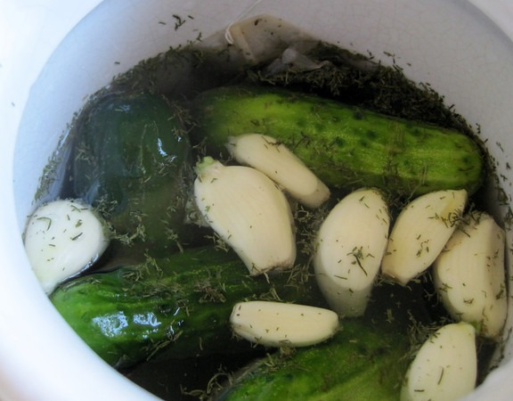
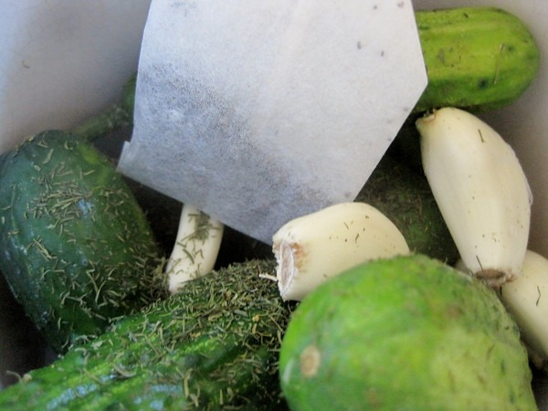

I've made pickles a few times this summer. They tasted great, but they weren't crunchy. Then I read on a forum how one can use a tea bag in the ferment to preserve the crunchy. I tested it out this week and it works. You need to use black tea. Check out the _Awesome Pickle_ post [Live-fermented dill pickles with tea](https://web.archive.org/web/20210304163601/http://awesomepickle.com/live-fermented-dill-pickles-with-tea/) for a pickle recipe that uses tea bags.  

---

## Comments

### Jim
*August 11 at 2012 at 4:38 PM*

Their 8/2 post describes a 1-week kimchi.  What do you think?

---

### MAS
*August 11 at 2012 at 4:47 PM*

@Jim - 1 week sounds right to me. Most of mine clock in around 6 days.

---

### Barbara
*August 11 at 2012 at 7:27 PM*

What a great tip! Divine and I didn't think to eat pickles during the summer, but what a fantastic idea!

---

### hännah
*August 13 at 2012 at 2:57 AM*

Thanks for the tip!  I just made my first fermented pickles (actually cauliflower) and I'll definitely try the tea bag trick in my next batch.

---

### Eric
*August 16 at 2012 at 6:09 PM*

@Jim I thought one week was a little short, too, but that kimchi tasted great. I usually let mine go longer, but it all comes down to taste and how quickly the fermentation is moving, which seems to have a lot to do with how hot it is.

---

### MAS
*August 16 at 2012 at 7:07 PM*

Interesting that in the new book The Art of Fermentation there is a quote from "a team of Korean academics" that determined optimal taste for kimchi required just a 3 day ferment with a 3% salt ratio. 

I've done 3 day ferments in the heat of the summer that tasted awesome. They don't have the diverse probiotic cultures of older ferments, but they still taste good!

---

