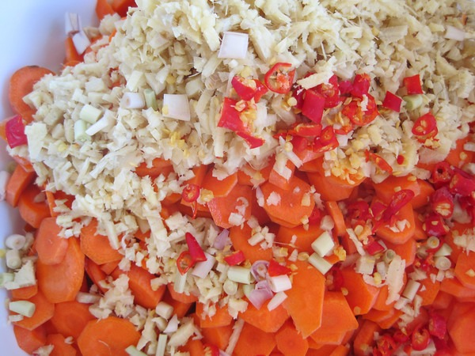

One of the easiest things to ferment is carrots. Earlier this year I posted [Fermented Carrots and Ginger](/2012/02/fermented-carrots-and-ginger-recipe/) as a kid-friendly sweet-tasting ferment. I make this frequently, especially when I buy too many carrots and they look like they are going to go bad before I can consume them all. Fermentation is an outstanding way to preserve fresh vegetables.

In the new book The Art of Fermentation, there is a sentence about a Vietnamese take on this recipe. It mentioned adding Thai peppers, lemongrass, and lime to the carrots and ginger. The first time I made this ferment I discovered that lime will totally dominate the flavor and make the entire ferment taste sour. So I made this ferment again only without the lime.

Anyway, this Vietnamese "adult version" of fermented carrots tasted great. A perfect balance of sweet plus spicy. I'm glad I made 10 pounds of it! I stopped the ferment after 7 days for half my jars. I'm going to let the rest ferment a few more days. The key to knowing when to end the ferment is [tasting as you go](/2012/06/fermenting-vegetables-taste-as-you-go/). There is no wrong answer.

This ferment is not only an excellent side dish but works as a salad dressing substitute. For the recipe, just review [Fermented Carrots and Ginger](/2012/02/fermented-carrots-and-ginger-recipe/) and then add the Thai peppers and lemongrass (video: [How to cut](http://www.youtube.com/watch?v=exe3Aa1d7Ro) lemongrass). As much or as little as you like.

_Carrots + ginger + lemongrass + Thai peppers + sea salt_

_Fermenting begins. As the ferment continues the water will become more cloudy._

---

## Comments

### Geoff
*August 24 at 2012 at 10:17 PM*

Awesomeness.  I just dropped some okra in a ferment, but this makes me wish I'd grabbed the carrots instead.

---

