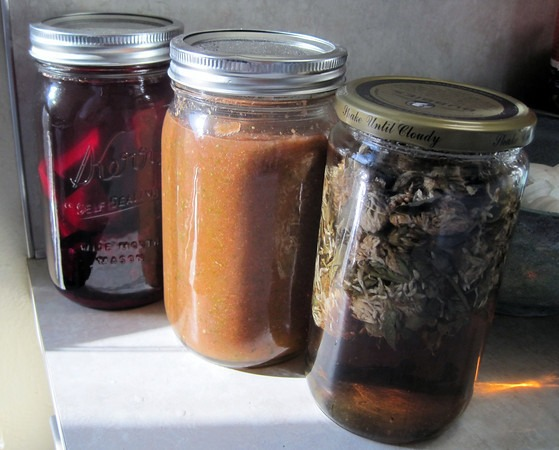

I few weeks ago I kicked off three new food projects. From left to right:

1.  **Beet Kvass** - Basically ferment some beets for a couple of days and then drink the juice. It tasted fine, but since I have nothing to compare it to, I don't know how well my ferment went. The remaining beets were later roasted and then blended into a soup. I seemed to have lost my notes, so the next time I attempt this, I will start from scratch.
2.  **Fermented Salsa** - This was my first vegetable ferment that used whey. The ferment went three days and tasted great to me. I didn't measure anything. Just added salsa like ingredients such as tomatoes, cilantro, hot peppers and salt. Then I took an immersion blender and topped it off with whey from the top of my yogurt.
3.  **Red Clover Infusion** - Did you know those red clover "weeds" can be infused to make a tasty beverage? Supposedly there are health benefits as well. Just add 1/2 to 1 ounce red clover into a quart jar, add warm water, let it sit overnight, strain off clovers, refrigerate and then drink.

_Beet Kvass, Fermented Salsa, Red Clover Infusion_

---

## Comments

### chuck
*September 26 at 2012 at 7:23 PM*

i made beet kvass once and didn't think it tasted fermented enough.  didn't have the tang i was suspecting.  i let it ferment longer but didn't get what i expected.  may have been perfect but i had no perspective to judge against.  been meaning to try again.

what was your experience with it?

---

### MAS
*September 27 at 2012 at 12:07 AM*

@chuck - My experience was the same as yours. Sweet without tang. I need to try a good kvass so I have a marker to shoot for.

---

### Jesse
*September 27 at 2012 at 4:10 AM*

I had a similar experience with kvass that was only fermented 3 days (per Nourishing Traditions) and just tasted salty without much flavor or kick. I let it ferment another week or two (can't remember) at room temp and then moved it to the fridge, where it got forgotten for a month or so. I just tried it and I think it turned out really good, although a little too salty. It has a similar taste and texture to what I've purchased at the store; slightly thickened, a little sweet, tangy, and lightly carbonated.

On a side note, any idea why all the NT vegetable fermentation recipes are for such a short time? I usually measure the time in weeks or months, so I just can't see how 3 days would do much of anything.

---

### MAS
*September 27 at 2012 at 4:12 AM*

@Jesse - I don't have a copy of NT around, but I recall most of their veggie ferments used whey and were not wild fermentation. That might speed up the ferment. 3 days does seem short.

---

