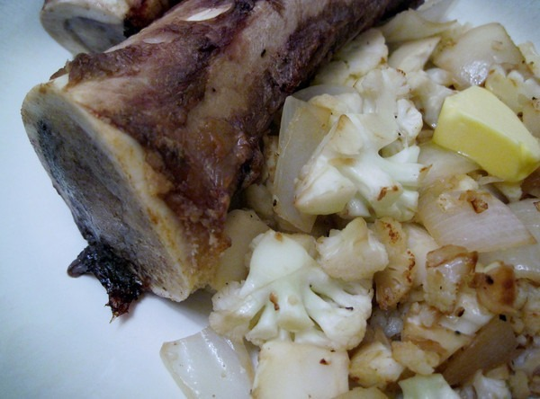

I finally got around to cooking up some bone marrow. Instead of putting the gooey center on toast, I cooked up some cauliflower and onions. Butter was also added. The bones were cooked for 15 minutes at 420 F, although I've seen recipes that use as low as 350 F. The marrow tasted creamy and wonderful. Afterwards, the bones were tossed into a stock pot and used to make [beef stock](/2011/04/homemade-beef-broth/). I used a butter knife to remove the marrow. Bone marrow is a prized food in traditional cultures and appears to be an excellent source of Vitamin K2, which is good for dental health. See [Vitamin K2 in Marrow](http://wholehealthsource.blogspot.com/2008/11/vitamin-k2-in-marrow.html) at Whole Health Source.   

---

## Comments

### Glenn
*September 17 at 2012 at 6:36 PM*

Good thinking. I'm now considering making the same thing but into a mash - maybe with a bit more clarified butter...

---

