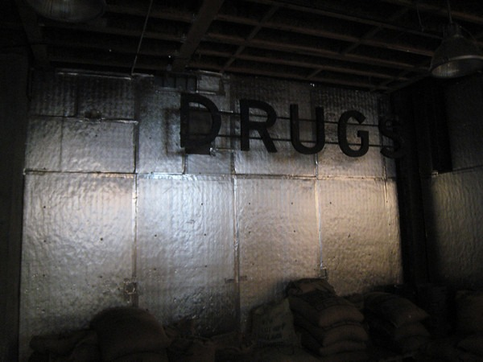

> My name is MAS and I'm a caffeine addict.

For the past few years, I have been deluding myself that my relationship with caffeine was healthy. When I mention that on a typical day I only consume 3 or 4 espressos, some people are shocked. Then I explain that back in my San Diego days I used to consume 5-6 mugs of french press coffee a day and those mugs were 16 ounces. By comparing my current intake to the amount I was consuming just a few years ago, I was able to trick myself into believing that I had made great progress in curbing my caffeine addiction.

When I switched from french press to espresso, my caffeine intake did go down. But this also about the time that I started getting an appreciation for quality loose leaf tea. These days I consume about 4 mugs of tea day. Overall my caffeine intake is lower, but not by as much as I thought. My sleep is better, but that is probably the result of not drinking coffee in the late afternoon or evening and not directly a result of lower total caffeine.

Is comparing current caffeine usage to past caffeine usage a useful metric? That question has been bothering me for a while. This week I conceded that it is wasn't. **The fact remains that I am equally addicted to caffeine albeit at a lower level than before.** My addiction might even be greater because today I am consuming espresso that is far better quality than just a few years ago. The strides I've made in my home roasting and shot pulling at home have improved a lot recently. By collecting more data and interviewing the best baristas in Seattle, my home espresso quality has improved more in the past 9 months than in the first 9 years I was making coffee. Every month or so my coffee tastes better than it did before. This is making my addiction stronger.

_The DRUGS sign at the Seattle roasting facility for Stumptown Coffee (12th Ave). So true._ 

### Prior Detox Attempts

In 2011 I went [14 days without coffee](/2011/09/what-i-learned-during-my-coffee-detox/), but my detox was flawed. First off, I was still drinking tea. Also, because I switched to decaf I was still getting the flavor stimulus. So I never went a day without caffeine or the taste of coffee. I built in a loophole in the very test I created. Now I see that the flavor stimulus for me is equally as addictive as caffeine, I know I can't use decaf to detox.

The only real 100% caffeine and coffee-free detox I did was way back in 1997 when I lasted 100 hellish hours. That was before I started home coffee roasting or had a real burr grinder. Even when I visited coffee hostile locations such as [South America](/2006/09/rio-to-buenos-aires-overview/), [Southeast Asia](/2010/01/planes-trains-and-elephants-my-2009-asia-trip-overview/), and [New Orleans](/2012/02/locating-a-decent-coffee-in-new-orleans/), I still acquired caffeine every single morning and most afternoons. So caffeine has played a role in my daily life for 15 non-stop years or approximately 5,475 consecutive days. And if you exclude those 4 days in 1997, you can add another decade to that number. This can't be healthy.

### Deeper Addiction

Beyond the caffeine and the stronger flavor signals, coffee and tea both now have strong social links for me. I am the organizer of the [Coffee Club of Seattle](https://www.meetup.com/seattle-coffee-club/) which meets an average of twice a week. This year I've had 160 espressos from Seattle area coffee shops. Yes, I have a spreadsheet. :) This doesn't count non-espresso drinks or the coffee I consumed when I was out of town. And it definitely doesn't count the drinks I made at home, which is a much larger number. Much of my social fabric since moving to Seattle is based upon coffee or began with coffee.

### Dark Clouds

I need to know who I am without caffeine. This isn't going to be easy. Tuesday morning I woke up after a perfect night of 8+ hours of deep sleep. I decided I would wait a while before making coffee. I should have been ready to take on the world without caffeine, but I couldn't. My head wanted coffee. Even though I was fully rested, I was mentally paralyzed. That is when I knew I had to do a real detox, but this one will require more planning because I need to break the addiction at every level.

If this post lacked my crisp writing style it is because I'm already in a funk from cutting back on the caffeine. I'm not getting caffeine headaches, just a sharp decline in mood. It feels more like a breakup than a withdrawal. I've doubled my [L-Tyrosine](/2012/07/safe-use-of-5-htp-and-l-tyrosine/) to no effect. Yesterday I left the headlights on in my car and ran the battery dead. Later I left the house with the oven on and burnt a 3-pound meatloaf. There may be fewer posts or suckier posts in the next few weeks.

Into the darkness.

---

## Comments

### Mark
*September 22 at 2012 at 12:27 AM*

I recommend continuing to drink your 4 mugs of tea each day, but change to doing it at precise predefined times.

For example, you might drink a cup at 8AM, 9AM, 10AM, and 11AM. Or whatever. Just take your preferred period of consumption, and try to spread it out evenly. When you drink on a schedule, you begin to take conscious control of your habit. Plus, you know that you only have to hold out for a little while longer before your next fix.

Do this for a week or two, and then cut down to 3 mugs. Once again spread it out evenly and drink them at precise times, and do this for a few weeks. Your body will definitely begin to adapt to lower caffeine levels. Then continue the process of weaning yourself off. It helps if you are patient while your body adapts. Don't try to cut too much caffeine too quickly. Your body will just rebel.

I have used this process successfully a few times. Every time I did it, my natural energy levels skyrocketed and were more stable. Caffeine always makes me crash.

Unfortunately, I always end up back on caffeine, like now. Usually, I encounter a day somewhere down the road where I'm exhausted, so I will drink some coffee. Since my tolerance for caffeine is reduced when I quit, it really feels great, and then my habit is back. :-(

One of my planned habit changes is getting off caffeine again, but right now I'm working on my habit of writing for 1 hour every day, which is what I'm going to do right now. :-)

---

### MAS
*September 22 at 2012 at 1:08 AM*

@Mark - Thanks for the tips. I will probably use your ideas for "phase 2". Phase 1 is already in progress and that is weaning myself off the coffee.

---

### Aaron
*September 22 at 2012 at 2:15 AM*

Dude, I've never commented on your caffeine posts before because I have only had a handful of cups my whole life, BUT, from the outside looking in, you nailed it here ... you are an addict.  25 years straight?  That makes my glue sniffing look like child's play ;)

Good luck.

---

### Karl
*September 22 at 2012 at 3:02 AM*

Hi MAS, I don't know if it's practical or possible for you, but I find that when I'm really busy with something totally new, it's a lot easier to power through a major change like giving up coffee. If I'm doing the same old routine then I find it nearly impossible.

Maybe if you took a trip that involved a very busy schedule- building houses in Costa Rico or a Movnat workshop kind of thing. Anything to get out of the routine so you don't have a lot of spare brain power to think of ways to get coffee. 

I've found that for most things I want to stop doing the physical addiction isn't the biggest obstacle, it's more the habit of doing the thing that's hard to break. For example if I start drinking at a smoky bar with a smoker (I'm in China, so there are lots of smokey bars and smokers), then it's a real struggle not to have a few. When I'm not drinking, my friends all don't smoke or when drinking in a non-smoking place I don't even think about it, but that mental trigger of that specific situation is really tough to get past. It can't be anything physical because I never think about smoking at any other time and in fact find smoking pretty disgusting.

I find it very difficult to break these sorts of habits, so good luck and I'll be eager to hear what does finally work for you.

---

### MAS
*September 22 at 2012 at 3:22 AM*

@Aaron - "glue sniffing"  ROFL!!! 

@Karl - That is outstanding advice. It is exactly the technique I used when I first started intermittent fasting. I couldn't do it when I was at home and following my normal routine. As soon as I started exploring and doing long urban hikes it became easier.

---

### charles
*September 22 at 2012 at 2:14 PM*

You might find this interesting

http://suppversity.blogspot.com/2012/09/coffee-3-cups-per-day-keep-insulin-at.html

---

### MAS
*September 22 at 2012 at 3:38 PM*

@Charles - For me this is not a question on if coffee is healthy or not. I believe that answer is highly personalized and changes over time. For me this about being able to perform at a high level with or without coffee. I have concerns about how caffeine affects brain chemistry. Most people focus on the positive hit of dopamine, but this comes at a cost as serotonin levels can become depleted. 

https://ineedcoffee.com/your-brain-on-coffee-how-caffeine-affects-brain-chemistry/

It is one thing to say coffee can positively impact mood. But when the absence of coffee causes a negative mood then I believe that is cause for concern. I didn't use to feel this way, but my quest today is not about being more healthy, it is about seeking greater resiliency. 

https://criticalmas.org/2012/05/healthy-vs-resilient/

---

### Mark
*September 22 at 2012 at 4:49 PM*

For me, my desire to give up caffeine isn't about the health effects either. I've been off caffeine, and I've been on caffeine. I definitely prefer being *off* caffeine. Once my body adapts, my energy levels are higher and *far* more stable. Plus I'm more relaxed.

In my opinion, we are doing something wrong if we need to get an artificial boost of energy from external sources by consuming things like caffeine and sugar. My biggest issues are poor sleep and eating habits. I'm trying to address the poor sleep habit first because I tend to make poor decisions when I'm tired from a lack of sleep.

---

### Ann
*September 22 at 2012 at 4:53 PM*

After all the great new studies out there about coffee and it's benefits... Why would you ever stop?
I know that you have read some things about  L-Tyrosine, I have to tell you that I have seen some things that concern me about it. IMO - you stopped something that was helping your thyroid and you added in something that could be dangerous. Coffee is a natural adaptogen. L-Tyrosine is a processed supplement that could be harmful.
ARK

---

### Geoff
*September 22 at 2012 at 7:28 PM*

MAS - are you also reworking your social life during this period of adjustment?  It seems you may need to constrct a social network outside of your coffee-circle to avoid putting yourself in situations where you are tempted to "relapse".  Is that practical for you?  Might your sour moods be partially the product of distancing yourself from those situations?

---

### MAS
*September 22 at 2012 at 9:11 PM*

@Mark - I am very interested to find out if my experience turns out to be like yours.

@Ann - I acknowledge that coffee has positive health benefits, but I don't believe coffee is required for great health. Like I said before, the caffeine response is highly personalized. If it is required to feel normal or it causes a stress reaction, how can that be healthy? I think the coffee cheerleaders pick and choose whatever research makes them feel better about their addiction. 

I believe the reason I got such a positive response from L-Tyrosine is because excessive caffeine had depleted my serotonin levels. I am using L-Tyrosine and 5-HTP during this period to adapt. I have no plans on making it a habit. 

Again this is about building resiliency, not about being more healthy. 

@Geoff - I am addressing the social concern. More on that in a future post. The short answer is I am breaking or redefining those connections.

---

### Ann
*September 22 at 2012 at 10:22 PM*

@MAS "In 1965, Hans Selye showed that the injection of serotonin caused muscular dystrophy. Subsequent studies suggest that serotonin excess is involved in both muscular and nervous dystrophy or degeneration." (O'Steen, 1967; Narukami, et al., 1991; Hanna and Peat, 1989.)
http://raypeat.com/articles/aging/tryptophan-serotonin-aging.shtml
Question is.. are you really sure that tryptophan and serotonin are good? Something to consider. 
xo
ARK

---

### MAS
*September 22 at 2012 at 11:01 PM*

@Ann - I'm not a PubMed warrior and I don't understand most of what Ray Peat writes. But I don't need to understand him to to know that I felt awful Tuesday morning when I waited an a hour for my first coffee. 

Let us keep this real simple. Not being able to function with coffee is not healthy.

---

### Pauline
*September 22 at 2012 at 11:09 PM*

Hi Michael I have to add I understand 100% the caffeine addiction. I started to cut back slowly about a month ago first one cup less a day for a week or two,  to 2 cups for a week or so then with more time down to one cup coffee (no tea substitutes) and then down to half a cup. I am this week for the first time without coffee at all. Mornings I feel calmer without that caffeine shot but it does level your mood down. For the slight pick up I have a piece of chocolate as part of my downshift and weaning. I also remind myself that it can take up to 2 months to feel the complete full benefit of caffeine being out of your system. Toda. I had a cup of tea for the first time and didn't enjoy it. I have been drinking herbal teas and find it strangely soothing relaxing and enjoyable. And i have that in all the places i would normally drink coffee  very liberating. Who would have thought. My partner is now down to one a day and is diluting that one and is surprised now how sensitive he is to the jolt caffeine gives his system. We both tend to feel our nervous system trembles from the adrenaline rush. I would never thought I would say this but I feel calmer off caffeine and only now realise how fearsome it's effects are if you are sensitive to it. I am hanging in there and very fascinated by this journey.  I wait patiently to see the full benefit of coming off caffeine. My thoughts are clearer and my Mood is slowly warming round too.

---

### Ann
*September 22 at 2012 at 11:15 PM*

@MAS-Maybe your blood sugar was low? Just a thought... could your blood sugar be the issue? I wonder what would happen if you started your day with a fresh glass of fresh home made(strained) oj? Then maybe the coffee wouldn't be the thing that was picking you up.

---

### Pauline
*September 22 at 2012 at 11:25 PM*

The other thing I want to add is I have also chosen to use the caffeine detox time to rest more. The body is going through a powerful adaptation process and I grab the opportunities where i can to distract my pre-occupation with the detoxing effects by sleeping, reading or watching tv or walking outside. Anything that adds a feeling of nurturing and balance. Vital to help yourself through it. I also journal and log my mood and feelings but sometimes it's better to put that aside and to also distract myself.  Meditation is very good when it is gentle and allows whatever arises to settle again within yourself. Anything you find relaxing also works and focussing on the body's wonderful ability to heal itself given the right environment. Rest and recovery.  I have also upped my dosage of magnesium taking it before I sleep and on waking. I take some during the day in between meals to spread out its calming effect.

---

### MAS
*September 22 at 2012 at 11:41 PM*

@Pauline - Thanks for your tips. I have increased my Magnesium. 

@Ann - What do you thing of TANG? I much prefer the fake taste of Tang to OJ. There is no way I will make fresh strained OJ. The smell of oranges repulses me. If there is a 2nd best option, please share. I'm willing to experiment.

---

### Ahrand
*September 23 at 2012 at 12:36 PM*

I'm thinking more and more along the lines of addiction myself. Addicted to food, smells, timing, combinations, volume can make me eat more then I want and make poor choices.
They all are linked to the dopamine reward you get from them.

I tried different things in my life controlling my food intake and some have been succesfull, others not so much.
One thing however, always seems to work although it is hellish to start : abstination.
Stop it and banish it our of your head.

If you can get to the other side, you'll be a better, wiser man.

You are a modern man, YOU control your dopamine reward, you are not a paleo warrior anymore whose dopamine reward controls him.

---

### MAS
*September 23 at 2012 at 2:24 PM*

@Ahrand - That method will not work for me. I need to work up to that point. Half my intake of caffeine for a period and then half it again. Weaken the signal first.

---

### Glenn
*September 23 at 2012 at 4:56 PM*

MAS - first and most important point:
Be gentle on yourself. You are a precious and highly creative being and you make significant contributions to the health and well-being on hundreds, even thousands of people.

There's no need to ascribe perjorative labels on yourself in order to keep improving as a person - indeed such labels can be counter-productive.

Secondly - Going 100 hours without caffeine - that's over four days. What the heck to I know, but I would think if you can do a caffeine fast once a month or so (randomly!) for four days at a time, that's enough to recalibrate the system (to use a completely unscientific notion)...

Lastly - on magnesium, I'm increasingly convinced that the glycinated form is vastly more effective for me, and well worth the additional expense.

---

### Pauline
*September 23 at 2012 at 4:58 PM*

Another book that helped me understand caffeine withdrawal:
http://www.amazon.com/Caffeine-Blues-Hidden-Dangers-Americas/dp/[phone removed]

---

### Nathan
*September 24 at 2012 at 12:38 AM*

After about 20 years (I'm 40 now) of drinking coffee pretty much ad libitum, in the last three weeks I've cut back to 2 16 oz cups first thing in the morning.  I've used no crutches like tea or decaf.

One reason I've cutting back is the theoretical notion that, if I ever found myself in some caffeine-less survival situation, at my previous level of addiction I would spend several days just fighting the headaches and the fog before being able to do much.

A more tangible benefit has been much more stable energy levels at work.  This has made me more productive.  I'm a software developer ... I think doing something cognitive for work makes you much more sensitive to (and affected by) small changes in energy and focus than if your work is more social or physical.

I plan to stay at 2 cups for the near future, but might try a caffeine-less day here or there just to say I did it.

---

### Ann
*September 24 at 2012 at 12:45 AM*

@MAS- I wish i could say that TANG was ok... no go... sadly to report TANG is a no go. What about fresh watermelon juice or coconut water? You could give that a go.

---

### Txomin
*September 24 at 2012 at 8:52 AM*

Power through, my friend. I've been there and, while hard, coffee is not cocaine, not even tobacco.

Remember that there are two components to withdraw: a physical (real) one and a psychological (imaginary) one. The real one will pull at you in pangs or bursts. Wait them out. They don't last more than a 2-3 minutes. Over time, these will decrease in frequency and intensity. It took 3 weeks for me to beat my caffeine addiction.

The imaginary component is the true danger. Folks make themselves think they need the fix after the pang of withdraw is gone. The idea of a fix (not the actual physical need) gets into their heads and there it goes round and round, growing and becoming more difficult to ignore. People then "negotiate" with their imagination and, oftentimes, yield to temptation.

Last, don't beat yourself up. If you fail, give it another go, a better one every time. The only defeat is to give up.

---

### MAS
*September 24 at 2012 at 3:59 PM*

@Glenn - Thanks! I like the idea of using randomness as I reduce levels and going forward. 

@Ann - Coconut water might be OK. I'll get some. Thanks.

@Nathan - The good news is I've been tracking daily intake for many months now. My morning caffeine is lower than yours, but my afternoon is higher. 

@Txomin - I slipped slightly yesterday. But I feel great this AM, so I'm moving in the right direction, but not in a straight line.

---

### Glenn
*September 24 at 2012 at 4:42 PM*

Maybe try Diane Sanfelippo's bacon brownie recipe - that might cheer you up...

---

### Glenn
*September 24 at 2012 at 4:48 PM*

Something like this: http://web.archive.org/web/[phone removed]4724/http://thingsmybellylikes.com/2012/04/27/bacon-brownies/

---

### sheri
*September 25 at 2012 at 2:54 AM*

I'm rootin' for ya, Dood.

---

### Pauline
*September 26 at 2012 at 8:46 AM*

I have been reading up on Coconut Water as a good source of potassium with lots of heart healthy benefits:

http://nutritiondiva.quickanddirtytips.com/is-coconut-water-good-for-you.aspx

---

