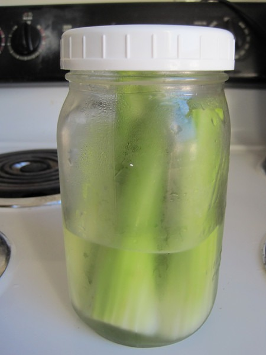

I love celery, but it annoys me how quickly it loses it crunch and goes limp. The trick to bringing celery back from the dead is to soak the stalks in cold water. For a while I was doing 30 minute ice baths for the celery in a flat tray. Then a few days ago I got a better idea. I cleaned and chopped the celery. Then I stuffed the stalks into a wide mouth quart jar. At that point, I filled the jar about 1/3 full of water and placed into the refrigerator. After about 30 minutes, my near dead celery was a crunchy as if it were just pulled from the Earth. Having it in a jar on the top shelf instead of buried in the crisper also means I'll be snacking on more celery.  _Celery Resurrection!_

---

## Comments

### chuck
*September 8 at 2012 at 1:44 AM*

that technique you invented is like celery viagra.  celery lovers rejoice!

---

### MAS
*September 8 at 2012 at 1:46 AM*

@Chuck - "celery viagra" --> perfectly said.

---

### Becka
*September 10 at 2012 at 5:53 PM*

I just did this last night with some sad floppy celery - this morning they're upright again, it's a miracle!

---

### MARK
*March 31 at 2013 at 5:12 PM*

Do you or have you ever tried fermented celery?

---

### MAS
*March 31 at 2013 at 9:03 PM*

@Mark - No, but I'm intrigued. Will try it later this week. Thanks for the idea.

---

### MARK
*March 31 at 2013 at 9:06 PM*

Cool! I'll be curious what recipe you come up with or use as your kimchi and the kraut recipes are really intriguing. If I get a bit more motivated today I may try my hand at them.

---

### David
*April 11 at 2013 at 12:39 PM*

Nice post, I've always loved celery... years ago I worked in Nouvelle Cuisine restaurant and we'd take the clump of tender baby leafy stalks at the core (my favorite part) dip them in a tempura like batter and fry them for an "amuse bouche ", totally wonderful... celery is also the best heartburn remedie due to it's alkalinity.

---

### MAS
*April 11 at 2013 at 3:11 PM*

@David - Was unaware that celery could help with heartburn. Great tip!

---

