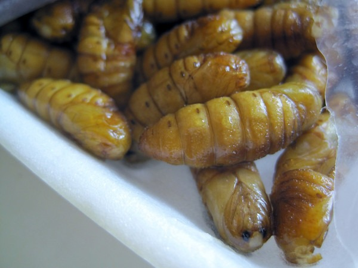
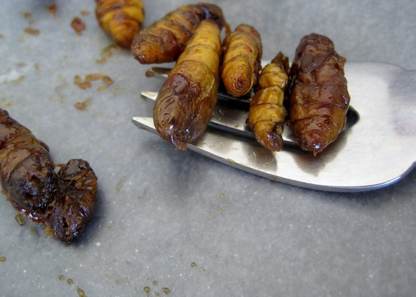

One of my favorite hobbies these days is looking for [interesting](/2012/01/pig-uterus-recipe-an-offal-idea/) [food](/2012/08/my-first-octopus/) at Asian grocery stores. Recently I was looking through the frozen seafood section at a Viet Wah grocery store when one item caught my eye. It was labeled "Frozen Ground Cucumber", but it appeared to be bugs. I pulled out my phone, did a quick search and confirmed that I was holding a package of frozen insects. I had to buy it.

_Ground Cucumber aka Con Nhong aka Silkworm Pupae_

Besides the "Frozen Ground Cucumber" label was the Vietnamese name of Con Nhong. The bugs turned out to be Silkworm Pupae. I had no idea how I was going to prepare them. My only bug experience was [eating some crickets](/2010/06/my-first-bug/) prepared Oaxacan style two years ago. I figured the best way to approach a recipe would be to eat one thawed out. It tasted like moist cashew meat. I shared this thought on Facebook and got a suggestion to pursue it from both a sweet and spicy angle. For cooking, I used a combination of pan frying and high-temperature roasting. Of the very few recipes I located, most appeared to favor deep frying.

### Brown Sugar Candied Bugs

I woke up the day after eating the thawed silkworm pupae and thought about how some people candy-roasted nuts. Would it work for bugs? Using the steps and the 3 to 1 nuts to brown sugar ratio outlined in the post [DIY Brown Sugar Candied Walnuts](https://web.archive.org/web/20190727214530/http://brighteyedbaker.com/2012/06/04/diy-brown-sugar-candied-walnuts/), I proceeded to candy my insects.

_Add brown sugar to pupae._

_Cook down brown sugar. Stir with a wooden spoon._ 

_Yummy! Candied silkworm pupae._

It tasted pretty good, which is what you'd expect with that much brown sugar. But it lacked any crunchiness, so I made a second batch that involved a 10-minute oven roast at 400 F. After the roast, I placed the pupae in the pan and repeated the brown sugar candy instructions. These were better because, in addition to the sweet taste of brown sugar, they have a slight crunch with a little toasty flavor.

### Cajun Style Ground Cucumber

For the spicy version, I also did a 10-minute oven roast at 400 F. Once the bugs were cooled, I added some Cajun spices. This is my favorite topping for [popcorn](/2012/07/high-satiety-foods-the-results/), so I figured it would work here as well. And it did. Although not nearly as crunchy as popcorn, the bugs did take to the Cajun spices.

_Roasted "Ground Cucumber" mixed with Cajun spices._

### The Winner?

The spicy version was more convenient, but I slightly preferred the sweeter-tasting candied version that used the 10-minute high-temperature roast prior to pan candying.

### Nutritional Superfood

Something seems wrong with the nutritional label on the back of the package of Con Nhong. It says a serving is 43.6 calories with 35 grams of protein. If protein is 4 calories per gram then that would equate to 140 calories per serving. Other web sources for nutritional data are for the canned version which is loaded with unhealthy cottonseed oil. Regardless of the calories, this food is a protein powerhouse.

From the study, [Silkworm Pupae (Bombyx mori) Are New Sources of High Quality Protein and Lipid](https://www.jstage.jst.go.jp/article/jnsv/56/6/56_6_446/_pdf):

> Consuming 100g (dry weight) of silkworm pupae would be equal to ingesting approximately 56 g of protein, which satisfies the recommended dietary allowance of protein for adults.

By comparison, 100 grams of ground beef (75% lean) yields 16 grams of protein. Each package is 454 grams, which I don't know if it is considered dry weight. Even if you cut the number in half that is well over 100 grams of protein for about $3.50. Pretty impressive. This is serious Paleo.

---

## Comments

### Brady
*September 12 at 2012 at 5:02 PM*

Awesome! Looks pretty tasty. I'm growing mealworms to supplement my workouts instead of whey, maybe these could be an easier option. I'll have to explore that.

PS If you want to crunch up your bugs, try dehydrating them for a couple hours if you have a dehydrator. That's how I make my mealworm flour. It may work on these guys too.

---

### MAS
*September 12 at 2012 at 6:55 PM*

@Brady - I didn't think to use the dehydrator, but I love the idea. Will try it next time. Also a brilliant idea about farming your own meal worms. Going down the rabbit hole!

---

### Stephan
*September 15 at 2012 at 9:39 AM*

I luv the idea of replacing the post workout whey protein with a bunch of protein-laden silkworms. 

Imagine the commercialisation of "MEALWORM FLOUR SUPPLEMENT" which would come in a different range of flavours with no additives... hilarious.

I'm dead sure the bodybuilding community would totally jump on this bandwaggon of revolutionary supplementation :)

---

### MAS
*December 11 at 2012 at 7:32 PM*

@Brady - I took your advice and used a food dehydrator. Much better! Thanks for the tip.

---

### Brady
*December 11 at 2012 at 9:54 PM*

@MAS - Glad to know it helped.

---

### Nanaverm
*September 21 at 2015 at 6:14 AM*

I read on another blog about silkworm pupae to bake them at 400 degrees for about 20-25 minutes, stirring.  Then they'll get crispy.

---

