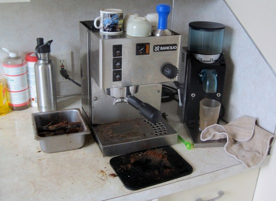
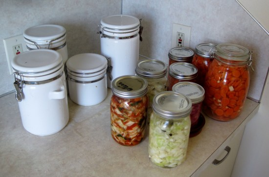

Today is Day 1 of my most challenging self experiment to date. **I am going to go the entire month of October without coffee. No decaf either.** My prior record was 4 days in 1997. :o I outlined my goal and plan in the previous post [My Caffeine Detox Plan](/2012/09/my-caffeine-detox-plan/). That post was written on Thursday and published on Friday. Here we are on Monday and I'm feeling super confident that I will succeed. The dark clouds already seems to be lifting. What happened? In that post, I said:

> There is a raging debate on whether announcing goals make you more or less accountable. Well, I am about to find out.

There have been articles making the case that we should keep our goals to ourselves. Derek Sivers posted [Shut up! Announcing your plans makes you less motivated to accomplish them.](http://sivers.org/zipit)

> Tests done since 1933 show that people who talk about their intentions are less likely to make them happen. Announcing your plans to others satisfies your self-identity just enough that you're less motivated to do the hard work needed.

And:

> Once you've told people of your intentions, it gives you a “premature sense of completeness.”

My history is that I almost never publicly announce goals unless I know there is a high probability of success. Otherwise I'm wasting everyone's time spouting off about something that likely won't happen. Being private is easier than being accountable. And being accountable is something I strongly value. Almost as if I created an experiment within an experiment, I decided to ignore Sivers advice and do the opposite of what I normally do. That is why I announced my intentions to curb my caffeine addiction in the post [Caffeinated Delusions](/2012/09/caffeinated-delusions/) and my goals in [My Caffeine Detox Plan](/2012/09/my-caffeine-detox-plan/).   _Boxing up all my coffee gear and putting it into storage was motivating. I liberated the space for some of my ferments. :)_ A fascinating thing happened after I published my goal. Immediately I started believing that I was going to be successful. My confidence soared. My mood improved and I honestly didn't feel the powerful pull of coffee. Never have I reduced my caffeine levels this fast this easily. It only became easier once I hit publish on Friday. By posting my intentions, I was saying that this goal no longer had a _high probability of failure_ and as a result it instantly felt more attainable. I still have a long way to go, but I think I will succeed. Being accountable has increased my motivation and my belief in myself. Siver's article seems like sound advice, but I wonder if there are cases or personality types that are exceptions? I suspect I might be one. We will find out. I'd be interested to hear other opinions on when it is wise to announce goals, when it isn't and how that affects success rates. **UPDATE Nov 1, 2012:** [Did It! A Month Without Coffee](/2012/11/did-it-a-month-without-coffee/)

---

## Comments

### jon
*October 1 at 2012 at 4:24 PM*

Good luck, from following your blog for a long time I'm pretty sure you'll make it.

---

### Anemone
*October 1 at 2012 at 4:58 PM*

I normally don't tell people my goals - I fail so often it's embarrassing. But the times I do tell people it's usually to motivate me to go for it, in part to spare myself the embarrassment of giving up in public.

Good luck!

---

### garymar
*October 2 at 2012 at 12:20 AM*

Maybe there's a critical point in your level of confidence: above that point, announcing becomes positive feedback; below that point, negative feedback. In any case you seem really psyched.

---

### Branden
*October 2 at 2012 at 12:36 AM*

Good Luck! I am new to your blog but from what I can tell is that your will is hardcore. I quit smoking years ago and the first week was the hardest. Get past the first week and its all downhill from there!

---

### Txomin
*October 3 at 2012 at 11:37 PM*

It depends on the goal and who you are talking to. I am not sure there is a single rule for it. Sometimes it can help, sometimes it can complicate things, sometimes it is inconsequential to the accomplishment of the goal.

Good luck, my friend. It's doable. Remember that.

---

### Peter
*October 4 at 2012 at 1:49 PM*

I ran into this study today, that may be some incentive to go lightly on caffeine:
http://scienceblog.com/56969/new-study-links-caffeinated-coffee-to-vision-loss/

There is so much pro/con on coffee, it is hard to decide if it is a net benefit or detriment.

---

### charles
*October 6 at 2012 at 12:44 PM*

https://www.sciencedaily.com/releases/2012/10/[phone removed]12.htm

"A new Harvard study has discovered a high incidence of vision problems among men and women who drank three or more cups of coffee a day. The research, published in Investigative Ophthalmology &amp; Visual Science, linked heavy consumption of caffeinated coffee with increased likelihood of developing exfoliation glaucoma, an eye disorder that affects about 10 percent of adults over age 50 and can lead to vision loss or blindness.

Specifically, the researchers reported that adults who drank three or more cups of coffee daily were 34 percent more likely to develop exfoliation glaucoma, compared to those who abstained from coffee. Women with a family history of glaucoma were at the highest risk, with their threat of exfoliation glaucoma soaring by 66 percent if they quaffed three or more cups of java per day."

http://www.iovs.org/content/53/10/6427.abstract?sid=9dd04ef5-beba-4204-b980-19a9afd4a3aa

he Relationship between Caffeine and Coffee Consumption and Exfoliation Glaucoma or Glaucoma Suspect: A Prospective Study in Two Cohorts

---

### Peter
*October 10 at 2012 at 3:23 PM*

There was previous indications that Caffeine was neuroprotective. Now there is some insight into the mechanism:

http://www.eurekalert.org/pub_releases/2012-10/uoic-cmb100812.php

---

### Pauline
*October 11 at 2012 at 9:31 AM*

Some feedback after going caffeine free for a month, I re-introduced on an experimental basis.  One cup a day, for 3 days in a row, I noticed I was more edgy, quick to jump to conclusions brain was brighter but harder, more crabby.  My stomach did not like it - after a break initial responses are clean and easy to pick up - my whole system felt squeezed, tight.  Very tired later in the day.  So I cut that out and had a day's break to check out how I feel if I don't have it every day.  So no coffee yesterday no big deal.  Today one cup coffee, will see if there is any difference in response later in the day.  My thinking is maybe a cup of coffee every 2-3 days.  the one negative is that coffee is a natural relaxer/stimulater of the colon, and without it everything seems very quiet.  Any thoughts and ideas.

---

### MAS
*October 11 at 2012 at 1:50 PM*

@Pauline - You are further into the journey than me. And I feel the caffeine response varies wildly from person to person, so the only results that matter are your own. I prefer espresso to coffee. Less caffeine, less stomach issues. I also love green tea when brewed at a correct temperature.

---

### Pauline
*October 11 at 2012 at 3:45 PM*

I do notice that the first cup of coffee after a longer break no initial hit response, I feel like I could take it or leave it.  But the next day the first cup has some brain perking effect but then you want more.  So my feeling is the second day I am dealing with withdrawal and the reward effect is the soothing of the withdrawal but this time your body/brain wants a bit more to feel that perk so that is how it creates this loop effect.  Fascinating.  Look forward to your thoughts on your caffeine-free journey this month.  Also I think my body is very sensitive to effects of caffeine in coffee but does not have the same response to caffeine in chocolate.

---

### Gil
*October 12 at 2012 at 7:30 PM*

Michael,

You are a better man than I am for giving up the Joe. I will give up many things, but coffe won't be one of them, lol.

---

### MAS
*October 12 at 2012 at 11:06 PM*

@Gil - I'm not there yet. So far 12 days no coffee and 5 days no caffeine. I wish I could say it get easier, but it hasn't. Almost broke down twice.

---

