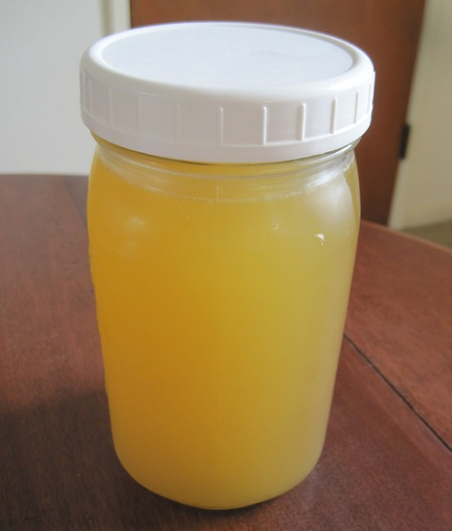

Making [beef stock](/2011/04/homemade-beef-broth/) is something I've been doing regularly for a few years now. As wonderful as that magic elixir is, I have been meaning to make a fish based stock for a long time. My motivation came recently when I started teaching myself Korean cooking. One of the base stocks for Korean recipes is the anchovy kelp stock. If you have access to a Korean grocery store this stock will be super easy make. If you aren't sure, do a search for H Mart in your city. I averaged several recipes online and then threw out their measurements and just winged it. All you need for this recipe is a container of dried anchovies and a package of _Dashima_. _Dashima_ is a large seaweed kelp. My guess is that if your Asian market doesn't carry this, you can substitute with another packaged seaweed. Then again I'm from Ohio and my entire Korean cultural experience was from a [layover in Seoul](/2009/12/a-rainy-day-in-seoul-south-korea/) three years ago.  _My photo of the Dried Anchovies didn't turn out well. This [photo](http://www.flickr.com/photos/crumbs/2670699660/in/photostream/) is by Kevin Chan._   To make the Anchovy Kelp Stock, I dumped a container of dried anchovies and several pieces of broken up _Dashima_ into a stock pot. Then I covered it all with cold water and let it soak for 2 hours. After the soak, I slowly brought the water up to a very light boil for 7 minutes. Then I turned off the heat and let it cool for a while. At that point, I removed the fish and seaweed and jarred the stock. That is it. I threw away the used fish and kelp, because I couldn't find anyone online that had a use for them. Please add a comment if you know of a second use. I didn't measure anything. In the spirit of stock, I just guessed and to no surprise it turned out great.   Anchovy Kelp stock is often added to Korean dishes prepared inside clay pots. Guess who bought his first Korean clay pot this weekend? :)

---

## Comments

### Mark
*October 4 at 2012 at 3:40 AM*

Great recipe, MAS. What do with leftover anchovies and kelp -

 -  feed anchovies to your chickens/ducks (if you have them)

- grind up Kelp/seaweed and put in water. It is an excellent plant fertilizer

---

### MAS
*October 4 at 2012 at 2:00 PM*

@Mark - Good ideas. I do live in a Marina neighborhood with geese. I could take it to them.

---

