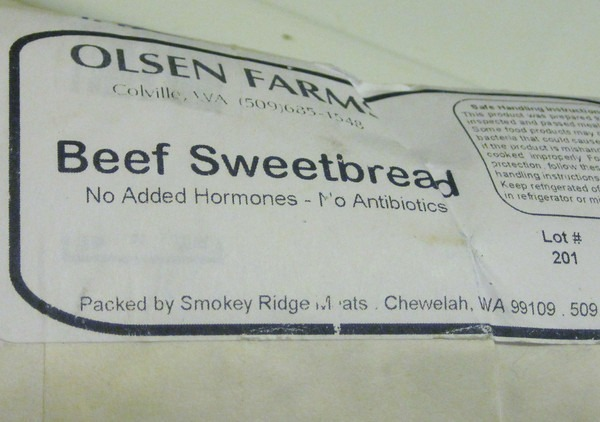
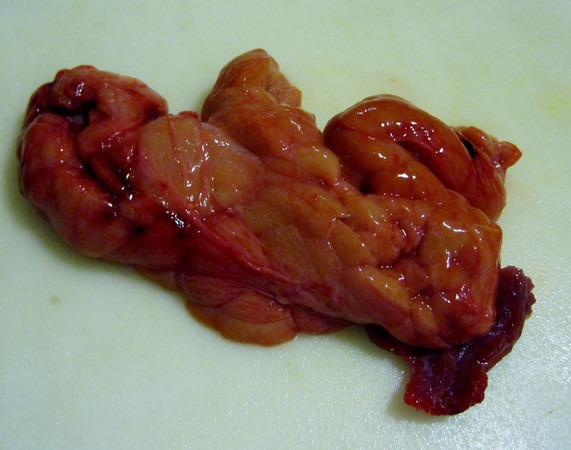

When I go to the Farmers Market, I walk past all the produce and head for the meat vendors. When I get to the meat vendors, I go straight to the cooler with the _nasty bits_. Nasty bits is a term used to describe offal or organ meat and other less popular cuts of meat. This is where nutritional density is the highest. They also are the cheapest cuts of meat. Win win. Recently I opened the Olsen Farms cooler and found something I had never seen before. A package of beef sweetbread  I had never heard of this animal part. Of course I had to buy it. Turns out my [sweetbread](https://en.wikipedia.org/wiki/Sweetbread) was the throat and thyroid area. Before cooking it I decided to eat a small piece of it raw. This is something I do with liver and kidney. Eating a small piece raw gives me clues on how long it needs cooking and what flavors might compliment it. Note that whenever I eat raw meat, I make sure that it has been frozen for at least 2 weeks first. Then I thaw and taste it no more than a day away. Sweetbread actually did taste sweeter than kidney or liver. Similar texture too.  _My kind of bread. And gluten-free too!  :)_   _Raw beef sweetbread._ My recipe is pretty straightforward. Mix chopped up garlic, ginger and sweetbread over a warm pan of melted butter. Cook for around 5-10 minutes. Hit it with some salt if you like.  _Beef sweetbread with garlic, ginger and lots of butter._  I liked this dish and will having it again. Tastes a little better than liver or kidney and I enjoy those dishes.

---

## Comments

### Jim
*October 10 at 2012 at 2:01 PM*

Your offal posts are always intriguing.

I give you a lot of credit for venturing into the offal territory the way you do.  I don't know how to get past the initial revulsion I experience when thinking about or seeing animal offal.  I know that there are valuable nutrients in organs, but I can't seem to get over the odd appearances and aromas.

---

### Ola
*October 10 at 2012 at 3:30 PM*

Over here in Finland, sweetbread is a delicacy offered by clued-in restaurants, such as Kosmos and Sea Horse (both in Helsinki). I find it tastes quite a bit like chicken...

---

### Glenn
*October 10 at 2012 at 11:17 PM*

Intriguing. In France, sweetbreads (ris de veau) is from veal - and it's by far the most expensive meat at the butcher or in a restaurant.

Does this producer not sell veal but mature only beef/cow?

---

### MAS
*October 11 at 2012 at 12:17 AM*

@Glenn - I've been a customer of this farm for years and this was the first and only sweetbread I've seen before. I'll ask them next time I see them.

---

### Ola
*October 11 at 2012 at 7:49 AM*

Beef sweetbread = veal sweetbread. The thymus (which is what sweetbread is) atrophies as the animal reaches maturity.

---

### Ola
*October 11 at 2012 at 7:52 AM*

...overlooked the "Turns out my sweetbread was the throat and thyroid area" bit. Maybe this is how you can tell which is which at the butchers (i.e. beef sweetbread = throat and thyroid, veal sweetbread = thymus).

---

### Zina
*July 1 at 2013 at 9:39 PM*

I really do hate to tell you this Scott - 'cause I really love that other people out there use all the part of the critter that gave their life for food for us - but you are getting hoodwinked! The Thyroid gland is NOT - NOT - NOT a beef sweetbread. A beef sweetbread is a THYMUS  gland - TOTALLY different. The only reason I actually know this is A.)  I LOVE sweetbreads - B.) - I grew up on a beef cattle ranch in SE Oregon - family has been here for over 100 years &amp; we butchered our own cattle since I could hold a knife  C.) The thymus gland is a white piece of meat when raw - &amp; I know where to find a sweetbread -thymus no thyroid....somebody is mistaken. If you think that the thyroid is yummy - just wait until you get a real sweetbread - you will crave them weekly - deeelish!  I am making them for my Dad tomorrow in a dry white wine sauce &amp; we may end up leg wrestling for the last bite! I'm not trying to be preachy here, but actual sweetbreads when they are raw, are a white-colored meat - they need to be delicately boiled then cleaned of the membrane - it's  pain in the patoot - but well worth the effort. E-mail me if you would like the recipes!!!! Good job Mister!

---

### Zina
*July 1 at 2013 at 9:45 PM*

Sorry - got the name wrong - Michael!!!! OOpsie!

---

### MAS
*July 1 at 2013 at 10:24 PM*

@Zina - Thanks for clearing that up. I've tried to get more since this post, but I haven't seen any. I'm going to chat with them on their definition.

---

### Zina
*July 2 at 2013 at 5:18 AM*

I'll post the recipe for you soon - they really are delectable!

---

### Mike
*July 2 at 2013 at 3:05 PM*

My family does a traditional recipe of sweetbread wrapped with a fat membrane and then wrapped in intestines.  Throw those bad boys on the grill and they form a crispy outside and soft inside with an unbelievable flavor.

---

### Zina
*August 11 at 2013 at 5:18 PM*

THAT! Sounds awesome - gonna have to try that one! Dang! I'm drooling!

---

