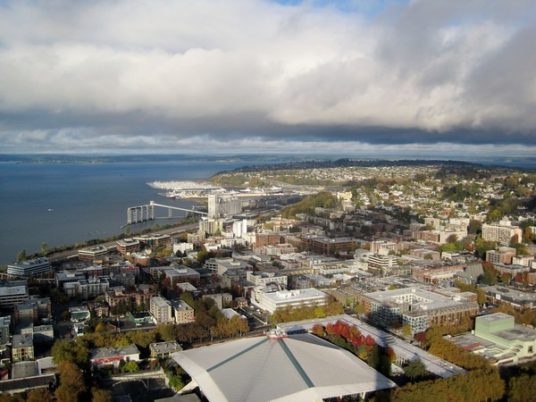
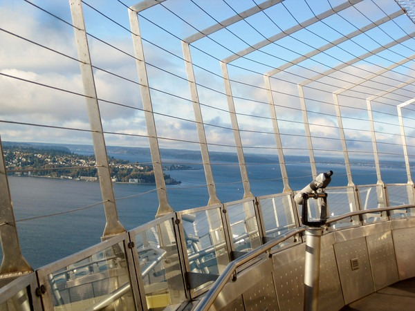

This summer has been the 50th anniversary of the Space Needle, which debuted at the 1962 World's Fair. In honor of that event, they rolled back the admission price to [just $1](http://web.archive.org/web/20140331002254/http://www.spaceneedle.com/news/2012/10/space-needle-dollar-day/). I think it is normally $19. Rain was expected, but it didn't come. The views were excellent.    [Full Gallery for Space Needle + Sculpture Park](https://www.flickr.com/photos/129592470@N02/sets/72157650141079305/)