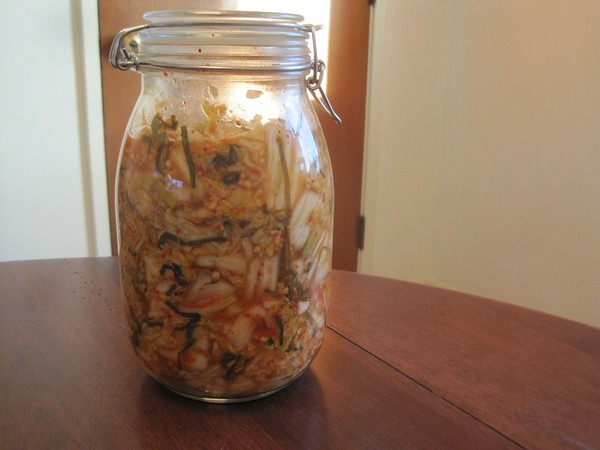

It was just 2 months ago that I posted [Kimchi 2.0](/2012/08/kimchi-2-0/). It was my "major release" of all the tricks and ingredients that had been working for me since my original kimchi recipe. It is probably too soon for a Kimchi 3.0, but I just recently made my favorite kimchi to date. I removed the mustard leaf and added chives. I'm going to dial this in some more, but I think I'm on the right path. Chives have a flavor that is sweeter and more mild than garlic or onions. After 4-6 days of fermenting, it really delivers a flavor punch to the kimchi.   My theory is when you add chives to kimchi, you do not need to add any garlic or onions. It does the job of both and does it better.

---

## Comments

### Becky
*November 3 at 2012 at 1:40 PM*

You totally have my attention on this kimchi!  Is it milder or just different?  I await further reports.  Congratulations, by the way, on your coffee experiment.  I am glad you are reunited with your old companion, and yet you still have dominion over it.  Coffee is your slave instead of vice versa!

---

### MAS
*November 3 at 2012 at 2:59 PM*

@Becky - sweeter and brighter.

---

### dhammy
*November 3 at 2012 at 7:51 PM*

No garlic in Kimchi?  Sacrilege, sir.  Sacrilege.

---

### MAS
*November 4 at 2012 at 1:31 AM*

@Dhammy - Ginger is where it is at. Garlic is good, but not necessary.

---

