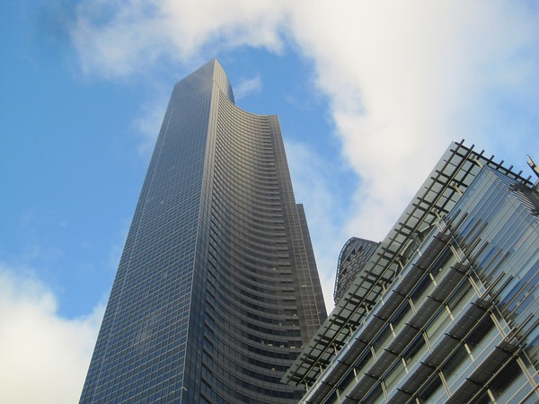

Maybe it has something to do with the angle of the Earth to the Sun during the winter, but I've always loved the look of Seattle on clear days from November to February. Here are some photos I took walking North on 4th Ave in Downtown Seattle.

   

[Full Gallery](https://www.flickr.com/photos/129592470@N02/sets/72157649726898828/)

---

## Comments

### Pauline
*December 2 at 2012 at 11:15 AM*

Love the second picture - it reminded me of this one:

http://3.bp.blogspot.com/-hGIf9T-3cm8/ULPyeT6QcJI/AAAAAAAAIpo/iHZpK9Z7njg/s1600/2012-11-27-InstitutMondeArabe.JPG

---

### Pauline
*December 2 at 2012 at 11:17 AM*

That pic is from www.dailyparisphoto.com

---

### Pauline
*December 2 at 2012 at 11:19 AM*

sorry should read -  www.parisdailyphoto.com

---

