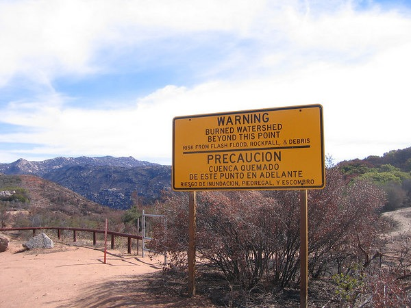

I haven't done a financial post in a long time, but I feel I need to defend what most people feel is indefensible: price gouging. What is price gouging? From the [Wikipedia](https://en.wikipedia.org/wiki/Price_gouging).

> Price gouging is a pejorative term referring to a situation in which a seller prices goods or commodities much higher than is considered reasonable or fair. This rapid increase in prices occurs after a demand or supply shock: examples include price increases after hurricanes or other natural disasters. In precise, legal usage, it is the name of a crime that applies in some of the United States during civil emergencies.

This topic has surfaced due to the damage caused by Hurricane Sandy. Who can possibly oppose laws that protect victims of a natural disaster from being price gouged? Me and I'll explain why. Price gouging is not immoral. It is a normal economic response to a crisis situation when demand is high and supplies are low. When authorities prevent gouging, they remove or reduce the profit incentive for new competitors to increase supplies. The result is fewer entrepreneurs race to the crisis area, which keeps supplies low and delays recovery. The fastest way to get supplies to an area and restore normal prices is to allow price gouging.  The best thing for an area in desperate need of supplies is to have reports that massive price gouging is occurring. Why? Because entrepreneurs in neighboring areas will risk time, capitol and possible injury racing to the scene with those goods. The higher the profit incentive, the more entrepreneurs show up, which restore supplies and lowers the price quicker. When authorities make or enforce laws against price gouging they discourage entrepreneurs from arriving to the scene with supplies. The price stays "fair", but the recovery takes longer, because fewer players are willing to take risks when the profit margin is reduced. In addition, they also run legal risks of charging too much and finding themselves in court defending themselves. Better to stay home and not do anything. It is also condescending for authorities to dictate price levels that free individuals can exchange with each other. If a family is without water or baby formula or insulin shots, then they should be free to pay whatever price it takes, because at that point in time those items do command a greater value. Some will say that price gouging isn't fair to the poor. But I would retort that not allowing those with more money to pay the higher price isn't fair to them. At least when the higher prices are paid, that capital can be used to acquire more supplies, which will drive down prices. This ultimately benefits the poor as the crisis time is reduced. If I haven't convinced you then I highly recommend the _EconTalk_ podcast [Munger on Price Gouging](https://www.econtalk.org/munger-on-price-gouging/).

> Mike Munger of Duke University recounts the harrowing (and fascinating) experience of being in the path of a hurricane and the economic forces that were set in motion as a result. One of the most important is the import of urgent supplies when thousands of people are without electricity.

---

## Comments

### dhammy
*November 4 at 2012 at 8:32 PM*

Price gouging should be allowed.  Prices will normalize over time...basic economics.

But we should still be able to shame the gougers...

---

### Jim
*November 4 at 2012 at 9:42 PM*

Great post MAS,
I also think that if my small neighborhood hardware store decides to stock a surplus of snow shovels, that take up a large portion of its small storage room, they should be able to charge more when that first huge snow storm hits.  Thus, allowing gauging not only brings in more players after the fact (as you argue), but would also lead existing providers to invest more on resources ahead of the event.

---

### Nick
*November 10 at 2012 at 11:38 PM*

Hooray!!!

Sending the link to Vladimir right now. :-)

---

### Matthew
*November 12 at 2012 at 5:38 PM*

This has the following embedded assumptions:

1) Entrepreneurs are rational enough.
2) There will be no collusion
3) Entrepreneurs have the necessary skills to enter an area quickly enough to meet the demand

Using the price gouging is good, Somalia would be the best "country" in disaster response in the world with the most vibrant and thriving economy.

---

