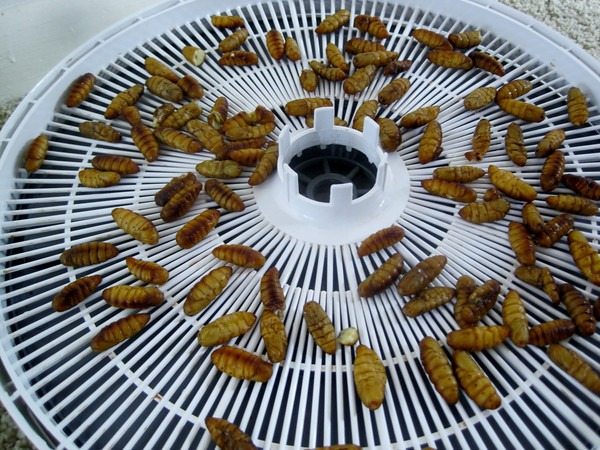
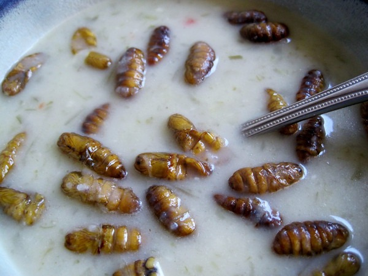

I've been loosely following the series of posts over on _Free the Animal_ on how potatoes might useful hack in accelerating fat loss. Now that I've _[porked out](/2012/11/low-caffeine-weight-gain/)_ from my month without coffee, I decided to try his [potato soup recipe](https://web.archive.org/web/20160228141518/https://www.freetheanimal.com/2012/11/the-latest-diet-exercise-hacking-towards-a-goal.html).

I did make a few changes to the recipe.

1.  I only used beef stock.
2.  I love adding Korean sea vegetables to my soups.
3.  A splash of heavy cream (optional).
4.  And then I added some bugs. 

I used [silkworm pupae](/2012/09/eating-silkworm-pupae-aka-ground-cucumber/), which I posted about earlier this year. Instead of frying or roasting the insects, I used a food dehydrator, which was an idea I got from commenter Brady. After two hours in the food dehydrator, these little fellows are perfect to add to soups or salads

The soup was outstanding and the bugs had a light nutty flavor, which complemented the soup. You are most likely to find Silkworm Pupae in a Vietnamese grocery store, such as Viet Wah in the frozen seafood section. You won't find them at Whole Fools. :)