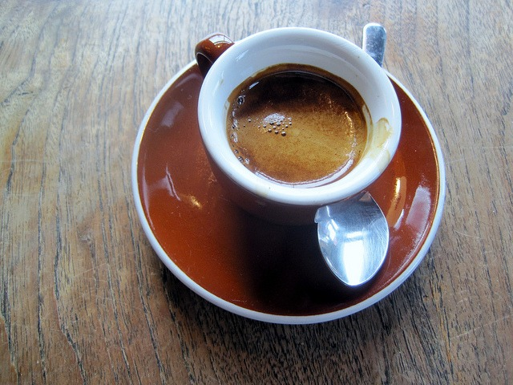

Last year I consumed 192 espressos in Seattle area coffee shops. I detailed who was pulling the best shots in the post 192 Espressos - The Best of Seattle Coffee 2012. In that post, I described my biases and the metrics I used to calculate my rankings. I thought I was finished with this project, but I had a good amount of data that I could use to answer more questions on the Seattle coffee scene.

1.  What neighborhood has the best espresso?
2.  Are single origin espressos higher or lower quality than blends?
3.  Does price predict quality?
4.  What day of the week am I most likely to get a great espresso?

### Espresso By Neighborhood

In 2012, the neighborhood of Ballard stepped up as a challenger to Capitol Hill for espresso supremacy. My gut tells me that this is still a few years away. What did the data say? For these tables, I only included neighborhoods with 5 or more visits.

**\[table id=25 /\]**

Before we say Ballard is better than Capitol Hill, we need to deal with neighborhood borders and minor neighborhoods. I am going to update the data with 3 rules.

1.  Roll the Central District (Tougo and Cortona Cafe) into Capitol Hill.
2.  The north Ballard neighborhood of Sunset Hill (Caffe Fiore) should be included in Ballard numbers.
3.  Pioneer Square will be merged into Downtown.

**\[table id=26 /\]**

With the new rules, Capitol Hill is better than Ballard. But it is only better when you include the bordering Central District. The University topped all, but that was all from _Trabant_. Had I ventured to other University places in 2012, that number would have been lower.

_Caffe Fiore in Sunset Hill (aka North Ballard)_

### Espresso: Single Origins vs Blends

Last year I was certain that I was going through Single Origin fatigue, but the data actually shows the opposite.

> Blends: **3.30** (132), Single Origins **3.73** (60)

When I split the year in the half, I found that although my average blend rating remained 3.30, my average Single Origin dropped from 3.84 to 3.44. This data point is probably only interesting to me, but it shows that for me there was a slight level of Single Origin fatigue. It also shows that even with the fatigue, the average SO beat the blends.

### Does Price Predict Quality?

I also wanted to know if espresso price was a predictor of quality, so I tracked the post-sales tax price of every espresso purchased in 2012. Price is a touchy topic. Many in specialty coffee believe that higher pricing signals higher quality. Whereas some consumers are price sensitive and may not see every price increase as justified. Before I dive into the data, I want to disclose two possible biases.

1.  I might demand more from higher priced espresso and thus rate it stricter.
2.  I might use the higher prices as a signal of higher quality and thus rate it less strict.

Although I'd like to think I rated each espresso fairly, the purpose of _192 Espressos_ was to collect so many data points that biases would be minimized.

**\[table id=27 /\]**

From my sample data, I found a slight inverse correlation between price and quality. The highest priced espresso got the lowest ratings. The differences were small, but the conclusion I reached is that higher prices are not a predictor of greater quality.

### What Day of the Week is Best for Espresso?

I'm not sure this data means much, but I have it so why not share it?

**\[table id=28 /\]**

Friday had the best espresso and Saturday had the worst. Monday also scored high.

### Putting It All Together

I am most likely to get a great espresso on Fridays or Mondays. I more likely to enjoy a Single Origin than a blend and I can't use price as a predictor of quality. And although I expect this gap to narrow in the next few years, I can still expect to get a better espresso in Capitol Hill than Ballard - assuming you consider the Central District part of Capitol Hill.

---

## Comments

### Roberta
*January 22 at 2013 at 7:59 PM*

Beacon Hill has coffee too! Plus, it's fun up here!

---

### MAS
*January 23 at 2013 at 1:36 AM*

@Roberta - I love The Station and Victrola 3.

---

